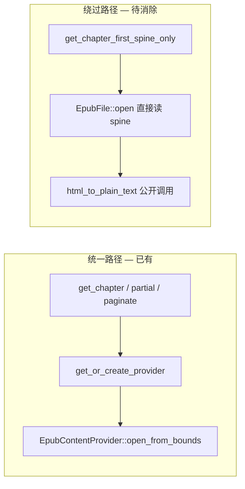

# EPUB 阅读路径统一到 EpubContentProvider

## 问题

当前 EPUB 阅读存在 **双路径**：



[`api/core.rs:350-385`](rust/src/api/core.rs) 是唯一 API 层 bypass（全库 `EpubFile::open` 在 `api/` 仅此处）。后果：

- DB bounds、stale book 检测、`ChapterTooLarge` 校验在首屏路径上被跳过
- `html_to_plain_text` 作为 provider 模块的 `pub(crate)` 函数被 API 直接调用，seam 泄漏
- 首屏与 session 分页可能因转换策略不同而 drift（现有测试 [`epub_first_spine_matches_session_prefix`](rust/tests/epub_reading_chain_test.rs) 已在监控）

**目标：** 所有 EPUB 章节文本读取经 `get_or_create_provider` → `EpubContentProvider`，`api/core.rs` 不再 touch `EpubFile`。

---

## 语义对照（必须保留）

| 行为 | 当前 bypass 实现 | 统一后要求 |
|------|------------------|------------|
| 边界来源 | `get_chapter_bounds` → global `start_idx` | 同：`open_from_bounds(start, end)` 已含 |
| 读哪段 spine | 仅 global spine `[start_idx]`（章首 spine） | 仅 `spine_hrefs[0]`（等价） |
| HTML 处理 | **先截 8KB 字符** 再 `html_to_plain_text` | **必须保留**（perf：避免首屏解析超大 HTML） |
| 输出上限 | 2000 字符 | 同，提为常量 |
| 空章 | `start >= spine.len()` → `""` | `open_from_bounds` 或 empty hrefs → `""` |
| 超大 spine | bypass **不**检查 2MB | 统一后走 `open_from_bounds` → `ChapterTooLarge`（行为改进，可接受） |

**注意：** 统一后首屏会对单 spine >2MB 的书报错，而 bypass 路径以前可能只截 8KB  silently 继续。开发版前提下（[`CORE_READING_CHAIN_STATUS.md`](issue/CORE_READING_CHAIN_STATUS.md)）这是合理收紧。

**注意：** `ensure_spine_text(0)` 对 HTML **不做** 8KB 截断；首屏 fast path 不能与 `read_text_range(0, n)` 共用，需独立方法。

---

## 方案：Provider 上增加 splash 方法

### 1. `EpubContentProvider::read_first_spine_plain`

在 [`rust/src/parser/epub/provider.rs`](rust/src/parser/epub/provider.rs) 新增：

```rust
pub const FIRST_SPINE_MAX_CHARS: usize = 2000;
pub const FIRST_SPINE_HTML_CHAR_CAP: usize = 8 * 1024;

impl EpubContentProvider {
    /// 首屏 fast path：只转换章内第一个 spine，HTML 先截断再转 plain。
    pub fn read_first_spine_plain(&self, max_chars: usize) -> Result<String, AppError> {
        if self.spine_hrefs.is_empty() {
            return Ok(String::new());
        }
        let href = &self.spine_hrefs[0];
        let html = self.epub.lock().read_resource(href).map_err(...)?;
        let truncated: String = html.chars().take(FIRST_SPINE_HTML_CHAR_CAP).collect();
        let plain = html_to_plain_text(&truncated);
        Ok(plain.chars().take(max_chars).collect())
    }
}
```

- `html_to_plain_text` 保持 `pub(crate)`，**不再**从 `api/core` 引用
- 单元测试：空 provider、正常 HTML、超 8KB HTML（验证截断生效）

### 2. `ChapterContentProvider::read_splash_prefix`（可选但推荐）

在 [`rust/src/parser/provider.rs`](rust/src/parser/provider.rs) trait 增加 default 方法，合并 EPUB/TXT/MD 首屏逻辑：

```rust
fn read_splash_prefix(&self, max_chars: usize) -> Result<String, AppError> {
    let read_end = ((max_chars as u64) * 3).min(self.content_length());
    let content = self.read_text_range(0, read_end)?;
    Ok(content.chars().take(max_chars).collect())
}
```

`EpubContentProvider` **override** → 调用 `read_first_spine_plain`（不用 default 的字节启发式）。

收益：`get_chapter_first_spine_only` 可写成格式无关的 5 行，TXT 首屏也从「读全文件」改为 provider 部分读。

### 3. 瘦身 `get_chapter_first_spine_only`

[`api/core.rs`](rust/src/api/core.rs) EPUB 分支替换为：

```rust
let format = format_from_file_path(&validated_path)?;
let provider = get_or_create_provider(&validated_path, chapter_index, &format).await?;
let text = provider.read_splash_prefix(FIRST_SPINE_MAX_CHARS)?;
Ok(FirstSpineResult { text })
```

删除：`spawn_blocking` + `EpubFile::open` + 直接 `html_to_plain_text` 块；TXT/MD 的 `read_to_string` 分支一并删除（由 default trait 覆盖）。

**FRB 签名不变**，无需 codegen。

---

## 与 ReadingOrchestrator 的关系

| 顺序 | 建议 |
|------|------|
| **可独立先做** | 本 refactor 仅动 `provider.rs` + `api/core.rs` ~40 行，不依赖 orchestrator 抽出 |
| **若 orchestrator 先做** | 在 Phase 4 迁 `get_chapter*` 时一并应用本方案 |
| **若本方案先做** | orchestrator 迁移时直接搬已统一的 `get_chapter_first_spine_only` |

推荐：**本方案先独立 PR**（小、可测、立刻消一条 seam）。

---

## 测试计划

### 已有（回归门禁）

- [`rust/tests/epub_reading_chain_test.rs::epub_first_spine_matches_session_prefix`](rust/tests/epub_reading_chain_test.rs) — 首屏第一行 vs session page 0
- [`rust/tests/pagination_session_test.rs`](rust/tests/pagination_session_test.rs) — TXT session 不受影响

### 新增

| 测试 | 位置 | 断言 |
|------|------|------|
| `read_first_spine_plain_truncates_html` | `provider.rs` unit | 注入 >8KB HTML，输出 plain 长度 bounded |
| `read_first_spine_plain_respects_max_chars` | `provider.rs` unit | `max_chars=100` → len ≤ 100 |
| `read_splash_prefix_uses_provider_not_full_file` | 可选 integration | TXT 大文件首屏不读全文件（mock 或 temp 文件） |

### 手动验证

- 本地 EPUB 打开首屏 ≤200ms 体感不退化（8KB 截断仍在）
- 长章 EPUB 首屏 → 全章分页后 page 0 第一行一致

---

## 实施步骤

1. **常量 + 方法**：`read_first_spine_plain` + provider 单元测试
2. **Trait**：`read_splash_prefix` default + EPUB override
3. **API**：重写 `get_chapter_first_spine_only`，删除 bypass 代码
4. **验证**：`cargo test` + 本地 `epub_reading_chain_test`
5. **文档**：在 [`issue/CORE_READING_CHAIN_STATUS.md`](issue/CORE_READING_CHAIN_STATUS.md) 「已统一」表补一行：首屏 EPUB 走 provider

---

## 刻意不做

- 富文本首屏（仍走 `api/epub.rs` / `parse.rs` 的 provider 路径，已统一）
- 将 `read_text_range` 改为 char 语义（属 char-range adapter 候选，独立 PR）
- 修改 Dart [`rust_chapter_content_repository.dart`](lib/features/reader/core/data/rust_chapter_content_repository.dart) 调用方式

---

## 验收清单

- [ ] `api/core.rs` 无 `EpubFile` / `html_to_plain_text` import
- [ ] EPUB 首屏经 `get_or_create_provider`（含 stale bounds + ChapterTooLarge）
- [ ] `FIRST_SPINE_*` 常量单点定义
- [ ] `epub_first_spine_matches_session_prefix` 仍绿
- [ ] `cargo clippy -- -D warnings` 通过
