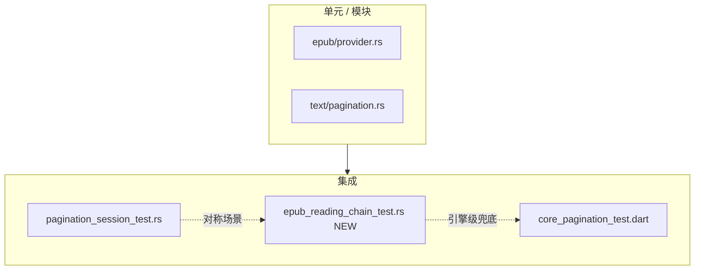

# EPUB 阅读链集成测试计划

## 目标

为 Rust 阅读核心建立**可持续回归**的 EPUB 集成测试，走与生产相同的 FFI 入口（非单元测试里的裸 `EpubContentProvider`），在本地快速暴露链路断裂。

**成功标准：**

- `cargo test --test epub_reading_chain_test` 在本地 fixture 齐全时全绿
- 覆盖 `[issue/CORE_READING_CHAIN_STATUS.md](issue/CORE_READING_CHAIN_STATUS.md)` 中分页 P0 场景（partial→full、连续页无重复、offset 单调）
- 与现有 TXT 测试 `[rust/tests/pagination_session_test.rs](rust/tests/pagination_session_test.rs)` 对称，便于对照排查

**范围外（本计划不做）：**

- CI 集成（你已确认仅本地跑；测试可默认 `#[ignore]` 或 feature gate，避免 CI `cargo test` 因缺 fixture 失败）
- Dart 层 EPUB 测试扩展（已有 `[test/features/reader/core_pagination_test.dart](test/features/reader/core_pagination_test.dart)` 的 `活着.epub` 组，Rust 侧做引擎级兜底即可）

---

## 现状与约束


| 已有                                   | 缺口                                                    |
| ------------------------------------ | ----------------------------------------------------- |
| TXT session 集成测试 12 个场景              | EPUB 零条 session 级集成测试                                 |
| EPUB 单元测试（html 转换、oversized spine）   | 无 `parse_book → session → get_session_page_content` 链 |
| `core.rs` 内 1 个 EPUB stale bounds 测试 | 混在 ~1200 行 god module 里，难维护                           |
| Dart `活着.epub` 真实书测试                 | 依赖 FFI + fixture，Rust 侧无等价                            |


**Fixture：** `[test/fixtures/](.gitignore)*` 被 gitignore，但本地已有 `medium.epub`、`活着.epub`（被 `[rust/src/api/core.rs](rust/src/api/core.rs)`、`[rust/benches/parsing_benchmark.rs](rust/benches/parsing_benchmark.rs)` 引用）。测试通过 `env!("CARGO_MANIFEST_DIR").join("../test/fixtures/...")` 解析路径。

---

## 文件结构

```
rust/tests/
  epub_reading_chain_test.rs    # 新建：主测试文件
  common/
    mod.rs                      # 扩展
    reading_chain.rs            # 新建：共享断言 + setup
    epub_local.rs               # 新建：fixture 路径解析 + skip 逻辑
```

不修改 FRB 生成代码；仅调用已有 public API：

- `[parse_book](rust/src/api/core.rs)`
- `[create_pagination_session](rust/src/api/core.rs)` / `[paginate_session_full](rust/src/api/core.rs)` / `[repaginate_session](rust/src/api/core.rs)`
- `[get_session_page_content](rust/src/api/core.rs)`
- `[get_chapter_first_spine_only](rust/src/api/core.rs)`（首屏 fast path）
- `[paginate_chapter](rust/src/api/core.rs)`（layout cache 路径）

---

## 测试 Harness

### 1. `epub_local.rs` — 本地 fixture 门控

```rust
fn fixture_path(name: &str) -> PathBuf { ... }

fn require_fixture(name: &str) -> Option<PathBuf> {
    let p = fixture_path(name);
    if p.exists() { Some(p) } else {
        eprintln!("SKIP: missing fixture {name} at {}", p.display());
        None
    }
}
```

- 每个测试开头：`let Some(path) = require_fixture("medium.epub") else { return; };`
- 或在文件级用自定义 macro `local_epub_test!` 减少重复
- **可选：** 文件顶部加 `#![cfg(feature = "local-fixtures")]`，本地跑 `cargo test --features local-fixtures`；默认 CI 不编译此文件

### 2. `reading_chain.rs` — 复用 TXT 模式的 setup

参照 `[pagination_session_test.rs:11-30](rust/tests/pagination_session_test.rs)`：

```rust
async fn setup_parsed_epub(path: &str) -> (TempDir, String) {
    init_storage(temp_dir);
    parse_book(path.to_string()).await.unwrap();
    (temp_dir, path.to_string())
}
```

**固定 `TypesetConfig`**（与 Dart `[core_pagination_test.dart](test/features/reader/core_pagination_test.dart)` 一致，避免 `Default` 导致页界漂移）：

```rust
fn test_typeset_config() -> TypesetConfig {
    TypesetConfig {
        page_width: 800,
        page_height: 600,
        font_size: 16,
        line_spacing: 1.5,
        language: LanguageType::Mixed,
        // ...
    }.validate_and_fix()
}
```

**共享断言函数：**


| 函数                                 | 验证什么                                                            |
| ---------------------------------- | --------------------------------------------------------------- |
| `assert_monotonic_descriptors`     | `start_offset <= end_offset`，且 `page[n].start >= page[n-1].end` |
| `assert_all_pages_non_empty`       | 每页 `get_session_page_content` 非空                                |
| `assert_no_cross_page_duplicate`   | 连续页文本无「整页重复前缀」（针对 CORE_READING_CHAIN 根因 2 类 bug）                |
| `assert_partial_full_page0_stable` | partial 与 full 后 page 0 文本一致（根因 1）                              |


---

## 测试场景（按优先级）

### P0 — 必做（回归网）


| #   | 测试名                                   | Fixture                          | 断言要点                                                                                             |
| --- | ------------------------------------- | -------------------------------- | ------------------------------------------------------------------------------------------------ |
| 1   | `epub_parse_and_session_baseline`     | `medium.epub`                    | `parse_book` 成功；chapter 0 session 有 descriptors；page 0 非空                                        |
| 2   | `epub_partial_to_full_upgrade`        | `medium.epub` 或长章 `活着.epub` ch.0 | `max_chars=500` → `is_partial`；`paginate_session_full` → `!is_partial`；page 0 文本 partial/full 一致 |
| 3   | `epub_consecutive_pages_no_duplicate` | 长章 fixture                       | 拉 page 0..min(3, len-1)；相邻页不满足 `page[n+1].starts_with(page[n])` 且拼接无异常重复                         |
| 4   | `epub_descriptors_monotonic_offsets`  | `medium.epub`                    | 全章 descriptors 单调；末页 `is_last_page`                                                              |


### P1 — 阅读链完整性


| #   | 测试名                                       | Fixture       | 断言要点                                                                     |
| --- | ----------------------------------------- | ------------- | ------------------------------------------------------------------------ |
| 5   | `epub_first_spine_matches_session_prefix` | `medium.epub` | `get_chapter_first_spine_only` 文本是 session page 0 的前缀（允许 page 0 更长）      |
| 6   | `epub_repaginate_font_change`             | `medium.epub` | `font_size` 16→24 repaginate 后 handle 仍可读；`config_hash` 变化               |
| 7   | `epub_layout_cache_roundtrip`             | `medium.epub` | 两次 `paginate_chapter` descriptors 相同（已有 TXT 版在 `core.rs` tests，EPUB 补一条） |
| 8   | `epub_multi_chapter_index_1`              | `活着.epub`     | chapter 1 可 session + 非空 page 0；DB bounds `start < end`                  |


### P2 — 边界 / 从 core 迁出


| #   | 测试名                               | 说明                                                                                                                          |
| --- | --------------------------------- | --------------------------------------------------------------------------------------------------------------------------- |
| 9   | `epub_stale_bounds_returns_error` | 从 `[core.rs:1185](rust/src/api/core.rs)` 迁入：corrupt DB bounds → `StaleBookData`                                             |
| 10  | `epub_chapter_too_large`          | 运行时 zip 改写出 >2MB spine（复用 `[provider.rs:668](rust/src/parser/epub/provider.rs)` 模式），`open_from_bounds` / session create 应失败 |


---

## 关键回归断言示例（P0 #3 / #2）

针对 `[CORE_READING_CHAIN_STATUS.md](issue/CORE_READING_CHAIN_STATUS.md)` 记录的真实 bug：

```rust
// partial → full：page 0 不应变空白或突变
let page0_partial = get_session_page_content(&handle, 0)?;
let full = paginate_session_full(handle.clone(), None).await?;
assert!(!full.is_partial);
let page0_full = get_session_page_content(&handle, 0)?;
assert_eq!(page0_partial, page0_full, "page 0 must stay stable after full upgrade");

// 连续页：page 1 不应以 page 0 全文开头
let p0 = get_session_page_content(&handle, 0)?;
let p1 = get_session_page_content(&handle, 1)?;
assert!(!p1.starts_with(&p0), "page 1 must not duplicate entire page 0");
```

---

## 隔离与稳定性

- **每测试独立 `TempDir` + `init_storage`**：与 TXT session 测试相同，避免 SQLite 污染
- **每测试唯一 EPUB 路径**：复制 fixture 到 temp（`std::fs::copy`），避免 `parse_book` 多次写入同路径冲突
- **Session 清理**：每个测试末尾 `dispose_pagination_session`
- **全局 LRU**：若测试间偶发干扰，在 setup 后调用已有 cache clear 模式（参考 `[core.rs:1210](rust/src/api/core.rs)` 的 `PROVIDER_CACHE.lock().clear()`）；仅在 flaky 时加

---

## 本地运行方式

```powershell
cd rust

# 方式 A：缺 fixture 则 skip（推荐）
cargo test --test epub_reading_chain_test -- --nocapture

# 方式 B：feature gate（CI 默认不编译）
cargo test --test epub_reading_chain_test --features local-fixtures
```

前置：确保 `test/fixtures/medium.epub` 存在（已有则直接用）。

---

## 实施顺序

1. **Harness**：`epub_local.rs` + `reading_chain.rs` + 扩展 `common/mod.rs`
2. **P0 四条**：baseline、partial→full、no duplicate、monotonic offsets
3. **P1 四条**：first_spine、repaginate、cache、multi-chapter
4. **P2**：迁移 stale bounds；oversized spine
5. **文档一行**：在 `[issue/CORE_READING_CHAIN_STATUS.md](issue/CORE_READING_CHAIN_STATUS.md)` 「相关测试」节追加 Rust 测试路径与运行命令

---

## 与现有测试的关系




- **不重复** provider 层 html 转换单测
- **补充** session 级 EPUB 路径（TXT 已有、EPUB 缺失的最大洞）
- **可选后续**：Dart 层 EPUB partial→full cache 测试（STATUS 文档已建议，非本计划必须项）

