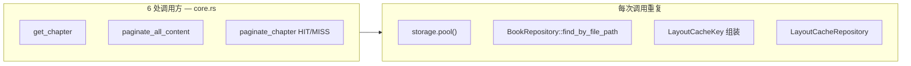
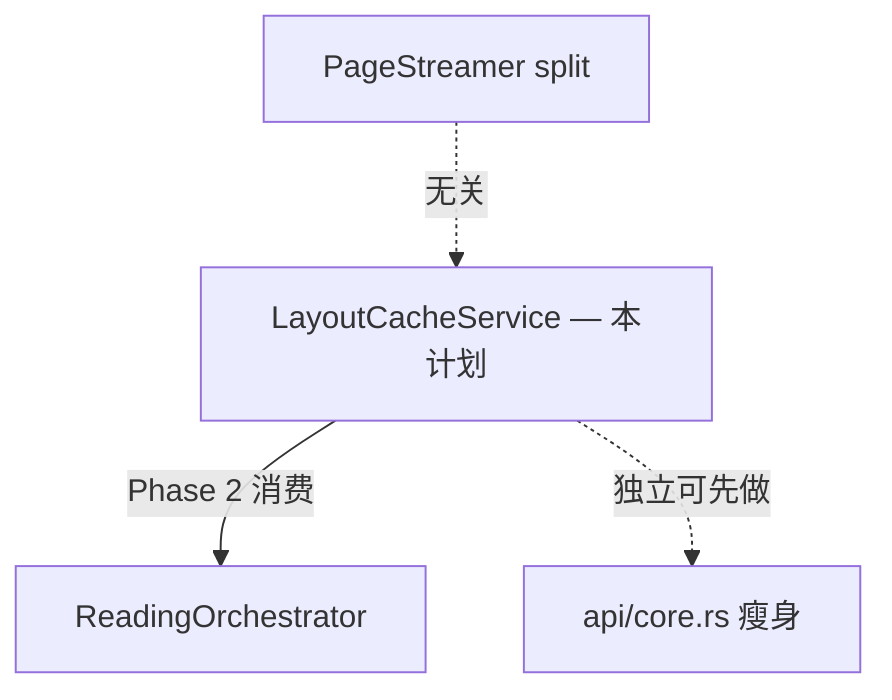

# LayoutCacheService adapter

## 问题

[`api/core.rs:198-280`](rust/src/api/core.rs) 中 layout cache 逻辑 **inline 且重复**：



| 问题 | 证据 |
|------|------|
| **locality 差** | book 查表 + KV 读写散在 6 处调用点旁，via 两个 80 行 private fn |
| **book_id 查表重复** | `try_get/save_cached` 每次 `find_by_file_path`；`get_chapter_bounds` 另有 `BOOK_ID_CACHE`（L108-120）— 同一 seam 两套实现 |
| **静默降级无 contract** | 读失败 → `None`，写失败 → `warn` + skip；行为正确但未集中文档化，难测 |
| **Repository 过 shallow** | [`layout_cache_repo.rs`](rust/src/storage/repos/layout_cache_repo.rs) 仅委托 `KvStore`，不含 path→book_id 解析 |

**调用统计（`chunk_index` 恒为 `None`）：**

- `get_chapter` — get + save 各 1（config Some 分支）
- `paginate_all_content` — get + save
- `paginate_chapter` — get（仅 `max_chars.is_none()`）+ save（仅 `!is_partial`）

---

## 目标

新建 **`LayoutCacheService`** adapter module：

- **Interface**：`(file_path, chapter_index, config_hash)` → pages，隐藏 `book_id` + `LayoutCacheKey`
- **Contract**：读 miss / 任意错误 → `None`；写失败 → log warn、不向上抛（与现行为一致）
- **leverage**：6 处调用变一行；book_id LRU 单点维护
- **testability**：可注入 temp storage + 内存 KV 单测，无需走完整 `paginate_chapter`

**不在本计划范围：** 改 KV 序列化格式、暴露 cache API 给 Dart、partial 分页写 cache。

---

## 模块位置

```
rust/src/reading/
  layout_cache.rs      # LayoutCacheService（本计划核心产出）
  mod.rs               # pub(crate) use layout_cache::LayoutCacheService
```

若 `reading/` 模块尚未创建（ReadingOrchestrator Phase 1 未做），**可先仅建** `reading/mod.rs` + `layout_cache.rs`，不必等完整 orchestrator。

备选（若不想引入 `reading/`）：`storage/services/layout_cache_service.rs` — 但阅读 pipeline 是主要消费者，放 `reading/` 更贴 locality。

---

## Interface 设计

```rust
// reading/layout_cache.rs

pub struct LayoutCacheService {
    book_id_cache: Mutex<LruCache<String, String>>,
}

impl LayoutCacheService {
    pub fn global() -> &'static Self { ... }

    /// 读缓存。任何失败（无 storage / 无 book / KV 错）→ None。
    pub async fn get_pages(
        &self,
        file_path: &str,
        chapter_index: i32,
        config_hash: u64,
    ) -> Option<Vec<PageContent>> { ... }

    /// 写缓存。失败仅 warn，不返回 Err。
    pub async fn save_pages(
        &self,
        file_path: &str,
        chapter_index: i32,
        config_hash: u64,
        pages: Vec<PageContent>,
    ) { ... }

    /// 按 book_id 失效（re-import / 删书时调用，若已有 call site）
    pub fn invalidate_book(&self, book_id: &str) -> Result<(), AppError> { ... }

    #[cfg(test)]
    pub fn clear_book_id_cache(&self) { ... }
}
```

**内部私有方法：**

```rust
async fn resolve_book_id(&self, file_path: &str) -> Option<String>
// 1. BOOK_ID_CACHE hit
// 2. BookRepository::find_by_file_path → fill cache
// 3. None on miss/error（读路径）/ early return（写路径）
```

**刻意简化：** 公开 API **不暴露** `chunk_index`（当前 6 处调用均为 `None`）。若未来 chunk 分页启用，在 service 内 overload 或加 `get_chunk_pages(..., chunk_index)`。

---

## 与 BOOK_ID_CACHE 合并

| 现状 | 合并后 |
|------|--------|
| `BOOK_ID_CACHE` 在 `core.rs`，供 `get_chapter_bounds` | 迁到 `LayoutCacheService` 或共享 `BookPathIndex` |
| `try_get/save` 每次 DB 查 book | 共用同一 LRU |

**推荐（本计划）：**

1. `LayoutCacheService` 持有 `book_id_cache`
2. 抽出 `reading/book_path.rs`：

```rust
pub(crate) async fn resolve_book_id(
    cache: &Mutex<LruCache<String, String>>,
    file_path: &str,
) -> Option<String>
```

3. `get_chapter_bounds`（仍在 core 或 orchestrator）调用同一 `resolve_book_id` — **消除双份查表**

若 scope 要极小：Phase 1 仅 layout cache 用 service 内 private resolve；Phase 2 再让 bounds 复用。

---

## api/core.rs 改动

**删除：** `try_get_cached`, `try_save_cached`（~82 行）

**替换示例：**

```rust
// 前
if let Some(pages) = try_get_cached(&validated_path, chapter_index, None, config_hash).await {

// 后
if let Some(pages) = LayoutCacheService::global()
    .get_pages(&validated_path, chapter_index, config_hash)
    .await
{
```

```rust
// 前
try_save_cached(&validated_path, chapter_index, None, config_hash, pages).await;

// 后
LayoutCacheService::global()
    .save_pages(&validated_path, chapter_index, config_hash, pages)
    .await;
```

**调用方 guard 不变：**
- partial 分页（`max_chars.is_some()`）仍 **不读** full cache — 逻辑留在 `paginate_chapter`，不沉入 service
- partial 结果仍 **不写** cache — `if !is_partial { save_pages(...) }` 留在 caller

---

## 测试计划

### 新建 `reading/layout_cache.rs` 单元 / 集成 test

| 测试 | 断言 |
|------|------|
| `get_miss_when_book_not_imported` | 无 DB 记录 → `None` |
| `save_then_get_roundtrip` | save → get 返回相同 `PageContent` 列表 |
| `get_miss_on_config_hash_mismatch` | hash A 写入，hash B 读取 → `None` |
| `save_failure_does_not_panic` | 无 storage 初始化 → save 静默返回 |
| `book_id_cache_avoids_second_db_lookup` | 可选：mock 计数或文档级验证 |

### 迁移现有测试

[`core.rs` 内联 `test_paginate_chapter_cache_hit_roundtrip`](rust/src/api/core.rs)（L1096+）→ 迁至 `tests/layout_cache_test.rs` 或 `reading/layout_cache` tests，直接测 service + `paginate_chapter` 端到端二选一。

### 回归门禁

- [`pagination_session_test.rs`](rust/tests/pagination_session_test.rs)
- [`epub_reading_chain_test.rs`](rust/tests/epub_reading_chain_test.rs)（若有 cache 相关场景）
- 现有 [`layout_cache_repo.rs`](rust/src/storage/repos/layout_cache_repo.rs) + [`kv_store.rs`](rust/src/storage/kv_store.rs) 测试保持不动

---

## 实施步骤

### Phase 1 — Service 骨架 + 行为对等迁移

1. 创建 `reading/mod.rs`、`reading/layout_cache.rs`
2. 实现 `LayoutCacheService`（从 `try_get/save_cached` **原样剪切**逻辑）
3. `lib.rs` 加 `mod reading`（`pub(crate)` 或 `mod reading` 不 pub）
4. 替换 `core.rs` 6 处调用，删除旧 fn
5. 跑测试

### Phase 2 — book_id 查表统一（可选，同 PR 或 follow-up）

1. 抽出 `reading/book_path.rs::resolve_book_id`
2. `get_chapter_bounds` 改用共享 cache
3. 删除 `core.rs` 中 standalone `BOOK_ID_CACHE`

### Phase 3 — 与 ReadingOrchestrator 对接

[`ReadingOrchestrator 计划`](.cursor/plans/readingorchestrator_extraction_aa13167e.plan.md) Phase 2 改为：`ReadingOrchestrator` 持有 `LayoutCacheService::global()` 引用，不再 inline cache 逻辑。

---

## 与相关计划的关系



**推荐顺序：** LayoutCacheService **独立小 PR**（~150 行新增，~80 行删除）→ ReadingOrchestrator Phase 2 直接引用。

---

## 刻意不做

- 将 silent failure 改为 `Result` 暴露给 Dart（行为变更）
- partial 分页 cache 策略调整
- 实现 chunk_index 分页 cache（无 call site）
- 修改 `LayoutCache` / `LAYOUT_CACHE_VERSION` 格式

---

## 验收清单

- [ ] `try_get_cached` / `try_save_cached` 从 `core.rs` 消失
- [ ] 6 处调用经 `LayoutCacheService::global()`
- [ ] 读 miss / 写 fail 语义与现网一致（warn 日志保留）
- [ ] 新增 service 级 roundtrip 测试
- [ ] `cargo test` + clippy 通过
- [ ] （Phase 2）`BOOK_ID_CACHE` 不重复查表
