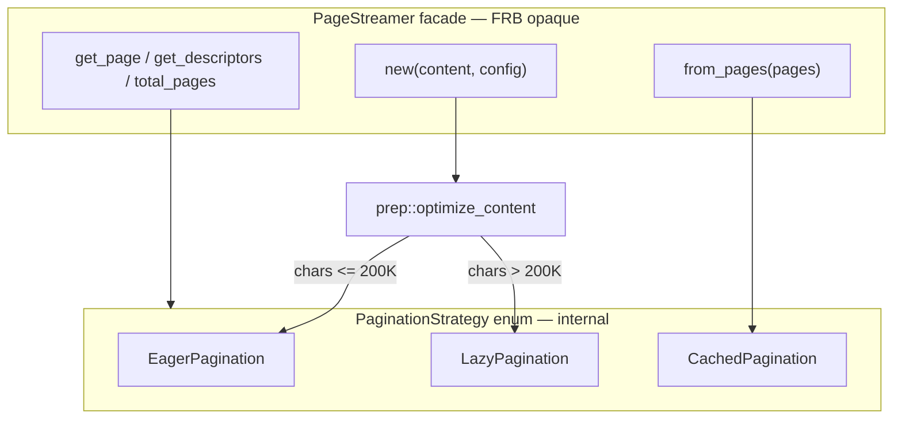

# PageStreamer 按 eager / lazy / cached 拆分

## 问题

[`pagination.rs`](rust/src/text/pagination.rs) 将三种分页模式揉在一个 struct 里：

| 模式 | 触发条件 | 当前识别方式 |
|------|----------|--------------|
| **cached** | `PageStreamer::from_pages`（KV cache HIT） | `cached_pages: Option<_>` |
| **eager** | 字符数 ≤ `LAZY_PAGINATION_CHAR_THRESHOLD`（200K） | `line_offsets` 非空 |
| **lazy** | 字符数 > 200K | `line_offsets.is_empty()` 且非 cached |

**摩擦：**
- `get_page` / `get_descriptors` / `total_pages` 各写三遍 `if cached … else if line_offsets.is_empty() … else …` — **shallow locality**
- lazy 与 eager 共用 struct 字段（`indent_str` 仅 eager 用，`char_boundaries` 仅 lazy 用）— AI/人读时字段语义不清
- 注释写「50K 阈值」，常量为 `200_000` — 文档 drift
- lazy 质量改进（[`CORE_READING_CHAIN_STATUS.md`](issue/CORE_READING_CHAIN_STATUS.md) 历史 P1）需要在 897 行文件中定位

**约束：**
- `PageStreamer` 是 `#[frb(opaque)]`，Dart 只认这一个类型 — **拆分仅限 Rust 内部**，不新增 FRB 类型
- `paginate_all`、`api/core.rs` 调用 `PageStreamer::new` / `from_pages` — **public 入口签名不变**

---

## 目标结构

```
rust/src/text/
  pagination/
    mod.rs           # PageStreamer facade + FRB impl + paginate_all
    line_break.rs    # compute_line_breaks_from_indices（纯函数）
    prep.rs          # typeset optimize 前置（从 new() 抽出）
    eager.rs         # EagerPagination state + build + get_page + descriptors
    lazy.rs          # LazyPagination state + get_page + descriptors
    cached.rs        # CachedPagination state + get_page + descriptors
  mod.rs             # pub mod pagination; re-export 不变
```



---

## 核心设计：显式 Strategy enum

替换隐式字段组合：

```rust
// pagination/mod.rs
enum PaginationStrategy {
    Eager(eager::EagerPagination),
    Lazy(lazy::LazyPagination),
    Cached(cached::CachedPagination),
}

pub struct PageStreamer {
    strategy: PaginationStrategy,
    pub(crate) current_page: usize,
    pub(crate) is_partial: bool,
}
```

**删除** facade 上的冗余字段（`content`, `line_offsets`, `cached_pages`, `char_boundaries` 等下沉到各 strategy struct）。

**模式 dispatch 变为单一 match**，不再用 `line_offsets.is_empty()` 猜测模式。

各 strategy 实现统一 **internal trait**（非 FRB）：

```rust
trait PaginationBackend {
    fn total_pages(&self) -> usize;
    fn total_lines(&self) -> usize;
    fn get_page(&self, page_index: usize, chapter_index: i32) -> Option<PageContent>;
    fn get_descriptors(&self) -> Vec<PageDescriptor>;
    fn progress(&self, current_page: usize) -> f32;
}
```

`PageStreamer` 的 FRB 方法一行 delegate：`self.strategy.get_page(...)`。

---

## 各模块职责

### `line_break.rs` (~80 行)

- 剪切现有 `compute_line_breaks_from_indices` + `SAFETY_MARGIN_PX` 依赖的 width 参数
- **零行为变更**，eager 唯一消费者
- 便于单独 unit test CJK 标点 squeeze、避头标点

### `prep.rs` (~30 行)

- 从 `PageStreamer::new` 抽出 typeset 预处理：

```rust
pub fn optimize_content(content: String, config: &TypesetConfig) -> String
```

- `OPTIMIZE_CHAR_LIMIT = 200_000` 常量集中在此
- `new()` 逻辑：`optimize_content` → 按阈值选 eager/lazy

### `eager.rs` (~200 行)

- `EagerPagination` struct：`content`, `line_offsets`, `first_of_paragraph`, `indent_str`, `line_paragraph_indices`, `lines_per_page`, `total_lines`
- `EagerPagination::build(content, config) -> Self`（原 `new_eager`）
- `build_single_page`, eager 版 `get_page` / `get_descriptors`
- 保留 `PAGE_STREAMER_MEMORY_THRESHOLD` 警告

### `lazy.rs` (~120 行)

- `LazyPagination` struct：`content`, `char_boundaries`, `chars_per_line`, `lines_per_page`, `total_lines`, `first_of_paragraph`, `line_paragraph_indices`
- `LazyPagination::build(content, config) -> Self`（原 `new_lazy`）
- `get_page`, `get_descriptors`（原 `get_page_lazy` / `get_descriptors_lazy`）
- **独立测试文件**：后续 lazy 质量改进只动此模块

### `cached.rs` (~60 行)

- `CachedPagination { pages: Vec<PageContent> }`
- `from_pages` 构造；`get_page` 仅 clone + 覆写 `chapter_index`
- `get_descriptors` 从 pages 映射（原逻辑）

### `mod.rs` (~150 行)

- `PageStreamer` + `#[frb] impl`（`current_page`, `next_page`, `prev_page`, `seek_to` 留在此）
- `paginate_all` 不变
- `pub use` 仅 `PageStreamer`, `paginate_all`（与现 [`text/mod.rs`](rust/src/text/mod.rs) 一致）

---

## 迁移步骤（checkpoint 制）

每步：`cargo test text::pagination` + `pagination_session_test` + 本地 `epub_reading_chain_test`。

### Phase 1 — 目录 + 纯函数抽出（零行为变更）

1. 创建 `text/pagination/` 目录
2. 移 `compute_line_breaks_from_indices` → `line_break.rs`
3. 移 typeset prep → `prep.rs`
4. `pagination.rs` 改为 `pagination/mod.rs`，`use line_break::…` / `use prep::…`
5. 验证：全部现有 unit test 仍通过

### Phase 2 — 引入 enum，并行保留旧字段（过渡）

1. 实现 `EagerPagination` / `LazyPagination` / `CachedPagination` + `PaginationBackend` trait
2. `PageStreamer` 增加 `strategy` 字段，构造时同时填充旧字段 + 新 enum
3. **不改** dispatch 逻辑 — 仅建立新结构

### Phase 3 — 切换 dispatch，删除旧字段

1. `get_page` / `get_descriptors` / `total_pages` / `progress` 改 match `strategy`
2. 删除 `cached_pages`、`line_offsets.is_empty()` 分支
3. 删除 facade 冗余字段
4. 修正注释：`LAZY_PAGINATION_CHAR_THRESHOLD` 文档与常量对齐（200K）

### Phase 4 — 测试重组

1. 按模块拆分 `#[cfg(test)]`：`eager.rs` / `lazy.rs` 各放模式相关 test
2. 共享 smoke test 留 `mod.rs`
3. **新增 lazy 专项**：超 200K 字符 fixture 断言 `get_descriptors` monotonic + 页数合理（为后续 lazy 改进留 hook）

---

## 与上下游计划的关系

| 计划 | 关系 |
|------|------|
| ReadingOrchestrator 抽出 | **独立**；orchestrator 仍调用 `PageStreamer::new`，无接口变更 |
| EPUB provider 统一 | **独立** |
| EPUB 阅读链集成测试 | **回归门禁**；拆分前后均需全绿 |
| Lazy 质量改进（未来） | 拆分后 **`lazy.rs` 是唯一改动面** — 这是本次拆分的主要 leverage |

---

## 刻意不做

- 修改 `LAZY_PAGINATION_CHAR_THRESHOLD` 数值或 lazy 算法（本次只搬家，不改排版结果）
- 新增 FRB 类型或 Dart 侧改动
- 把 `paginate_all` 改成 streaming API
- 为三种模式各建独立 public struct 暴露给 Dart

---

## 风险与缓解

| 风险 | 缓解 |
|------|------|
| 拆分引入分页结果 drift | Phase 1-2 零逻辑变更；Phase 3 前跑 golden：固定 content+config 对比 descriptors 快照 |
| FRB opaque 路径断裂 | `PageStreamer` 名字与 `#[frb(opaque)]` 留在 `mod.rs`，不移动 struct 定义到其他 crate 路径 |
| 测试散落 | Phase 4 集中整理；拆分过程中 test 暂留 `mod.rs` 也可 |

---

## 验收清单

- [ ] `pagination.rs` 单文件消失，变为 `pagination/` 目录（5-6 文件）
- [ ] 无 `line_offsets.is_empty()` 模式探测
- [ ] `PageStreamer::new` / `from_pages` / `paginate_all` 签名不变
- [ ] `cargo test` + session/EPUB 集成测试全绿
- [ ] `cargo clippy -- -D warnings` 通过
- [ ] lazy 阈值注释与 `200_000` 常量一致
