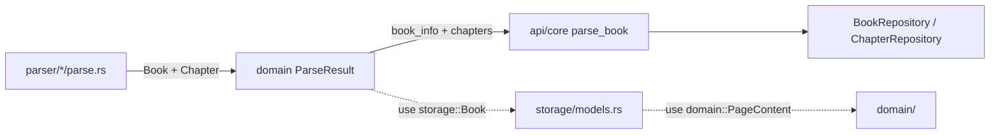
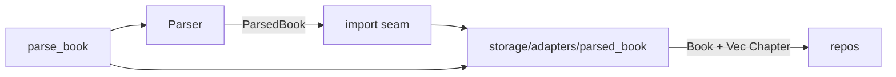

# 导入 seam 引入 domain ParsedBook

## 目标

修复当前 **import seam 泄漏**：parser 直接构造 SQLite 行类型，[`domain/types/metadata.rs`](rust/src/domain/types/metadata.rs) 反向依赖 [`storage/models.rs`](rust/src/storage/models.rs)。

**成功标准：**
- `domain/` 不再 `use crate::storage::models::{Book, Chapter}`
- 4 个格式 parser（TXT / EPUB / PDF / MD）返回 `ParsedBook`
- `parse_book` 通过 **单一 adapter** 持久化，行为与 today 一致（含 `book_id` UUID、章节边界语义不变）
- 现有测试绿：`api_test` parse 用例、parser 单元测试、EPUB 阅读链测试（若已存在）

**零 Dart/FRB 变更：** `ParseResult`  today 无 `#[frb]`，Dart 仍消费 `storage::Book` / `Chapter`；adapter 输出不变。

---

## 现状：seam 泄漏



**问题（架构词汇）：**
- `ParseResult` module **shallow** — interface 等于 SQLite row shape
- parser 测试被迫了解 `Chapter.id` / `cached_at` 等 persist 字段
- `chapter_detect`、`epub/toc` 在 text/parser 层直接 emit `storage::Chapter`

**涉及文件（全量）：**

| 层 | 文件 |
|----|------|
| domain | [`metadata.rs`](rust/src/domain/types/metadata.rs) — 删/替换 `ParseResult` |
| domain | **新建** `types/parsed_book.rs` |
| adapter | **新建** `storage/adapters/parsed_book.rs` |
| parser | [`txt/parse.rs`](rust/src/parser/txt/parse.rs), [`epub/parse.rs`](rust/src/parser/epub/parse.rs), [`epub/toc.rs`](rust/src/parser/epub/toc.rs), [`pdf/parse.rs`](rust/src/parser/pdf/parse.rs), [`md/parse.rs`](rust/src/parser/md/parse.rs), [`mod.rs`](rust/src/parser/mod.rs) |
| text | [`chapter_detect.rs`](rust/src/text/chapter_detect.rs) |
| api | [`core.rs`](rust/src/api/core.rs) `parse_book` |

---

## 目标架构



- **Parser module**：只产出 parse-time 语义（标题、边界、format）
- **Adapter module**：唯一知道 `Book`/`Chapter` 行形状的地方（`id`、`cached_at`、`added_at` 在此生成）
- **Domain module**：`ParsedBook` 纯数据结构，无 storage import

---

## Domain 类型设计

新建 [`rust/src/domain/types/parsed_book.rs`](rust/src/domain/types/parsed_book.rs)：

```rust
/// 解析阶段的书籍元数据（persist 前）
pub struct ParsedBookMetadata {
    pub file_path: String,
    pub title: String,
    pub author: Option<String>,
    pub cover_path: Option<String>,
    pub description: Option<String>,
    pub publisher: Option<String>,
    pub translator: Option<String>,
    pub isbn: Option<String>,
    pub file_size: i64,
    pub total_characters: i64,
    pub format: BookFormat,   // 见下方 BookFormat 决策
}

/// 解析阶段的章节（无 DB id / cached_at / book_id）
pub struct ParsedChapter {
    pub title: String,
    pub chapter_index: i64,
    pub level: i64,
    /// TXT/MD: 文件字节偏移；EPUB/PDF: spine/页索引
    pub start_index: i64,
    pub end_index: i64,
}

pub struct ParsedBook {
    pub metadata: ParsedBookMetadata,
    pub chapters: Vec<ParsedChapter>,
}
```

**刻意不包含的 persist 字段：**

| 字段 | 生成位置 |
|------|----------|
| `book_id` | adapter（`Uuid::new_v4()`，与 today 一致） |
| `Chapter.id` | adapter |
| `Chapter.cached_at` / `Book.added_at` | adapter（`Utc::now()`） |
| `Book.status` / `is_pinned` | adapter（`Default`） |

**`BookFormat` 决策（推荐 Phase 0 一并做）：**

- 将 [`BookFormat`](rust/src/storage/models.rs) 移到 `domain/types/book_format.rs`
- `storage/models.rs` 改为 `pub use crate::domain::BookFormat`（保持 Dart FRB 路径可通过 re-export 不变，或保留 storage 侧 type alias）
- 理由：format 是 parse 语义，不是 SQLite 专有

**`ParseResult` 迁移：**

- Phase 4 删除 `ParseResult`
- 过渡期可 `pub type ParseResult = ParsedBook` + 字段 rename shim（不推荐长期保留；结构字段名不同，`book_info` → `metadata`）

---

## Adapter interface

新建 [`rust/src/storage/adapters/parsed_book.rs`](rust/src/storage/adapters/parsed_book.rs)：

```rust
/// 将 parse 输出转为 persist 行并写入 DB，返回 book_id
pub async fn persist_parsed_book(
    pool: &SqlitePool,
    parsed: ParsedBook,
) -> Result<String, AppError> {
    let book_id = Uuid::new_v4().to_string();
    let book = to_book(&book_id, &parsed.metadata);
    let chapters = to_chapters(&book_id, &parsed.chapters);
    BookRepository::save(pool, &book).await?;
    BookRepository::save_metadata(pool, &book).await?;
    ChapterRepository::save(pool, &book_id, &chapters).await?;
    Ok(book_id)
}

fn to_book(book_id: &str, meta: &ParsedBookMetadata) -> Book { ... }
fn to_chapters(book_id: &str, chapters: &[ParsedChapter]) -> Vec<Chapter> { ... }
```

**`parse_book` 瘦身后：**

```rust
let parsed = parser.parse(&validated_path).await?;
let book_id = persist_parsed_book(&pool, enrich_file_size(parsed, metadata.len())).await?;
Ok(book_id)
```

`enrich_file_size`：today parser 部分 format 写 `file_size: 0`，adapter 或 `parse_book` 层用 `fs::metadata` 补齐（保持现有行为）。

---

## 下游模块迁移

### 1. `text/chapter_detect.rs`

- 返回 `Vec<ParsedChapter>`，去掉 `book_id` 参数
- `extract_chapters(content, max_chapters)` — index/边界逻辑不变

### 2. `parser/epub/toc.rs`

- `extract_chapters_from_epub(...) -> Vec<ParsedChapter>`（去掉 `book_id` 参数）
- `Chapter::new(...)` → `ParsedChapter { ... }`
- spine 拆分逻辑（`MAX_SPINE_ITEMS_PER_CHAPTER = 20`）原样保留

### 3. 各 format `parse_*.rs`

统一模式：

```rust
// before
let book_id = Uuid::new_v4().to_string();
let chapters = extract_...(..., &book_id);
let book_info = Book { book_id, ... };
Ok(ParseResult { book_info, chapters })

// after
let chapters = extract_...(...);
Ok(ParsedBook {
    metadata: ParsedBookMetadata { file_path, title, format: BookFormat::Txt, ... },
    chapters,
})
```

### 4. `parser/mod.rs`

```rust
pub async fn parse(self, file_path: &str) -> Result<ParsedBook, AppError>
```

---

## 分阶段实施

### Phase 0 — 类型 + adapter（并行旧路径）

- 新建 `ParsedBook` / `ParsedChapter` / `BookFormat`（若迁移）
- 实现 `persist_parsed_book` + 单元测试（字段映射表驱动断言）
- **不删** `ParseResult`，不改编 parser
- **验证：** adapter 单测：`ParsedBook` → `Book`/`Chapter` 字段一一对应

### Phase 1 — 章节提取层

- 迁移 `chapter_detect.rs`、`epub/toc.rs` → `ParsedChapter`
- EPUB/TXT parser 内部改用新类型，对外仍包一层转 `ParseResult`（临时 shim 函数 `parsed_to_legacy` 仅测试用，或直接改 parser 返回）
- **验证：** `toc.rs` / `chapter_detect` 现有 unit tests

### Phase 2 — 四格式 parser

- TXT → EPUB → PDF → MD 顺序迁移（TXT 最简单，EPUB 依赖 toc）
- `Parser::parse` 返回 `ParsedBook`
- **验证：** 各 `parse.rs` 内 `#[cfg(test)]`

### Phase 3 — 接入 `parse_book`

- [`api/core.rs:128-185`](rust/src/api/core.rs) 改用 `persist_parsed_book`
- 删除 parser 内 `BookRepository` 相关任何残留（today 无，仅在 api 层）
- **验证：** [`api_test.rs`](rust/tests/api_test.rs) `test_parse_book_*`

### Phase 4 — 清理

- 删除 `ParseResult` 与 `metadata.rs` 中对 storage 的 import
- 更新 `domain/mod.rs` 文档（「纯数据结构」终于成立）
- 删除过渡 shim
- **验证：** `cargo clippy -- -D warnings && cargo test`

---

## 测试策略

| 测试 | 位置 | 验证 |
|------|------|------|
| Adapter 映射 | `storage/adapters/parsed_book.rs` tests | `ParsedChapter` → `Chapter` 边界、title、index；`book_id`/`id` 由 adapter 生成 |
| Parser 行为不变 | 现有 parser unit tests | 改断言为 `ParsedBook` 字段 |
| 导入 E2E | `api_test` + EPUB chain test | `parse_book` 后 DB 中 bounds 与改前一致 |
| 回归对照 | 可选 snapshot | 同一 fixture parse 前后 `ChapterRepository::find_by_book` 结果 serde 相等 |

**Adapter 测试示例断言：**

```rust
let parsed = ParsedBook { metadata: ..., chapters: vec![
    ParsedChapter { title: "Ch1", chapter_index: 0, level: 0, start_index: 0, end_index: 100, },
]};
let chapters = to_chapters("book-1", &parsed.chapters);
assert_eq!(chapters[0].book_id, "book-1");
assert_eq!(chapters[0].start_index, 0);
assert!(!chapters[0].id.is_empty());
```

---

## 风险与约束

| 风险 | 缓解 |
|------|------|
| `BookFormat` 移动影响 FRB/Dart | storage 侧 `pub use domain::BookFormat` 保持 import 路径；改后跑 `dart analyze` 确认 |
| EPUB spine index vs byte offset 语义 | **不改语义**，仅换类型；文档在 `ParsedChapter.start_index` 注释中保留 |
| `chapter_index` 拆分后子章 index 规则 | toc.rs 逻辑原样搬运，adapter 不 reinterpret |
| 与 ReadingOrchestrator  refactor 冲突 | **独立 seam**；`parse_book` 留 core 或后续迁 `api/import.rs`，与 reading 无关 |
| 开发版「清库重导」前提 | 无 migration 脚本；旧 DB 脏数据不在 scope |

---

## 预期收益

- **deletion test 通过：** 去掉 adapter 则 persist 知识无处安放；去掉 ParsedBook 则 parser 重新绑死 storage
- **locality：** 行形状变更（如新增 `Chapter` 列）只改 adapter
- **interface is the test surface：** parser 测试断言 `ParsedChapter` 边界，不碰 UUID/SQLite
- **two adapters justify the seam：** parser（prod）+ in-memory fake（测试）可 mock parse 输出

---

## 建议执行顺序

1. **本计划 Phase 0–4**（import seam）
2. [ReadingOrchestrator 抽出](c:\Users\20840\.cursor\plans\readingorchestrator_extraction_56b0ee96.plan.md)（阅读 seam，与 import 正交）
3. [EPUB 阅读链集成测试](c:\Users\20840\.cursor\plans\epub_reading_chain_tests_019c870d.plan.md)（验证 parse → read 不断裂）

可选后续：domain `ParsedBook` 术语写入项目 `CONTEXT.md`（若建立 domain glossary）。
