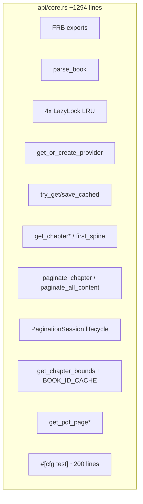

# 抽出 ReadingOrchestrator，瘦身 api/core.rs

## 问题与目标

[`rust/src/api/core.rs`](rust/src/api/core.rs) 当前是 **god module**：FFI 导出、4 个全局 LRU、layout cache、provider 工厂、分页、session 生命周期、章节读取、PDF 入口、内联集成测试全部混在一起。

**目标：**
- **locality**：阅读链 bug 集中在一个 deep module
- **interface 不变**：Dart/FRB 签名零改动（`#[frb]` 仍留在 `api/core.rs`）
- **leverage**：`pagination_session_test.rs` + `epub_reading_chain_test.rs` 作为每步 checkpoint

**成功标准：**
- `api/core.rs` 降至 ~200 行（薄 wrapper + `parse_book` + PDF 暂留）
- `cargo test` + 本地 EPUB 链测试全绿
- `api/epub.rs` 对 `get_chapter_bounds` 的依赖改指向新模块

---

## 现状职责分布



| 块 | 行级位置 | 迁出? |
|----|----------|-------|
| `parse_book` | L128-185 | **留** core（导入 seam，非阅读编排） |
| 4 全局 cache + session | L47-120, L691-906 | **迁** |
| `try_get/save_cached` | L198-280 | **迁** → 子模块 `layout_cache.rs` |
| `get_or_create_provider` | L283-342 | **迁** |
| `get_chapter*` / `first_spine` | L350-500 | **迁** |
| `paginate_*` / `get_page_content` | L508-689 | **迁** |
| session API | L691-906 | **迁** |
| `get_chapter_bounds` | L924-956 | **迁**（`pub(crate)` 供 epub 用） |
| PDF | L966-991 | **暂留** core 或后续 `api/pdf.rs` |
| 内联 tests | L1000+ | **迁** 到 `tests/` 或 `reading` 模块 test |

---

## 目标模块结构

```
rust/src/
  reading/
    mod.rs                  # pub use + re-exports for api layer
    orchestrator.rs         # ReadingOrchestrator struct + global instance
    session.rs              # PaginationSessionEntry, handle 逻辑
    provider_cache.rs       # PROVIDER_CACHE + get_or_create_provider
    streamer_cache.rs       # STREAMER_CACHE + get_page_content 查表
    layout_cache.rs         # try_get_cached / try_save_cached
    chapter_access.rs       # get_chapter / partial / first_spine / bounds
    pagination.rs           # paginate_chapter / paginate_all_content
  api/
    core.rs                 # 薄 FFI：validate_path → orchestrator.method()
```

[`lib.rs`](rust/src/lib.rs) 增加 `pub mod reading;`（内部模块，`api` 以外不对外暴露）。

---

## ReadingOrchestrator 接口（内部，非 FRB）

```rust
// reading/orchestrator.rs
pub struct ReadingOrchestrator {
    provider_cache: ProviderCache,
    streamer_cache: StreamerCache,
    session_store: SessionStore,
    book_id_cache: BookIdCache,
    layout_cache: LayoutCacheAdapter,
}

impl ReadingOrchestrator {
    pub fn global() -> &'static Self { ... }  // LazyLock 单例，匹配现有 FFI 语义

    // 章节读取
    pub async fn get_chapter_bounds(&self, path: &str, chapter_index: i32) -> Result<(i32, i32), AppError>;
    pub async fn get_chapter(&self, ...) -> Result<ChapterContent, AppError>;
    pub async fn get_chapter_partial(&self, ...) -> Result<String, AppError>;
    pub async fn get_chapter_first_spine_only(&self, ...) -> Result<FirstSpineResult, AppError>;

    // 分页
    pub async fn paginate_chapter(&self, ...) -> Result<PaginateResult, AppError>;
    pub async fn paginate_all_content(&self, ...) -> Result<Vec<PageContent>, AppError>;
    pub fn get_page_content(&self, ...) -> String;

    // Session
    pub async fn create_pagination_session(&self, ...) -> Result<(PaginationSessionHandle, PaginateResult), AppError>;
    pub async fn create_pagination_session_adopt(&self, ...) -> ...;
    pub async fn repaginate_session(&self, ...) -> ...;
    pub async fn paginate_session_full(&self, ...) -> ...;
    pub fn get_session_page_content(&self, ...) -> Result<String, AppError>;
    pub fn dispose_pagination_session(&self, ...) -> Result<(), AppError>;

    #[cfg(test)]
    pub fn clear_caches_for_test(&self) { ... }  // 替代 tests 直接 lock PROVIDER_CACHE
}
```

**设计原则：**
- **一个 adapter = hypothetical seam**：全局单例即可，不强行 DI（FFI 无构造器入口）
- **两个 adapter 才 justify seam**：layout cache、provider 各自独立文件，便于后续 mock
- FRB 类型（`PaginationSessionHandle`, `ChapterContent`, `FirstSpineResult`）可留在 `api/core.rs` 或迁到 `reading/types.rs` 再由 core re-export — 推荐 **`reading/types.rs`**，core 只做 `pub use`

---

## api/core.rs 瘦身后的形态

```rust
// api/core.rs — 示意，~15 个 FRB 函数各 3-5 行
pub async fn paginate_chapter(file_path: String, ...) -> Result<PaginateResult, AppError> {
    let path = validate_file_path(&file_path)?;
    ReadingOrchestrator::global()
        .paginate_chapter(&path, chapter_index, config, max_chars)
        .await
}

pub async fn parse_book(file_path: String) -> Result<String, AppError> {
    // 不动 — 导入 seam
}
```

[`api/epub.rs`](rust/src/api/epub.rs) 改动一行：

```rust
// 前: crate::api::core::get_chapter_bounds(...)
// 后: crate::reading::get_chapter_bounds(...)  // pub(crate) re-export
```

**不触发 FRB codegen**：所有 `#[frb]` 函数签名、参数类型、返回类型保持字面一致。

---

## 分阶段迁移（checkpoint 制）

每阶段末尾：`cargo clippy -- -D warnings` + `cargo test` + 本地 `cargo test --test epub_reading_chain_test`。

### Phase 1 — 骨架 + cache 子模块（低风险）

- 新建 `reading/` 目录与空 `ReadingOrchestrator`
- **剪切** 4 个 `LazyLock` + 常量 → 各自 cache 文件
- `get_chapter_bounds` + `BOOK_ID_CACHE` → `chapter_access.rs`
- core.rs 改为 `ReadingOrchestrator::global().get_chapter_bounds(...)`
- 验证：`api/epub.rs` 编译通过

### Phase 2 — 分页 + layout cache

- 迁 `try_get/save_cached` → `layout_cache.rs`
- 迁 `get_or_create_provider` → `provider_cache.rs`
- 迁 `paginate_chapter`, `paginate_all_content`, `get_page_content` → `pagination.rs` + `streamer_cache.rs`
- core.rs 仅 delegate

### Phase 3 — Session 生命周期

- 迁 `PaginationSessionEntry`, `SESSION_MAP`, `apply_session_repagination`
- 迁 `create_*`, `repaginate_*`, `paginate_session_full`, `get_session_page_content`, `dispose_*`
- **重点回归**：[`pagination_session_test.rs`](rust/tests/pagination_session_test.rs) 12 场景 + [`epub_reading_chain_test.rs`](rust/tests/epub_reading_chain_test.rs) P0

### Phase 4 — 章节读取 + 测试清理

- 迁 `get_chapter`, `get_chapter_partial`, `get_chapter_first_spine_only`
- 将 `core.rs` 内 `#[cfg(test)]` 模块（~200 行，含 EPUB stale bounds）→
  - 已有逻辑并入 `epub_reading_chain_test.rs`（stale bounds 已在 P2）
  - TXT cache 测试并入 `tests/reading_orchestrator_test.rs` 或保留 orchestrator 单元 test
- 删除 core.rs 中已迁出的 private fn
- 目标：`core.rs` ≤ 250 行

---

## 与 EPUB 集成测试的协同

| 顺序 | 建议 |
|------|------|
| **已有** | [`epub_reading_chain_test.rs`](rust/tests/epub_reading_chain_test.rs) P0 四条已覆盖 partial→full、重复页、monotonic |
| **Refactor 前** | 确认本地 EPUB 测试全绿，作为 baseline |
| **每 Phase 后** | 重跑 TXT session + EPUB chain |
| **Phase 4 后** | 在 `ReadingOrchestrator::clear_caches_for_test()` 替换 tests 里直接 `PROVIDER_CACHE.lock().clear()`（当前 [`core.rs:1210`](rust/src/api/core.rs) 内联测试写法） |

---

## 刻意不做（本计划范围外）

- **ParsedBook seam**（domain/storage 解耦）— 独立 refactor
- **EPUB first_spine 统一到 provider** — 可在 Phase 4 顺手做，但不阻塞 orchestrator 抽出
- **PDF 迁出 `api/pdf.rs`** — Phase 4 之后的小 PR
- **FRB codegen 重跑** — 无签名变更则不需要
- **Dart 侧改动** — 零

---

## 风险与缓解

| 风险 | 缓解 |
|------|------|
| 全局 cache 迁移动作语义漂移 | 原样剪切代码，不改逻辑；测试门禁 |
| `parking_lot::MutexGuard` 跨 await | 保持现有「锁内 clone / 锁外 await」模式，不 refactor 并发 |
| 测试直接访问 `PROVIDER_CACHE` | Phase 4 统一改为 `clear_caches_for_test()` |
| 文件间循环依赖 | 依赖方向：`orchestrator → {session, pagination, chapter_access, *cache}`，cache 层不引用 session |

---

## 验收清单

- [ ] `api/core.rs` ≤ 250 行，无业务逻辑块（仅 validate + delegate + parse_book + PDF）
- [ ] `reading/` 模块可单独打开理解完整阅读链
- [ ] `cargo test` 全绿（含 `pagination_session_test`, `epub_reading_chain_test`）
- [ ] `cargo clippy -- -D warnings` 通过
- [ ] `api/epub.rs` 不再依赖 `api::core` 内部函数
- [ ] 无 FRB 签名变更
