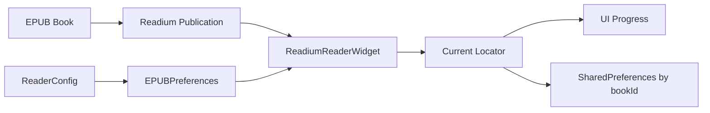

# 阅读核心 — 领域模型

> Phase 0 产出；EPUB Readium MVP 更新（2026-07-31）。实现渐进，**语义**以此为准。
> 术语见 [glossary.md](./glossary.md)；边界见 [READING_BOUNDARIES.md](./READING_BOUNDARIES.md)。

> **当前路线覆盖**：[ADR-020](./adr/020-epub-readium-mvp.md) 取代 ADR-019
> 作为当前实施路线。下文 IR/Builtin/ReadingBackend 模型保留为历史与未来参考，
> 不是当前 MVP 验收面。

## 0. 当前 MVP 模型



| 概念 | 当前语义 |
|---|---|
| `Publication` | EPUB 打开产物，提供 metadata、TOC 和 reading order |
| `ReadiumReaderWidget` | 唯一正文渲染视口；`onReady` 是生命周期门槛 |
| `Locator` | MVP 导航、进度与恢复坐标；不存页码 |
| `ReaderConfig` | Flutter 侧用户设置，viewport ready 后映射为 `EPUBPreferences` |
| `ReadiumViewModel` | publication、viewport 事件、Locator 保存和 UI 状态的单一协调者 |

---

## 1. 核心实体

```mermaid
erDiagram
    Book ||--o{ Chapter : contains
    Chapter ||--|| ChapterDocument : loads_to
    ChapterDocument ||--|| ContentIR : has
    ChapterDocument ||--|| PlainText : projects
    ChapterDocument ||--o| RichPayload : legacy_scroll
    ReadingSession ||--|| ReadingPosition : tracks
    ReadingPosition }o--|| Chapter : at
    ReadingPosition ||--o| EnginePositionHint : may_have
    PaginationView }o--|| ContentIR : derives_from
    ScrollView }o--|| ContentIR : derives_from
    StagingCache }o--|| Chapter : prefetches

### Book / Chapter

- 书架与目录；`chapterIndex` 为导航主键。

### ChapterDocument（章加载产物）

| 字段 | 类型 | 说明 |
|------|------|------|
| `chapterIndex` | int | |
| `blocks` | `ContentBlock[]` | **渲染输入**（scroll + pagination，ADR-009） |
| `plainText` | String | **进度/搜索/TTS 锚点**（IR 投影，ADR-001/008） |
| `rich` | RichPayload? | **过渡**；Phase 4 目标由 IR 替代 scroll 主路径 |

### ReadingPosition（持久化进度）

| 字段 | 类型 | 说明 |
|------|------|------|
| `chapterIndex` | int | |
| `charOffset` | int | 在 `plainText` 内的 UTF-16 code-unit offset（ADR-017） |
**不持久化** `pageIndex`（ADR-001）。

**不持久化** Readium Locator（ADR-019）— 仅作为 EnginePositionHint 保存。

**不持久化** `pageIndex`（ADR-001）。

### PaginationView（派生视图）

| 字段 | 类型 | 说明 |
|------|------|------|
| `descriptors` | PageDescriptor[] | IR/`plainText` 上的页范围 |
| `pageIndex` | int | 运行时；由 `charOffset` 推算 |

### ScrollView（派生视图，Phase 4）

| 字段 | 类型 | 说明 |
|------|------|------|
| `segments` | ScrollChapterSegment[] | 多章 IR 块序列拼接 |
| `scrollOffset` | double | 运行时；映射回 `charOffset` |

### ContentBlock（IR，Phase 2+）

| 变体 | 说明 |
|------|------|
| `Text` | 块级样式（`text_indent`、margin 等，ADR-010）+ span |
| `Image` | `asset_id`，字节懒加载 |

章 = `Vec<ContentBlock>`；块分页产出 `PageInfo`（页 → 块 id 范围）。

### StagingCache（性能层，ADR-004 / ADR-012）

- 缓存**相邻章**首屏/末屏分页结果与块数据。
- **不是**第二套 ChapterDocument；不替代 ReadingPosition。
- adjacent 跨章时 **必须预取命中**，不得向用户展示 loading（ADR-012）。

---

### ReadingBackend（Phase R1 新增 seam）

**不是领域实体**，而是 Adapter 抽象 seam。放在此处以保持领域模型的可见性。

```dart
abstract interface class ReadingBackend {
  ReadingBackendKind get kind;
  ReadingCapabilities get capabilities;
  ValueListenable<ReadingSnapshot> get snapshot;

  Future<void> open(ReadingOpenRequest request);
  Future<void> execute(ReadingCommand command);
  Future<void> applyPreferences(ReadingPreferences preferences);
  Future<void> close();
}
```

| 字段 | 说明 |
|------|------|
| `kind` | builtin / readium |
| `capabilities` | 引擎支持的能力列表 |
| `snapshot` | 原子阅读状态快照 |

### ReadingCapabilities（引擎能力描述）

引擎不支持的能力必须显式标记，UI 据此决定显示/禁用/降级，禁止空实现。

```dart
class ReadingCapabilities {
  final bool pagination;
  final bool continuousScroll;
  final bool precisePosition;
  final bool textSelection;
  final bool annotations;
  final bool nativeTts;
  final bool customFont;
  final bool letterSpacing;
  final bool paragraphSpacing;
  final bool firstLineIndent;
}
```

### ReadingSnapshot（原子阅读状态快照）

每页一次看到内部一致的一份状态，而非分别订阅多个可能不同步的信号。

```dart
class ReadingSnapshot {
  final ReadingStatus status;
  final String bookTitle;
  final String chapterTitle;
  final double totalProgress;
  final ReadingPosition? position;
  final String? errorMessage;
}
```

### EnginePositionHint（引擎私有位置加速）

只用于恢复加速，不是跨功能真理。Locator 与当前出版物指纹不匹配时必须丢弃。

```dart
class EnginePositionHint {
  final ReadingBackendKind engineKind;
  final String publicationFingerprint;
  final String opaqueLocator;
}
```

---

## 2. 用例 → 实体（谁读谁）

| 用例 | 读什么 | 模式 |
|------|--------|------|
| 显示当前页 | PaginationView + IR 块 | pagination / pageTurn |
| 滚动显示 | IR 块（目标）/ rich 过渡 | scroll |
| 存进度 | ReadingPosition | 全模式 |
| 书签/笔记 | ReadingPosition + plain 内 offset | 全模式 |
| 全书搜索 | plainText（FTS） | 全文 ready 后 |
| TTS | plainText | 全文 ready 后 |
| 双语 | IR/plain + 翻译 API | 独立 feature；设置开启 |
| 换章丝滑 | StagingCache | pagination / pageTurn |
| Readium 渲染 | ReadiumBackend → ReadiumViewport | Readium adapter |
| 引擎选择 | ReadingBackendPolicy | 按格式/配置 |
---

## 3. 不变量（违反即 bug）

### EPUB Readium MVP（当前）

1. **M1**：只有 EPUB 可进入阅读视口；非 EPUB 必须显式拒绝。
2. **M2**：原生 viewport `onReady` 前不得应用设置、导航或发布 ready。
3. **M3**：进度和恢复使用 Locator，不持久化页码。
4. **M4**：关闭必须幂等；退出后事件不得回写 UI。
5. **M5**：打开失败必须可见且可重试；不得发布 ready。

### 双引擎模型（已暂停）

> I1-I7 保留不变。新增 Phase R1 不变量：

> **I1**：持久化只用 `ReadingPosition`，不用 `pageIndex`。

1. **I1**：持久化只用 `ReadingPosition`，不用 `pageIndex`。
2. **I2**：`plainText` 全文未 ready 时，不跑 TTS/搜索索引。
3. **I3**：分页输入为 IR，不并行拉 EPUB rich FFI。
4. **I4**：staging 只加速换章，不改变 I1 的进度语义。
5. **I5**：pageTurn 与 pagination 共享同一 PaginationView 加载路径（ADR-002）。
6. **I6**：scroll 与 pagination **渲染输入均为 IR**（ADR-009）；`plainText` 仍为进度锚点。
7. **I7**：adjacent 跨章 staging 未就绪时 **不得** 展示可见 loading（ADR-012）。
8. **I8**：引擎切换时，`ReadingPosition` 保持为统一格式；Readium Locator 仅作为 hint。
9. **I9**：不支持的能力必须通过 `ReadingCapabilities` 显式暴露，不得空实现。
10. **I10**：Readium Locator 与当前出版物指纹不匹配时必须丢弃（不用于恢复）。
---

## 4. 双引擎历史现状（2026-07-22，已暂停）

| 目标实体 | 现状 | 状态 |
|----------|------|------|
| ContentIR | scroll + pagination 均走 IR 主路径 | ✅ P4-1 |
| ChapterDocument.plainText | `chapterContent` + IR 投影 | ✅ 对齐 ADR-001/008 |
| PaginationView | `RustPaginationSession` + descriptors + 块渲染 | ✅ P4-2/P4-4 |
| ScrollView | `ScrollBoundaryCoordinator` + IR 段 | ✅ P4-1 |
| RichPayload | block `font_size` 贯穿 IR → Flutter | ✅ G1+G2 |
| StagingCache | `next/prevChapterStaging` 零 spinner | ✅ P4-3 |
| ReadingPosition | `chapterIndex` + `currentCharOffset` | ✅ I1 fixed |
| Bilingual | 独立 `features/bilingual/` 模块 | ✅ P4-5 |
| ReadingBackend | 抽象 seam — 待实现 | 🔄 R04/R05 |
| ReadingCapabilities | 引擎能力描述 — 待实现 | 🔄 R02 |
| EnginePositionHint | 引擎私有位置加速 — 待实现 | 🔄 R03 |
| ReadiumPositionMapper | Locator ↔ charOffset 双向映射 — 待实现 | 🔄 R06 |

---

## 5. 北极星（EPUB Readium MVP）

> **EPUB 文件由 Readium 原生视口渲染；Flutter 只负责壳层、设置和状态。**
> **viewport ready 后才应用 preference；Locator 负责导航/进度/恢复；错误可见、关闭幂等。**
