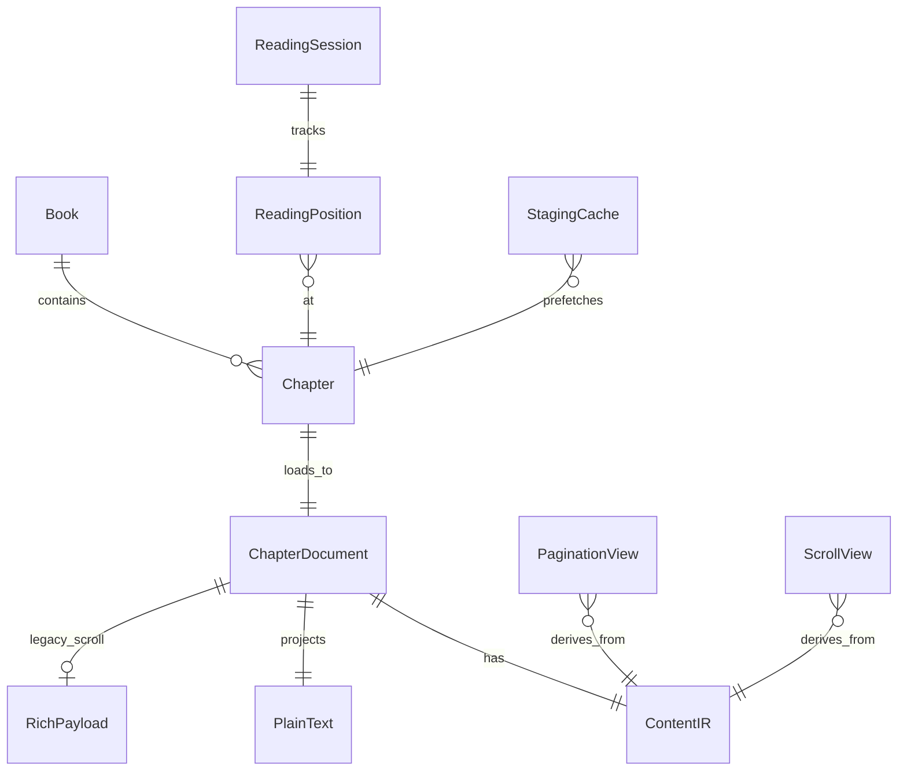

# 阅读核心 — 领域模型

> Phase 0 产出；Phase 4 更新（2026-06-25）。实现渐进，**语义**以此为准。  
> 术语见 [glossary.md](./glossary.md)；边界见 [READING_BOUNDARIES.md](./READING_BOUNDARIES.md)。

---

## 1. 核心实体

### Book / Chapter

- 书架与目录；`chapterIndex` 为导航主键。

### ChapterDocument（章加载产物）

| 字段 | 类型 | 说明 |
|------|------|------|
| `chapterIndex` | int | |
| `blocks` | `ContentBlock[]` | **渲染输入**（scroll + pagination，ADR-009） |
| `plainText` | String | **进度/搜索/TTS 锚点**（IR 投影，ADR-001/008） |
| `rich` | RichPayload? | **过渡**；Phase 4 目标由 IR 替代 scroll 主路径 |

### ReadingPosition（持久化进度）

| 字段 | 类型 | 说明 |
|------|------|------|
| `chapterIndex` | int | |
| `charOffset` | int | 在 `plainText` 内的字符索引 |

**不持久化** `pageIndex`（ADR-001）。

### PaginationView（派生视图）

| 字段 | 类型 | 说明 |
|------|------|------|
| `descriptors` | PageDescriptor[] | IR/`plainText` 上的页范围 |
| `pageIndex` | int | 运行时；由 `charOffset` 推算 |

### ScrollView（派生视图，Phase 4）

| 字段 | 类型 | 说明 |
|------|------|------|
| `segments` | ScrollChapterSegment[] | 多章 IR 块序列拼接 |
| `scrollOffset` | double | 运行时；映射回 `charOffset` |

### ContentBlock（IR，Phase 2+）

| 变体 | 说明 |
|------|------|
| `Text` | 块级样式（`text_indent`、margin 等，ADR-010）+ span |
| `Image` | `asset_id`，字节懒加载 |

章 = `Vec<ContentBlock>`；块分页产出 `PageInfo`（页 → 块 id 范围）。

### StagingCache（性能层，ADR-004 / ADR-012）

- 缓存**相邻章**首屏/末屏分页结果与块数据。
- **不是**第二套 ChapterDocument；不替代 ReadingPosition。
- adjacent 跨章时 **必须预取命中**，不得向用户展示 loading（ADR-012）。

---

## 2. 用例 → 实体（谁读谁）

| 用例 | 读什么 | 模式 |
|------|--------|------|
| 显示当前页 | PaginationView + IR 块 | pagination / pageTurn |
| 滚动显示 | IR 块（目标）/ rich 过渡 | scroll |
| 存进度 | ReadingPosition | 全模式 |
| 书签/笔记 | ReadingPosition + plain 内 offset | 全模式 |
| 全书搜索 | plainText（FTS）；**无独立章内搜索 UI**（D4-C） | 全文 ready 后 |
| TTS | plainText | 全文 ready 后 |
| 双语 | IR/plain + 翻译 API | 独立 feature；设置开启 |
| 换章丝滑 | StagingCache | pagination / pageTurn |

---

## 3. 不变量（违反即 bug）

1. **I1**：持久化只用 `ReadingPosition`，不用 `pageIndex`。
2. **I2**：`plainText` 全文未 ready 时，不跑 TTS/搜索索引。
3. **I3**：分页输入为 IR，不并行拉 EPUB rich FFI。
4. **I4**：staging 只加速换章，不改变 I1 的进度语义。
5. **I5**：pageTurn 与 pagination 共享同一 PaginationView 加载路径（ADR-002）。
6. **I6**：scroll 与 pagination **渲染输入均为 IR**（ADR-009）；`plainText` 仍为进度锚点。
7. **I7**：adjacent 跨章 staging 未就绪时 **不得** 展示可见 loading（ADR-012）。

---

## 4. 现状 vs 目标（2026-06-26 更新）

| 目标实体 | 现状 | 状态 |
|----------|------|------|
| ContentIR | scroll + pagination 均走 IR 主路径 | ✅ P4-1 |
| ChapterDocument.plainText | `chapterContent` + IR 投影 | ✅ 对齐 ADR-001/008 |
| PaginationView | `RustPaginationSession` + descriptors + 块渲染 | ✅ P4-2/P4-4 |
| ScrollView | `ScrollBoundaryCoordinator` + IR 段 | ✅ P4-1 |
| RichPayload | block `font_size` 贯穿 `RichParagraph` → IR → Flutter | ✅ G1+G2 |
| StagingCache | `next/prevChapterStaging` 零 spinner | ✅ P4-3 |
| ReadingPosition | `chapterIndex` + `currentCharOffset`，`pageIndex` 已从持久化移除 | ✅ I1 fixed |
| Bilingual | 独立 `features/bilingual/` 模块，主链零 import | ✅ P4-5 |
---

## 5. 一句话（Phase 4 北极星）

> **进度存 charOffset；渲染统一吃 IR；plain 为搜索/TTS 锚点；staging 预取必须命中、零可见 loading。**
