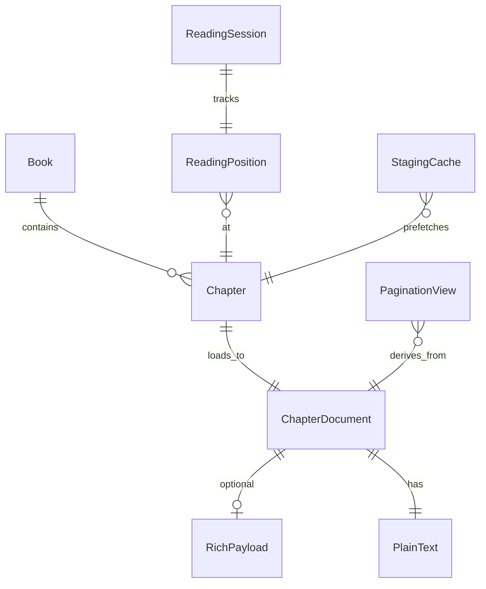

# 阅读核心 — 领域模型

> Phase 0 产出（domain modeling）。实现可以渐进，**语义**以此为准。  
> 术语见 [glossary.md](./glossary.md)；边界见 [READING_BOUNDARIES.md](./READING_BOUNDARIES.md)。

---

## 1. 核心实体

### Book / Chapter

- 书架与目录；`chapterIndex` 为导航主键。

### ChapterDocument（章加载产物）

| 字段 | 类型 | 说明 |
|------|------|------|
| `chapterIndex` | int | |
| `plainText` | String | **权威正文**（搜索、TTS、进度锚点、IR 导出） |
| `rich` | RichPayload? | scroll/bilingual 用；分页 **输入不依赖** rich |

### ReadingPosition（持久化进度）

| 字段 | 类型 | 说明 |
|------|------|------|
| `chapterIndex` | int | |
| `charOffset` | int | 在 `plainText` 内的字符索引 |

**不持久化** `pageIndex`（ADR-001）。

### PaginationView（派生视图）

| 字段 | 类型 | 说明 |
|------|------|------|
| `descriptors` | PageDescriptor[] | 每页在 plain/IR 上的范围 |
| `pageIndex` | int | 运行时；由 `charOffset` 推算 |

### ContentBlock（目标 IR，Phase 2）

| 变体 | 说明 |
|------|------|
| `Text` | 带块级样式与 span |
| `Image` | `asset_id`，字节懒加载 |

章 = `Vec<ContentBlock>`；块分页产出 `PageInfo`（页 → 块 id 范围）。

### StagingCache（性能层，ADR-004）

- 缓存**相邻章**首屏/末屏分页结果与块数据。
- **不是**第二套 ChapterDocument；不替代 ReadingPosition。

---

## 2. 用例 → 实体（谁读谁）

| 用例 | 读什么 | 模式 |
|------|--------|------|
| 显示当前页 | PaginationView + 块/IR | pagination / pageTurn |
| 滚动显示 | rich 或 plain 段落 | scroll |
| 存进度 | ReadingPosition | 全模式 |
| 书签/笔记 | ReadingPosition + plain 内 offset | 全模式 |
| 章内搜索 | plainText | 全文 ready 后 |
| TTS | plainText | 全文 ready 后 |
| 双语 | plainText + 翻译 API | 设置开启；Should |
| 换章丝滑 | StagingCache | pagination / pageTurn |

---

## 3. 不变量（违反即 bug）

1. **I1**：持久化只用 `ReadingPosition`，不用 `pageIndex`。
2. **I2**：`plainText` 全文未 ready 时，不跑 TTS/搜索索引。
3. **I3**：分页路径不并行拉 EPUB rich（Phase 1）；Phase 2 分页输入为 IR，非 rich FFI。
4. **I4**：staging 只加速换章，不改变 I1 的进度语义。
5. **I5**：pageTurn 与 pagination 共享同一 PaginationView 加载路径（ADR-002）。

---

## 4. 现状 vs 目标（诚实映射）

| 目标实体 | 现状近似 | 差距 |
|----------|----------|------|
| ChapterDocument.plainText | `chapterContent` signal | partial firstSpine 曾当全文 |
| RichPayload | `RichParagraph[]` | 分页不用 |
| PaginationView | `RustPaginationSession` + descriptors | plain only，无 Image 块 |
| ContentBlock IR | 无 | Phase 2 |
| StagingCache | `next/prevChapterStaging` | 保留，需与 IR 演进对齐 |
| ReadingPosition | `chapterIndex` + `currentCharOffset` | 已对齐 ADR-001 |

---

## 5. 一句话（Phase 0 验收）

> **进度存 charOffset；正文以 plain 为锚；分页吃 IR（目标）或 plain（过渡）；staging 只负责换章快。**
