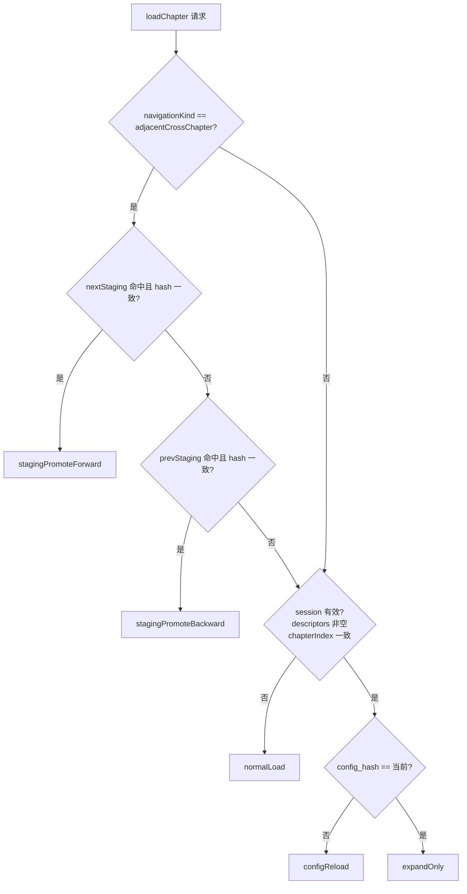

# 章节分页 Intent 契约（Phase 1 冻结）

> **状态**：已文档化（R4-5，2026-06-18）  
> **代码**：`ChapterPaginationIntent` + `chapter_pagination_intent_resolver.dart`  
> **原则**：Phase 1 **保留 5 个 intent**；`normalLoad` / `configReload` 共用 `_runCalibratedPartialPaginate`；新 intent 须 ADR。

---

## 一览

| Intent | 触发场景 | 执行路径 | 典型产出 |
|--------|----------|----------|----------|
| `normalLoad` | 换章、无有效 session、format 不匹配 | `_runCalibratedPartialPaginate` → `beginPaginate(2000)` → await plain → expand | 新 descriptors + full plain |
| `configReload` | 同章 + `config_hash` 变化（字号/行距等） | `_runCalibratedPartialPaginate` → `repaginateInPlace(maxChars=2000)` → expand | 新 descriptors，**不** dispose handle |
| `expandOnly` | 同章 + 同 config + session 已有 partial | 跳过首屏；直接 `expandToFullChapter` | 全章 descriptors |
| `stagingPromoteForward` | 跨章下一章 + `nextChapterStaging` hash 命中 | adopt cache → pageIndex=0 | 零感知换章 |
| `stagingPromoteBackward` | 跨章上一章 + `prevChapterStaging` hash 命中 | adopt cache → pageIndex=last | 零感知换章 |

**staging 双向必须区分**（R4-5）：forward 落首页，backward 落末页；合并为一个 promote 会增加内部分支且无收益。

---

## 推导顺序（`resolveChapterPaginationIntent`）

### session 有效

- `repo.sessionConfigHash != null`
- `repo.descriptors` 非空
- `repo.sessionChapterIndex == request.chapterIndex`

---

## 与各模式关系

| ReadingMode | 走 intent 链？ |
|-------------|----------------|
| `pagination` | 是 |
| `pageTurn` | 是（与 pagination **相同** orchestrator 路径，R4-4） |
| `scroll` / `bilingual` | 否（直读 plain + 可选 rich） |

---

## 禁止事项（Phase 1）

- 不得在 intent 路径并行启动「第二套」`getEpubChapterRichContent`（见 ROADMAP 1.3）。
- 不得用 firstSpine partial 充当持久化 `plainText`（ADR-001 / simplify）。
- 新增第 6 个 intent 前须 ADR 说明触发条件与迁移。

---

## 相关

- [ADR-004](./adr/004-cross-chapter-staging.md) — staging
- [ADR-002](./adr/002-pageturn-is-pagination-skin.md) — pageTurn 共用本链
- [PHASE1_EXIT.md](./PHASE1_EXIT.md) — 验收
