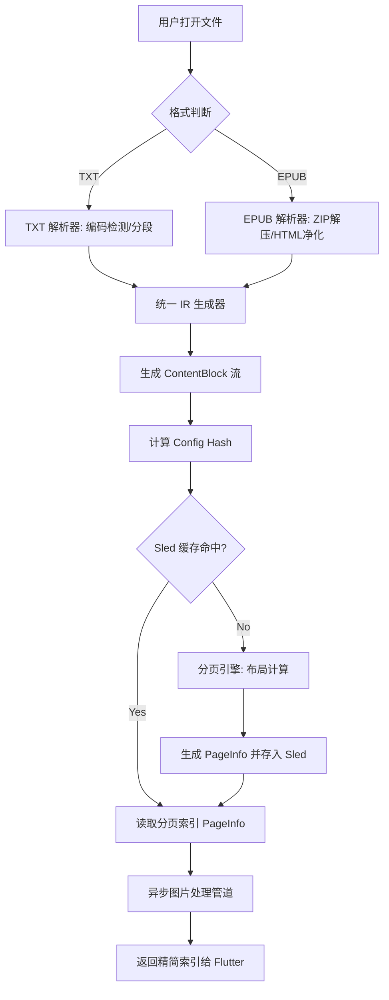

针对 EPUB 和 TXT 这两种差异巨大的格式，在 Rust 层实现核心流程时，核心设计思想是：**“异构输入，统一中间表示 (Unified Intermediate Representation, IR)”**。

无论上层传来的是复杂的 ZIP 压缩包还是纯文本文件，Rust 层的任务是将它们“清洗”并转化为一个标准的、扁平化的**内容流 (Content Stream)**。后续的 pagination（分页）、caching（缓存）和 rendering（渲染准备）都只针对这个 IR 进行，从而复用 90% 以上的逻辑。

以下是核心流程的架构拆解：

### 1. 抽象层：统一的入口与元数据提取

首先，你需要定义一个 `BookSource` 抽象。无论是 `.epub` 还是 `.txt`，在进入系统时都被视为一种资源。

*   **元数据标准化**：
    *   **EPUB**：从 `content.opf` 中提取标题、作者、封面、章节列表（Spine）。
    *   **TXT**：由于缺乏元数据，通常以文件名作为标题，或者通过简单的启发式算法（如第一行）尝试提取。
    *   **产出**：一个统一的 `BookMeta` 结构，包含唯一 ID（用于生成 `config_hash` 的一部分）、总章节数（TXT 可视为单章或按空行分章）。

### 2. 解析层：异构转 IR (The Normalization Phase)

这是 Rust 层最核心的转换环节。目标是消除格式差异。

#### **A. TXT 解析路径 (极简模式)**
*   **输入**：原始字节流。
*   **处理**：
    1.  **编码检测**：自动识别 UTF-8, GBK, Big5 等编码（这对中文阅读器至关重要）。
    2.  **分段策略**：根据用户设置（如“按空行分章”或“固定字数分章”）将长文本切分为逻辑上的 `Chapter`。
    3.  **IR 生成**：将每一段文本标记为 `TextBlock`。如果检测到类似 URL 或图片占位符的特殊标记，可转换为对应的 `ImageBlock` 或 `LinkBlock`。

#### **B. EPUB 解析路径 (复杂模式)**
*   **输入**：ZIP 归档。
*   **处理**：
    1.  **容器解压**：使用 `zip` crate 读取内存或临时文件，建立虚拟文件系统。
    2.  **清单解析**：解析 `META-INF/container.xml` 找到 OPF 文件，再解析 OPF 获取 Manifest（资源表）和 Spine（阅读顺序）。
    3.  **HTML 净化与提取**：
        *   使用 `html5ever` 或 `quick-xml` 解析 XHTML。
        *   **CSS 内联化/简化**：将复杂的 CSS 类名转换为具体的样式属性（FontWeight, FontSize, Color）。
        *   **资源重定向**：将 HTML 中的相对路径图片引用（如 `../images/cover.jpg`）映射为唯一的 `AssetID`。
    4.  **IR 生成**：将解析后的 DOM 树扁平化为一系列 `ContentBlock`（Text, Image, HorizontalRule 等）。

#### **C. 统一的 IR 结构 (The Common Ground)**
最终，两种格式都会变成类似这样的结构：
`Vec<Chapter>`, 其中每个 Chapter 包含 `Vec<ContentBlock>`。
*   `ContentBlock::Text { content: String, style: Style }`
*   `ContentBlock::Image { asset_id: String, alt: Option<String> }`

### 3. 索引与缓存键生成 (Indexing & Hashing)

在分页之前，必须建立高效的查找机制。

*   **全局唯一标识**：为每个 `AssetID`（图片）和每个 `ChapterID` 生成哈希。
*   **Config Hash 计算**：
    *   结合 `BookID` + `FontSize` + `LineHeight` + `PageMargin` + `DPI` 生成 `config_hash`。
    *   这个 Hash 是 Sled KV Store 的核心 Key 前缀。
*   **预扫描 (Pre-scan)**：
    *   对于 TXT，快速统计总行数/字数，估算总页数。
    *   对于 EPUB，统计所有章节的图片数量和文本长度。
    *   **目的**：为了在 UI 层显示进度条和总页数，而不需要立即执行昂贵的分页计算。

### 4. 分页引擎 (The Pagination Engine)

这是纯计算模块，它不关心内容是来自 TXT 还是 EPUB，它只面对 IR。

*   **输入**：`Vec<ContentBlock>` + `ViewportMetrics` (宽、高、字体参数)。
*   **核心算法逻辑**：
    1.  **状态机**：维护当前页的剩余高度 `remaining_height`。
    2.  **文本块处理**：根据行高计算能放下多少行。如果放不下，进行“断行”处理，剩余部分放入下一页。
    3.  **图片块处理**：
        *   查询图片元数据（宽高比）。
        *   根据页面宽度计算缩放后的高度。
        *   **决策**：如果当前页剩余空间不足以放下图片，且图片高度超过阈值，则强制换页（Full-page Image）或缩小插入。
    4.  **产出**：`Vec<PageInfo>`。注意，这里存储的不是具体内容，而是**偏移量索引**（例如：第 1 页包含 Block 0-5，第 2 页包含 Block 6-12）。

### 5. 资源管道与持久化 (Asset Pipeline & Storage)

*   **图片处理流水线**：
    *   当分页引擎遇到 `ImageBlock` 时，它不会立即加载图片二进制，而是记录 `asset_id`。
    *   **后台任务**：Rust 层启动异步任务，根据 `asset_id` 从 EPUB 压缩包或 TXT 关联文件夹中提取原图。
    *   **转码与缓存**：将原图 resize 到适合屏幕的分辨率，转为 WebP，存入文件系统，并在 Sled 中记录 `asset_id -> file_path` 的映射。
*   **分页结果持久化**：
    *   将 `Vec<PageInfo>` 序列化后存入 Sled。Key 为 `chapter_id:config_hash`。
    *   **优势**：下次用户以相同配置打开同一本书时，跳过解析和分页，直接从 Sled 读取索引，实现“秒开”。

### 6. 核心流程总结图

### 7. 架构上的关键权衡

1.  **内存 vs 速度**：
    *   对于超大 TXT（如几百万字的网络小说），不能一次性全部加载进内存生成 IR。
    *   **解决方案**：采用**分块加载 (Chunked Loading)**。Rust 层维护一个“游标”，只将当前章节或前后几章的内容保留在内存 IR 中。切换章节时，卸载旧章节的 IR。

2.  **精确度 vs 性能**：
    *   EPUB 的 CSS 布局非常复杂。完全模拟浏览器行为成本极高。
    *   **解决方案**：在 Rust 层实现一个**“受限的排版子集”**。只支持阅读器常用的样式（加粗、斜体、字号、颜色、对齐）。对于不支持的复杂 CSS（如 Float, Grid），在解析阶段直接降级为基本块级元素。

3.  **一致性保证**：
    *   确保 TXT 和 EPUB 在相同的 `config_hash` 下，其分页算法的行为是一致的。这样用户在切换不同格式的书籍时，阅读体验（翻页节奏）是连贯的。

通过这个流程，Rust 层成功地将“文件格式的复杂性”屏蔽在了内部，向 Flutter 层暴露的是一个干净、高效、可缓存的“页面索引服务”。