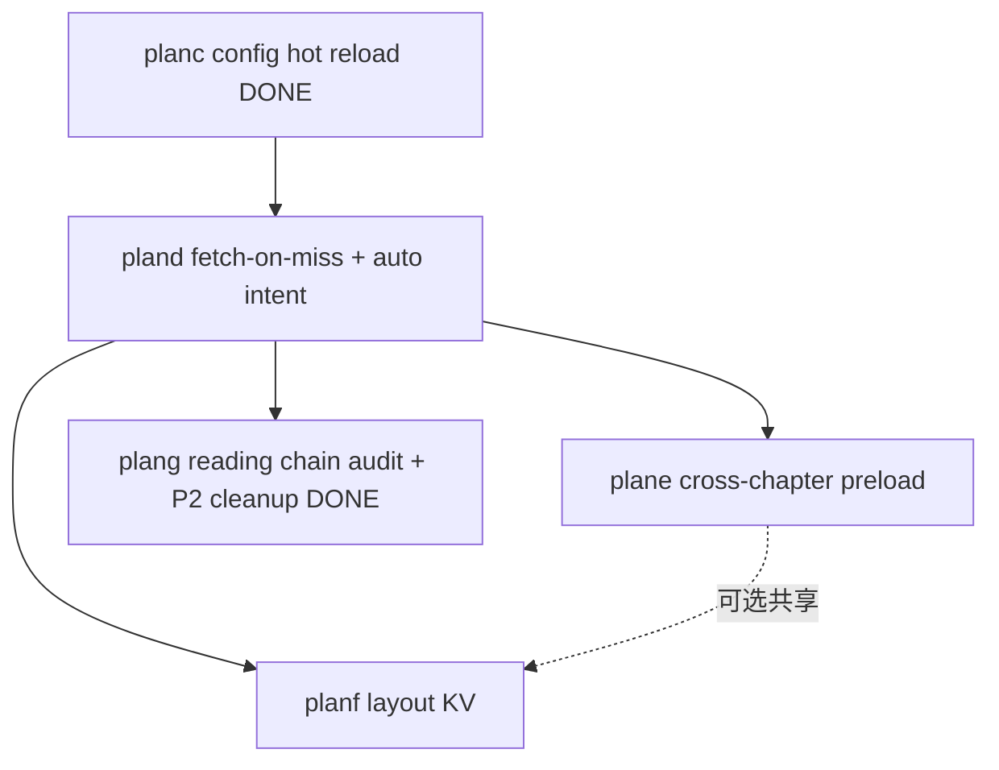

# Reader 引擎与架构规划索引

活跃规划（待实施或进行中）。已完成规划见 [archive/README.md](archive/README.md)。

## 推荐阅读顺序

| 顺序 | 文档                                                               | 主题                                                                                  | 优先级 |
| -- | ---------------------------------------------------------------- | ----------------------------------------------------------------------------------- | --- |
| 1  | [pland.md](pland.md)                                             | pageContent fetch-on-miss + 自动推导 `ChapterPaginationIntent`                          | P0  |
| 2  | [plane-cross-chapter-preload.md](plane-cross-chapter-preload.md) | 跨章无缝翻页（pageTurn 预分页）                                                                | P1  |
| 3  | [planf-layout-kv-cache.md](planf-layout-kv-cache.md)             | Layout KV 与 `paginate_chapter` / session 路径对齐                                       | P1  |
| 4  | [planf.md](planf.md)                                             | 滚动跨章接缝修复（ScrollChapterSegment + ScrollDocumentComposer + ScrollBoundaryCoordinator） | P1  |
| 5  | [plang.md](plang.md)                                             | 核心阅读链状态审计与修复计划（P0/P1/P2 分阶段路线图）                                                     | P2  |

## 已完成（归档）

- [archive/plan-unify-typeset-truth.md](archive/plan-unify-typeset-truth.md) — Rust descriptors 唯一真理
- [archive/planb-pagination-cache-consolidation.md](archive/planb-pagination-cache-consolidation.md) — Session / PageContentCache 收敛
- [archive/planc-session-config-hot-reload.md](archive/planc-session-config-hot-reload.md) — `repaginate_session` + intent 化
- [archive/plang-engine-polish.md](archive/plang-engine-polish.md) — 小优化合集（跳过 redundant full、测试/文档）
- **P2 缝补清理（2026-06-17）** — 删除 `enable_hyphenation` 死代码 + 超大单 spine 检测 + 老书 stale bounds 检测（`ChapterTooLarge`/`StaleBookData` error），见 [`issue/PLAN_EXECUTION_DEVIATIONS.md`](issue/PLAN_EXECUTION_DEVIATIONS.md) |

## 依赖关系

`plane` 与 `planf` 可并行；均建议在 `pland` PR2（auto intent + session 元数据）之后启动。

## P2 清理清单（2026-06-17）

| 任务 | 状态 | 说明 |
|------|------|------|
| TOC href fallback 修复 | ✅ | 失败 entry 改为按 spine 长度顺序分布（不再全部 collapse 到 0）|
| Dart 桥接测试补齐 | ⚡ 部分 | `AppErrorMapper.humanReadable` 覆盖 18 个变体；`RustChapterContentRepository` 完整路径待补 |
| 验证清单 | ✅ | 181 Rust tests + 6 Dart tests + dart analyze 0 errors |
