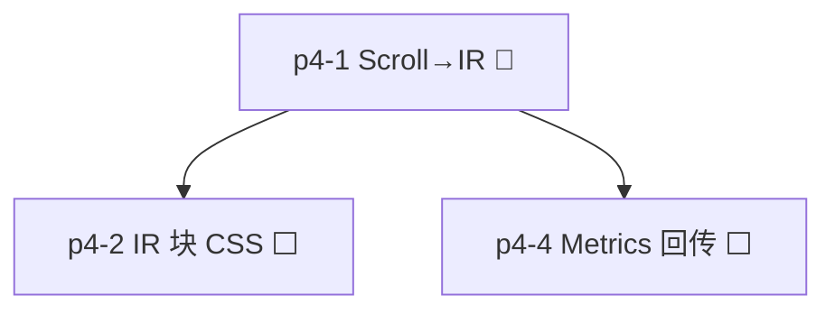

# Reader 引擎与架构规划索引

活跃规划（待实施或进行中）。已完成规划见 [archive/README.md](archive/README.md)。

## 推荐阅读顺序

| 顺序 | 文档                                                               | 主题                                                                                  | 优先级 |
| -- | ---------------------------------------------------------------- | ----------------------------------------------------------------------------------- | --- |
| 1  | [discuss/PHASE4_SCOPE.md](../discuss/PHASE4_SCOPE.md)             | Phase 4 引擎完善（活跃主线）                                                              | P0  |
| 2  | [discuss/plans/PHASE4_PARTICIPANT_INDEX.md](../discuss/plans/PHASE4_PARTICIPANT_INDEX.md) | 可并行参与任务（文档/测试/staging）                                                    | P0  |
| 3  | [plan-p4-1-scroll-ir-unification.md](plan-p4-1-scroll-ir-unification.md) | P4-1 Scroll→IR（Agent 主线程）                                                         | P0  |

## 已完成（归档）

- [archive/plan-unify-typeset-truth.md](archive/plan-unify-typeset-truth.md) — Rust descriptors 唯一真理
- [archive/planb-pagination-cache-consolidation.md](archive/planb-pagination-cache-consolidation.md) — Session / PageContentCache 收敛
- [archive/planc-session-config-hot-reload.md](archive/planc-session-config-hot-reload.md) — `repaginate_session` + intent 化
- [archive/plang-engine-polish.md](archive/plang-engine-polish.md) — 小优化合集（跳过 redundant full、测试/文档）
- **P2 缝补清理（2026-06-17）** — 删除 `enable_hyphenation` 死代码 + 超大单 spine 检测 + 老书 stale bounds 检测（`ChapterTooLarge`/`StaleBookData` error），见 [`issue/PLAN_EXECUTION_DEVIATIONS.md`](issue/PLAN_EXECUTION_DEVIATIONS.md) |

## 依赖关系

历史规划（已全部完成/归档）见 [archive/README.md](archive/README.md)。

## P2 清理清单（2026-06-17）

| 任务 | 状态 | 说明 |
|------|------|------|
| TOC href fallback 修复 | ✅ | 失败 entry 改为按 spine 长度顺序分布（不再全部 collapse 到 0）|
| Dart 桥接测试补齐 | ⚡ 部分 | `AppErrorMapper.humanReadable` 覆盖 18 个变体；`RustChapterContentRepository` 完整路径待补 |
| 验证清单 | ✅ | 181 Rust tests + 6 Dart tests + dart analyze 0 errors |
