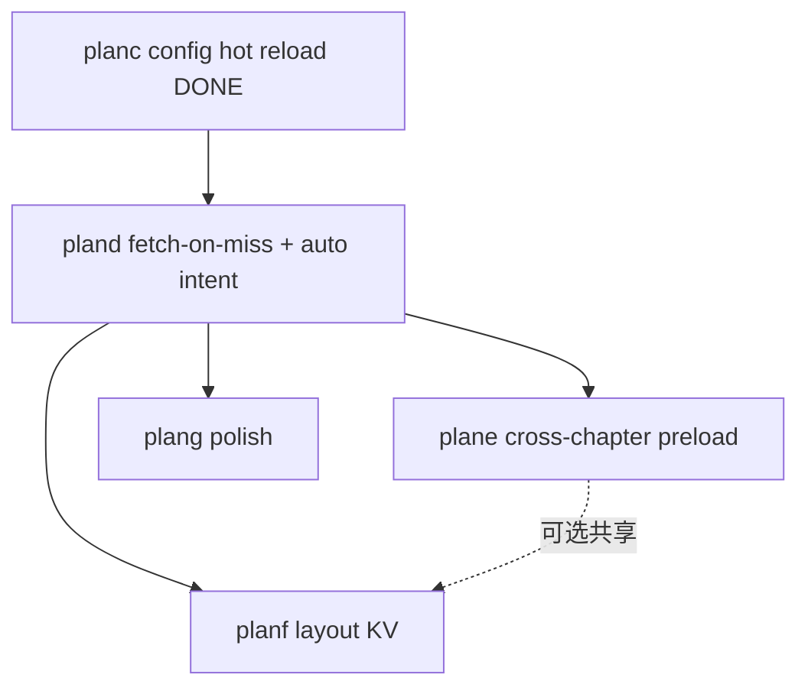

# Reader 引擎与架构规划索引

活跃规划（待实施或进行中）。已完成规划见 [archive/README.md](archive/README.md)。

## 推荐阅读顺序

| 顺序 | 文档 | 主题 | 优先级 |
|------|------|------|--------|
| 1 | [pland.md](pland.md) | pageContent fetch-on-miss + 自动推导 `ChapterPaginationIntent` | P0 |
| 2 | [plane-cross-chapter-preload.md](plane-cross-chapter-preload.md) | 跨章无缝翻页（pageTurn 预分页） | P1 |
| 3 | [planf-layout-kv-cache.md](planf-layout-kv-cache.md) | Layout KV 与 `paginate_chapter` / session 路径对齐 | P1 |
| 4 | [plang-engine-polish.md](plang-engine-polish.md) | 小优化合集（跳过 redundant full、测试/文档） — ✅ 已实现 | P2 |
| — | [READER_ARCH_GOVERNANCE_PHASES.md](READER_ARCH_GOVERNANCE_PHASES.md) | UI/VM 层架构治理（与引擎并行） | 工程债 |

## 已完成（归档）

- [archive/plan-unify-typeset-truth.md](archive/plan-unify-typeset-truth.md) — Rust descriptors 唯一真理
- [archive/planb-pagination-cache-consolidation.md](archive/planb-pagination-cache-consolidation.md) — Session / PageContentCache 收敛
- [archive/planc-session-config-hot-reload.md](archive/planc-session-config-hot-reload.md) — `repaginate_session` + intent 化

## 依赖关系

`plane` 与 `planf` 可并行；均建议在 `pland` PR2（auto intent + session 元数据）之后启动。
