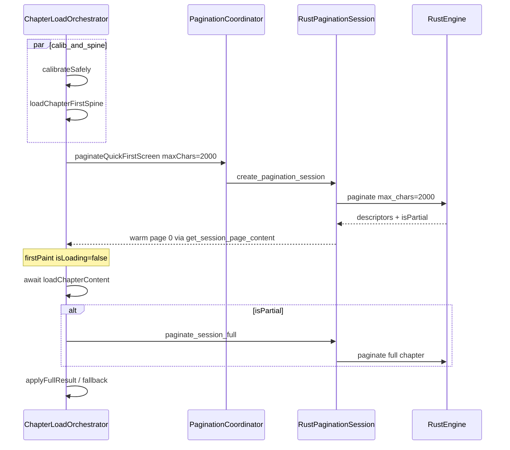

# 统一排版真理（Rust 单源）

## 问题定义

当前存在 **两套分页算法**，首屏与精排结果可能不一致：

| 路径 | 算法 | 使用场景 |
|------|------|----------|
| Dart `PaginationEngine.paginateApproximate` | 字号/行高粗算字符数 | [`_runFirstSpine`](lib/features/reader/core/application/chapter_load_orchestrator.dart)、[`fallbackToCalculatePages`](lib/features/reader/core/application/pagination_coordinator.dart)、[`preloadNextChapterFirstPage`](lib/features/reader/core/data/rust_chapter_content_repository.dart) |
| Rust `text/pagination.rs` | CharWidthTable + 标点挤压 + 避首避尾 | `create_pagination_session` / `paginate_session_full` |

渲染层也双轨：[`PaginatedModeRenderer`](lib/features/reader/rendering/paginated_renderer.dart) 优先 `descriptors`，回退 `approximatePages`（PageInfo）。

**症状**：首屏用 Dart 估算页码，partial/full 切到 Rust 后 `totalPages`/`pageIndex` 可能跳变；`ChapterNavigator` 在 descriptors 与 `currentPages` 间切换 offset 解析。

**目标**（你已选方案 A）：首屏 Rust `max_chars=2000`，全文后 `paginate_session_full` 升级；生产路径不再依赖 Dart 估算。

---

## 目标数据流



**关键不变量**：
- 首屏到全文升级 **复用同一 PaginationSession handle**，不再 `_createSession(50K)` 重建
- `pageIndex` / `charOffset` 始终从 `PageDescriptor` 解析
- Dart `paginateApproximate` 仅保留为 Rust 失败时的显式 fallback

---

## 分阶段实施

### Phase 1 — 新增 Rust 快速首屏 API（Dart 侧）

**文件**：[`pagination_coordinator.dart`](lib/features/reader/core/application/pagination_coordinator.dart)、[`rust_pagination_session.dart`](lib/features/reader/core/data/rust_pagination_session.dart)、[`pagination_session.dart`](lib/features/reader/core/domain/pagination_session.dart)

1. 新增常量 `firstScreenMaxChars = BigInt.from(2000)`（与 Rust [`get_chapter_first_spine_only`](rust/src/api/core.rs) 截断一致）
2. 新增 `PaginationSession.paginateQuickFirstScreen({bookId, chapterIndex, params})`：
   - 调用现有 `create_pagination_session(maxChars: 2000)`
   - `_preloadPageRange(1..5)` 预取首页
   - 返回 `({int totalPages, bool isPartial})`
3. 新增 `PaginationCoordinator.paginateQuickFirstScreen(int chapterIndex)` 封装参数构建

**不新增 Rust FFI**——复用 [`create_pagination_session`](rust/src/api/core.rs) + [`get_session_page_content`](rust/src/api/core.rs)。

---

### Phase 2 — 重构 ChapterLoadOrchestrator 流水线

**文件**：[`chapter_load_orchestrator.dart`](lib/features/reader/core/application/chapter_load_orchestrator.dart)

调整 `_runFirstSpine` / `_runPartialPaginate` / `run()` 主流程：

**Before（现状）**：
```
firstSpine text → paginateApproximate → partialPaginate(50K, new session) → paginateFull
```

**After（目标）**：
```
parallel(calibrateSafely, loadChapterFirstSpine)
→ paginateQuickFirstScreen(2000)   // 创建 session + descriptors
→ firstPaint（resolvePageIndexForOffset + ensurePageWindow）
→ await contentFuture
→ if isPartial: paginateFull on SAME session   // 即 paginate_session_full
→ finalize
```

具体改动：
- `_runFirstSpine`：删除 `paginateApproximate`、`currentPages = firstPages`；改为调用 `paginateQuickFirstScreen`；`pageIndex` 用 `PaginationEngine.resolvePageIndexForOffset(descriptors, charOffset)`
- **删除独立 `_runPartialPaginate(50K)` 步骤**（50K 中间态由 2000→full 升级替代）
- `run()` 中：`if (partialResult.isPartial) fullPaginateFuture = paginateFull(...)` 逻辑保留，但 `partialResult` 来自 quick first screen
- 校准时序：将 `calibFuture` 与 `loadChapterFirstSpine` **并行启动于 firstSpine 之前**，在 `paginateQuickFirstScreen` 前 `await` 两者（校准目标 <2ms，可接受）

新增/调整 phase 枚举用法：`firstSpine` 后直接进入 `partialPaginate` 或重命名为 `quickPaginate`（可选，非必须）。

---

### Phase 3 — 收敛渲染与导航到 descriptors

**文件**：
- [`chapter_load_orchestrator.dart`](lib/features/reader/core/application/chapter_load_orchestrator.dart) — 不再写 `currentPages` / `approximatePages`
- [`chapter_navigator.dart`](lib/features/reader/core/application/chapter_navigator.dart) — `loadPage` / `previousChapter` 仅读 `_repo.descriptors`，删除 `currentPages` 分支
- [`paginated_renderer.dart`](lib/features/reader/rendering/paginated_renderer.dart) — 删除 PageInfo 回退分支（保留 `_buildFallbackPagination` 作 descriptors 为空时的 loading 占位）
- [`reader_content.dart`](lib/features/reader/page/widgets/reader_content.dart) — 同步删除 approximatePages 分支

**保留**：`PaginationSession._approximatePages` 字段暂留，仅 fallback 路径写入，避免一次性删接口破坏测试。

---

### Phase 4 — 预加载与 fallback 统一

**文件**：
- [`rust_chapter_content_repository.dart`](lib/features/reader/core/data/rust_chapter_content_repository.dart) — `preloadNextChapterFirstPage` 改为调用 Rust quick paginate（或仅预取 firstSpine 文本 + 后台 quick session；若跨章 session 复杂，**最小改法**：预取 firstSpine 文本，翻页时再 paginate——先文档化，Phase 4 可只做 firstSpine 文本预取，Rust 分页留到进入该章时）

  **推荐最小实现**：preload 只缓存 `loadFirstSpine` 文本（已有），去掉其中的 `paginateApproximate`；跨章首页内容改由目标章 quick paginate 提供。

- [`pagination_coordinator.dart`](lib/features/reader/core/application/pagination_coordinator.dart) — `fallbackToCalculatePages` 保留，日志标明 `rust_pagination_fallback`；这是唯一 Dart 估算入口

- [`reader_repository_interface.dart`](lib/features/reader/core/domain/reader_repository_interface.dart) — `paginateApproximate` 标记 `@Deprecated('Rust fallback only')` 或移入 `PaginationEngine` 私有，Repository 不再公开

---

### Phase 5 — 测试与基准

**测试更新**：
- [`chapter_manager_test.dart`](test/features/reader/chapter_manager_test.dart) — mock 新增 `paginateQuickFirstScreen` 或调整 `paginateChapterPartial` mock 为 quick 路径；断言首屏后 `descriptors != null` 且无 `paginateApproximate` 调用
- [`core_pagination_test.dart`](test/features/reader/core_pagination_test.dart) — 保留 `paginateApproximate` 单元测试（算法仍存在作 fallback）
- 新增集成测试（可选）：quick 2000 → full 升级后，前 N 页 `startOffset` 与 quick 阶段一致（需 Rust FFI，放 `test/helpers/integration_test_helper.dart` 环境）

**基准**：
- 更新 [`cold_start_benchmark.dart`](test/benchmarks/cold_start_benchmark.dart) 注释/步骤，反映新流水线
- 对比指标：`firstSpine TTI`、`quickPaginate 2000`、`session_full` 三段 `[Timing]` 日志

---

## 与已有 refactor 的关系

| 已完成 | 本计划利用 |
|--------|-----------|
| [`ChapterLoadOrchestrator`](lib/features/reader/core/application/chapter_load_orchestrator.dart) + generation 防竞态 | 改阶段方法即可，不改对外 API |
| `loadPhase` 可观测 | quickPaginate / sessionFull 阶段可直接写入 |

| 后续 follow-up（不在本计划） |
|------------------------------|
| `restartSession` 接入排版设置重载（[`ReaderViewModel._debounceReloadChapter`](lib/features/reader/core/application/reader_view_model.dart)） |
| P1 收敛 `_pageCache` / `STREAMER_CACHE` / `SESSION_MAP` 冗余 |
| Rust 侧 `paginate_session_partial(max_chars)` 若需恢复 50K 中间态 |

---

## 风险与缓解

| 风险 | 缓解 |
|------|------|
| Rust 2000 首屏比 Dart 估算慢 | 2000 字符分页量小；benchmark 对比；校准与 spine 并行 |
| 无校准时 Rust 用默认 CharWidthTable | 首屏可接受；calib 完成后 full paginate 修正 |
| `totalPages` 在 isPartial 时仅为前 2000 字估算 | UI 进度条可能暂低；full 完成后更新（现有行为类似） |
| 删除 PageInfo 回退后 descriptors 为空 | 保留 loading 占位 + fallbackToCalculatePages |
| 预加载跨章复杂度 | Phase 4 先只预取文本，不预分页 |

---

## 验收标准

- [ ] 正常加载路径不调用 `paginateApproximate`（grep 生产代码为零，fallback 除外）
- [ ] 首屏分页由 `create_pagination_session(max_chars=2000)` 产生 descriptors
- [ ] 全量升级走 `paginate_session_full`，不重建 50K session
- [ ] `ChapterNavigator` / `PaginatedModeRenderer` 生产路径只读 descriptors
- [ ] `chapter_manager_test` 全部通过；`dart analyze --fatal-infos` 无新增问题
- [ ] 快速连跳章竞态测试（已有）仍通过

---

## 建议提交顺序（3 PR / 3 commits）

1. **Phase 1+2**：Orchestrator 流水线切换 + PaginationSession quick API（行为变更，核心）
2. **Phase 3**：渲染/导航去掉 PageInfo 回退
3. **Phase 4+5**：预加载/fallback 清理 + 测试/benchmark 更新
