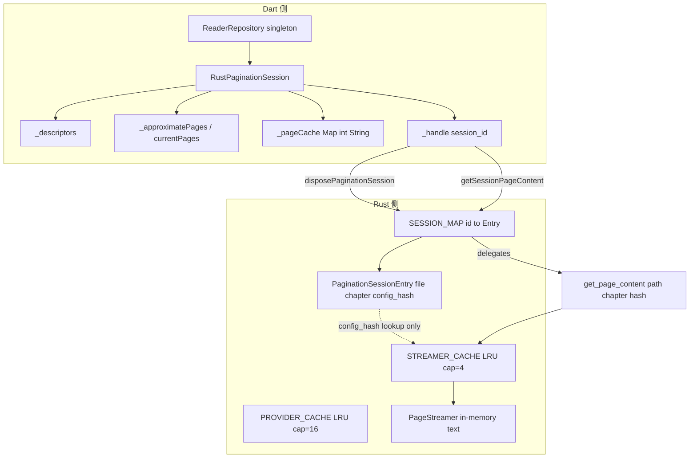
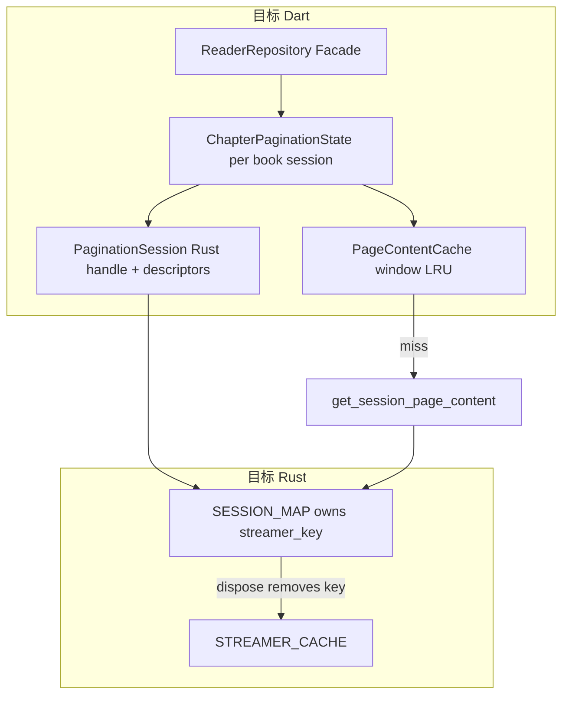

# 收敛分页会话/缓存路径 — 详细规划

## 1. 现状：缓存与会话拓扑

当前分页状态分散在 **Rust 3 层 + Dart 4 层**，职责重叠、生命周期不一致。




### 1.1 Rust 侧


| 组件               | 位置                                                 | 容量/键                                            | 作用                                                           |
| ---------------- | -------------------------------------------------- | ----------------------------------------------- | ------------------------------------------------------------ |
| `STREAMER_CACHE` | `[rust/src/api/core.rs](rust/src/api/core.rs)` L70 | LRU 4；`(file_path, chapter_index, config_hash)` | 存 `PageStreamer`，供 `get_page_content` 切片取页                   |
| `SESSION_MAP`    | 同文件 L92                                            | 无上限 HashMap；`session_id`                        | 存 `PaginationSessionEntry`（路径/章/config），**不持有** PageStreamer |
| `PROVIDER_CACHE` | 同文件 L58                                            | LRU 16                                          | 章节 ContentProvider，与分页独立                                     |


**调用链**：

- `create_pagination_session` → `paginate_chapter` → 写入 `STREAMER_CACHE` → 注册 `SESSION_MAP`
- `get_session_page_content(handle, i)` → 查 `SESSION_MAP` → `get_page_content(file, chapter, hash, i)` → 查 `STREAMER_CACHE`
- `dispose_pagination_session` → **仅删除** `SESSION_MAP` 条目，**不删除** `STREAMER_CACHE` 对应 streamer

**问题**：Session dispose 后 streamer 仍占内存，靠 LRU(4) 被动驱逐；多章快速切换时 streamer 与 session 元数据可能短暂不一致。

### 1.2 Dart 侧


| 组件                                   | 位置                                                                                                          | 作用                                        |
| ------------------------------------ | ----------------------------------------------------------------------------------------------------------- | ----------------------------------------- |
| `_descriptors`                       | `[rust_pagination_session.dart](lib/features/reader/core/data/rust_pagination_session.dart)`                | Rust 分页结果（真理之一）                           |
| `_approximatePages` / `currentPages` | 同上 + `[reader_repository_interface.dart](lib/features/reader/core/domain/reader_repository_interface.dart)` | Dart `PageInfo` 列表（估算真理，与 descriptors 竞争） |
| `_pageCache`                         | 同上                                                                                                          | 页文本 LRU 窗口（center±5 驱逐）                   |
| `_handle`                            | 同上                                                                                                          | Rust session id                           |
| `warmPageCache`                      | 同上                                                                                                          | 外部注入页文本（首屏 approximate 路径）                |


**重复 API**（同一语义多个入口）：


| 能力       | 入口 A                   | 入口 B                                                 |
| -------- | ---------------------- | ---------------------------------------------------- |
| 取页文本     | `pageContent(i)`       | `getPageContent(i)`                                  |
| 页列表      | `descriptors`          | `approximatePages` / `currentPages`                  |
| 部分分页     | `paginatePartial(50K)` | `paginateQuickFirstScreen(2000)`                     |
| Rust 裸调用 | —                      | `PaginationEngine.paginateChapter`（仅测试/benchmark 使用） |


**生命周期缺口**：

- `[ChapterViewModel.reset()](lib/features/reader/core/application/chapter_view_model.dart)` **不调用** `PaginationSession.dispose()`
- 换章依赖 `[_createSession](lib/features/reader/core/data/rust_pagination_session.dart)` 内 `_releaseHandle()` 替换 handle
- 关书 `[resetForNewBook](lib/features/reader/core/application/reader_view_model.dart)` 同样不 dispose → Rust `SESSION_MAP` 可能残留（直到下次 `_createSession` 或进程结束）

### 1.3 渲染/导航对多路径的依赖

- `[PaginatedModeRenderer](lib/features/reader/rendering/paginated_renderer.dart)`：descriptors 优先 → approximatePages 回退 → 本地 fallback
- `[ChapterNavigator](lib/features/reader/core/application/chapter_navigator.dart)`：`loadPage` / `previousChapter` 在 descriptors 与 `currentPages` 间切换 offset 解析
- `[chapter_load_orchestrator.dart](lib/features/reader/core/application/chapter_load_orchestrator.dart)` 首屏仍写 `currentPages` + `warmPageCache`（待「统一排版真理」改造）

---

## 2. 目标架构

**单一真理**：`PageDescriptor[]` + `PaginationSessionHandle` + Rust `PageStreamer`

**单一 Dart 页缓存**：`PageContentCache`（从 `RustPaginationSession` 抽出）

**单一 Rust 会话所有权**：dispose session 时同步驱逐对应 streamer




### 2.1 目标 invariant

1. **读页**：`PageContentCache.get(i)` → miss → `get_session_page_content` → 写入 cache；**无** approximatePages 回退
2. **换章**：同一 book 内 upgrade handle（2000→full）或 `_beginChapter(chapterIndex)` 显式 dispose+create
3. **换书/关阅读器**：`PaginationState.dispose()` → Rust dispose + 清空 Dart cache
4. **设置变更重载**：`restartSession=false` 时 `paginate_session_full` 复用 handle；`true` 时 dispose+create（与 `[ChapterLoadRequest.restartSession](lib/features/reader/core/application/chapter_load_request.dart)` 挂钩，follow-up）
5. **对外 Facade**：`ReaderRepository` 只暴露 `descriptors`、`pageContent`、`ensurePageWindow`；删除 `currentPages` / `getPageContent` 重复命名

---

## 3. 与「统一排版真理」的依赖关系


| 顺序  | 计划                       | 关系                                                     |
| --- | ------------------------ | ------------------------------------------------------ |
| 先   | [统一排版真理](doc/plan.md) P0 | 去掉生产路径对 `approximatePages` / `warmPageCache(估算文本)` 的依赖 |
| 后   | **本计划** P1               | 在 descriptors-only 前提下合并缓存层，避免收敛已废弃路径                  |


若并行开发：Phase 1（生命周期）可先做；Phase 2–4（删 approximate API）须在 P0 Phase 3 完成后进行。

---

## 4. 分阶段实施

### Phase 0 — 生命周期与泄漏修复（低风险，可独立 PR）

**目标**：Session dispose 可达，Rust 侧 dispose 清理 streamer。

**Dart** — `[rust_pagination_session.dart](lib/features/reader/core/data/rust_pagination_session.dart)`、`[rust_reader_repository.dart](lib/features/reader/data/repositories/rust_reader_repository.dart)`、`[chapter_view_model.dart](lib/features/reader/core/application/chapter_view_model.dart)`：

1. `ReaderRepository.disposePagination()` → `_session.dispose()`
2. `ChapterViewModel.reset()` 与 orchestrator `resetPhase()` 链路上调用上述 dispose
3. `_createSession` 前 `_releaseHandle()` 保持不变；关书路径补齐 dispose

**Rust** — `[rust/src/api/core.rs](rust/src/api/core.rs)`：

1. `PaginationSessionEntry` 增加 `streamer_key: (String, i32, u64)` 字段（create 时写入）
2. `dispose_pagination_session`：`SESSION_MAP.remove` 后 `STREAMER_CACHE.pop(&streamer_key)`
3. 补充 `[rust/tests/pagination_session_test.rs](rust/tests/pagination_session_test.rs)`：dispose 后 `get_session_page_content` 失败 + streamer 不可 get

**验收**：关书/reset 后无 orphan session；Rust 单测通过。

---

### Phase 1 — 抽出 `PageContentCache`（Dart 结构收敛）

**新增**：`[lib/features/reader/core/data/page_content_cache.dart](lib/features/reader/core/data/page_content_cache.dart)`

```dart
/// 滑动窗口页文本缓存；center±window 保留，其余驱逐。
class PageContentCache {
  static const int windowRadius = 5;

  String? get(int pageIndex);
  void put(int pageIndex, String content);
  void warm(int pageIndex, String content); // 同 put，语义别名
  void clear();
  void trimAround(int centerPage);
}
```

**迁移**：从 `RustPaginationSession` 移出 `_pageCache`、`_prefetchSurrounding` 的驱逐逻辑 → `PageContentCache`

`**RustPaginationSession.pageContent`**：

```dart
String? pageContent(int pageIndex) {
  final cached = _contentCache.get(pageIndex);
  if (cached != null) return cached;
  _fetchPageSync(pageIndex); // get_session_page_content → put
  return _contentCache.get(pageIndex);
}
```

**删除**：`pageContent` 内 `_approximatePages` 回退分支（P0 完成后）

---

### Phase 2 — 合并分页入口（Dart API 收敛）

**现状**：三个方法均 `_createSession` + 不同 `maxChars`：

- `paginatePartial` → 50_000
- `paginateQuickFirstScreen` → 2_000
- `paginateFull` → upgrade 或 full create

**目标**：`[pagination_session.dart](lib/features/reader/core/domain/pagination_session.dart)` 统一为：

```dart
abstract class PaginationSession {
  /// 创建或替换会话并分页。maxChars=null 表示全章。
  Future<PaginateResultView> beginPaginate({
    required String bookId,
    required int chapterIndex,
    required PaginationParams params,
    BigInt? maxChars,
    bool reuseHandle = false, // restartSession 语义
  });

  /// 在同一会话上扩展到全章（paginate_session_full 包装）
  Future<PaginateResultView> expandToFullChapter();

  PaginateResultView? get activeResult;
  // ...
}
```

**删除/Deprecated**：

- `paginatePartial` / `paginateQuickFirstScreen` → 调用方改用 `beginPaginate(maxChars: ...)`
- `[PaginationCoordinator](lib/features/reader/core/application/pagination_coordinator.dart)` 只保留 `paginateFirstScreen()` / `paginateFull()` 两个语义化 wrapper

**Repository 接口** — `[reader_repository_interface.dart](lib/features/reader/core/domain/reader_repository_interface.dart)`：

- 删除 `paginateChapterPartial`、`paginateChapterQuickFirstScreen` 公开方法
- 保留 `paginateChapter` 作为 `expandToFullChapter` 别名（或改名 `finalizePagination`）

---

### Phase 3 — 删除 PageInfo 缓存路径（依赖 P0）

**删除字段/API**：


| 删除                                        | 替代                       |
| ----------------------------------------- | ------------------------ |
| `_approximatePages` / `approximatePages`  | 仅 descriptors            |
| `currentPages` getter/setter              | 删除                       |
| `warmPageCache` 外部注入估算文本                  | 仅 `_fetchPageSync` 写入    |
| `ReaderRenderDataSource.approximatePages` | 删除                       |
| Renderer PageInfo 分支                      | loading 占位 + descriptors |


**保留 fallback**：`calculatePages` → Dart approximate **仅** Rust 失败时写入临时 descriptors 等价物，或仍产 PageInfo 但只进 fallback 专用字段（可选 `FallbackPageList`，不进入 RenderDataSource 主路径）

**文件**：`[paginated_renderer.dart](lib/features/reader/rendering/paginated_renderer.dart)`、`[reader_content.dart](lib/features/reader/page/widgets/reader_content.dart)`、`[chapter_navigator.dart](lib/features/reader/core/application/chapter_navigator.dart)`

---

### Phase 4 — Repository 会话作用域（可选，中高风险）

**现状**：`[ReaderRepository](lib/features/reader/data/repositories/rust_reader_repository.dart)` `@Injectable()` 单例，内嵌一个 `PaginationSession` → 全局唯一分页状态。

**目标**：分页状态随 `[ReaderSession](lib/features/reader/core/application/reader_session.dart)` 生命周期：

```
ReaderSessionFactory.create()
  → ReaderViewModel
  → ReaderRepository scoped instance  // 或 ChapterPaginationState 注入 VM
```

**步骤**：

1. `PaginationSessionFactory.create()` 改由 `ReaderSessionFactory` 调用，不再注入 singleton Repository
2. `getIt<ReaderRepository>()` 调用方（rendering）改为从 VM / RenderDataSource 注入
3. DI：`ReaderRepository` 注册为 `factory` 或 lazy singleton per session

**风险**：19+ 处 `getIt<ReaderRepository>()` 引用（见 `[GOD_CLASS_REFACTOR_PLAN.md](issue/GOD_CLASS_REFACTOR_PLAN.md)`）；可分步：先 factory per session，Facade 接口不变。

---

### Phase 5 — Rust 可选深化（非必须，性能/正确性）

1. **Session 持有 Streamer 强引用**（替代双 Map 间接 lookup）
  - `PaginationSessionEntry` 内嵌 `PageStreamer` 或 `Arc<PageStreamer>`
  - `get_session_page_content` 不再经 `get_page_content` 三参数查找
  - `STREAMER_CACHE` 仅作 `paginate_chapter` 无 session 时的 legacy（benchmark）
2. **废弃公开 `get_page_content(path, chapter, hash, page)`**
  - Dart 生产代码只走 session API
  - benchmark 可保留
3. **Layout cache 对齐** — `[layout_cache_repo.rs](rust/src/storage/repos/layout_cache_repo.rs)` key 与 `config_hash` 一致；session dispose 时不删 layout cache（持久化），换 config 自然 miss

---

## 5. 文件变更清单


| 阶段  | 新增                                   | 修改                                                                                                                          | 删除/Deprecated                                            |
| --- | ------------------------------------ | --------------------------------------------------------------------------------------------------------------------------- | -------------------------------------------------------- |
| P0  | —                                    | `core.rs`, `rust_pagination_session.dart`, `chapter_view_model.dart`, `reader_view_model.dart`                              | —                                                        |
| P1  | `page_content_cache.dart`            | `rust_pagination_session.dart`                                                                                              | —                                                        |
| P2  | `paginate_result_view.dart`（可选 DTO）  | `pagination_session.dart`, `pagination_coordinator.dart`, `reader_repository_interface.dart`, `rust_reader_repository.dart` | `paginatePartial/Quick` 公开 API                           |
| P3  | —                                    | renderer, navigator, orchestrator                                                                                           | `approximatePages`, `currentPages`, `warmPageCache` 生产调用 |
| P4  | `reader_repository_factory.dart`（可选） | DI `app_module`, `reader_session.dart`, `reader_page`                                                                       | singleton Repository 注入                                  |
| P5  | —                                    | `rust/src/api/core.rs`                                                                                                      | 直接 `get_page_content` Dart 调用                            |


---

## 6. 测试计划


| 测试                            | 文件                                      | 断言                           |
| ----------------------------- | --------------------------------------- | ---------------------------- |
| dispose 清 session + streamer  | `rust/tests/pagination_session_test.rs` | dispose 后 get 失败             |
| reset 调 dispose               | `chapter_manager_test.dart`             | mock verify dispose          |
| PageContentCache 窗口驱逐         | `test/.../page_content_cache_test.dart` | center±5 保留                  |
| beginPaginate 2000→expandFull | `chapter_manager_test.dart`             | 同 handle mock，descriptors 更新 |
| 无 approximatePages 渲染         | `paginated_renderer_test.dart`          | 删旧版分支测试，改 descriptors-only   |
| 竞态 + 换章                       | 已有 `loadChapter 竞态`                     | 仍 pass                       |
| Benchmark                     | `cold_start_benchmark.dart`             | 改用 session API 步骤文档          |


---

## 7. 风险矩阵


| 风险                     | 影响                   | 缓解                                    |
| ---------------------- | -------------------- | ------------------------------------- |
| P0/P3 与「统一排版真理」冲突      | 重复改 orchestrator     | 严格顺序：P0 排版真理 Phase 1–3 后再 P1 Phase 3  |
| dispose streamer 过早    | 翻页空文本                | dispose 仅换章/关书；upgrade 用 session_full |
| Repository 作用域改动面大     | 编译大量失败               | Phase 4 可选、独立 PR                      |
| LRU(4) streamer 仍驱逐活跃章 | 偶发空页                 | Phase 5 强引用；或增大容量+session 绑定          |
| `restartSession` 未实现   | 改设置仍 rebuild session | Phase 2 `reuseHandle` 一并实现            |


---

## 8. 建议 PR 顺序

```
PR1  Phase 0 — lifecycle + Rust dispose 清 streamer
PR2  Phase 1 — PageContentCache 抽取
PR3  Phase 2 — beginPaginate / expandToFull API 合并（配合 P0 排版真理 orchestrator 改造）
PR4  Phase 3 — 删 approximatePages/currentPages 生产路径
PR5  Phase 4 — ReaderRepository per ReaderSession（可选）
PR6  Phase 5 — Rust session 内嵌 streamer（可选）
```

---

## 9. 验收标准

- [ ] 生产路径仅 **一种** 页文本来源：`get_session_page_content` → `PageContentCache`
- [ ] 生产路径仅 **一种** 页边界来源：`PageDescriptor[]`
- [ ] `dispose_pagination_session` 同步清理 Rust streamer，无已知 SESSION_MAP 泄漏
- [ ] 关书/reset 必调 `PaginationSession.dispose()`
- [ ] `ReaderRepositoryInterface` 无 `currentPages` / 重复 `getPageContent`
- [ ] `paginatePartial` 与 `paginateQuickFirstScreen` 合并为 `beginPaginate(maxChars:)`
- [ ] 现有 `chapter_manager_test` + `pagination_session_test` + renderer 测试通过
- [ ] `dart analyze --fatal-infos` / `cargo clippy` 无新增问题