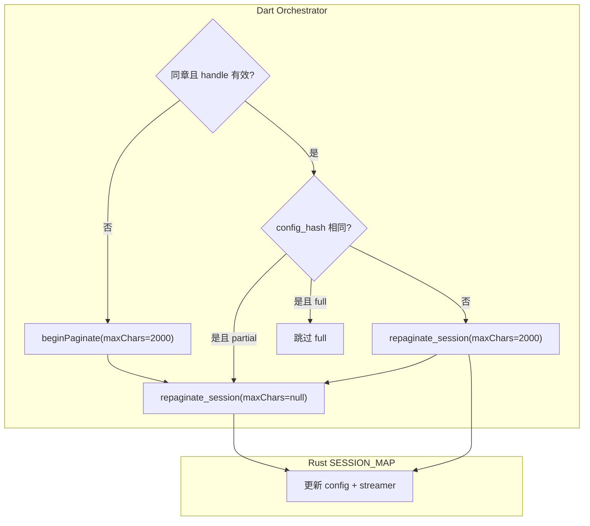

# Session Config 热更新与 restartSession 简化

## 现状与问题

当前 Rust session 在 `[create_pagination_session](rust/src/api/core.rs)` 时把 `TypesetConfig` **固化**进 `SESSION_MAP`；`[paginate_session_full](rust/src/api/core.rs)` 只读 `entry.config`，**忽略** Dart 传入的 `PaginationParams`：

```726:735:rust/src/api/core.rs
pub async fn paginate_session_full(handle: PaginationSessionHandle) -> Result<PaginateResult, AppError> {
    let entry = lookup_pagination_session(handle.session_id)?;
    let result = paginate_chapter(
        entry.file_path.clone(),
        entry.chapter_index,
        entry.config.clone(),  // 固化 config，无法热更新
        None,
    ).await?;
```

Dart 侧因此不得不用 `restartSession: true`（设置重载）走 `_createSession` → dispose + 重建，整条链路过长；`restartSession: false` 则跳过 firstSpine 但同样无法应用新 config。

另有一个 **隐性 bug**：`paginate_session_full` 更新 entry 时用 `..entry`，**streamer 换了但 `entry.config` 未更新**（L747-752），config 热更新时必须一并修复。

---

## 目标架构




**核心 invariant**：

- **换章** → 必须 `_releaseHandle()` + `create_pagination_session`（chapter_index 变）
- **同章 config 变** → `repaginate_session`，**不** dispose handle
- **同章 config 不变 + partial** → `repaginate_session(max_chars=null)` 即 full expand
- **页内容** → 始终通过 `get_session_page_content(handle, i)`，config_hash 由 session entry 保证一致

---

## Phase 1 — Rust 统一重排 API（PR1）

### 1.1 抽取内部 helper

在 `[rust/src/api/core.rs](rust/src/api/core.rs)` 新增私有函数（示意）：

```rust
async fn apply_session_repagination(
    session_id: u64,
    entry: PaginationSessionEntry,
    config: TypesetConfig,
    max_chars: Option<u64>,
) -> Result<PaginateResult, AppError>
```

职责：

1. `config.validate_and_fix()`
2. 记录 `old_key = (path, chapter, entry.config.config_hash())`
3. 调用现有 `paginate_chapter(path, chapter, config, max_chars)`
4. 从 `STREAMER_CACHE` 取新 streamer
5. **写入 SESSION_MAP**：`config` + `streamer` 均更新（禁止 `..entry` 留旧 config）
6. 若 `old_key != new_key` → `STREAMER_CACHE.pop(&old_key)`（与 dispose 策略一致，避免 orphan）

### 1.2 新导出 API

```rust
/// 在已有 session 上用新 config 重排。max_chars=None 表示全章。
#[frb]
pub async fn repaginate_session(
    handle: PaginationSessionHandle,
    config: TypesetConfig,
    max_chars: Option<u64>,
) -> Result<PaginateResult, AppError>
```

### 1.3 改造 `paginate_session_full`

改为薄包装，保持向后兼容：

```rust
pub async fn paginate_session_full(
    handle: PaginationSessionHandle,
    config: Option<TypesetConfig>,  // None = 使用 entry 内 stored config
) -> Result<PaginateResult, AppError>
```

实现：`repaginate_session(handle, config.unwrap_or(entry.config), None)`

### 1.4 Rust 测试（`[rust/tests/pagination_session_test.rs](rust/tests/pagination_session_test.rs)`）


| 用例                              | 断言                                            |
| ------------------------------- | --------------------------------------------- |
| partial → full（同 config）        | `is_partial` false，页数不减                       |
| **同 handle，改 font_size 重排**     | descriptors 变化，`get_session_page_content` 仍可用 |
| config 变更后 dispose              | 旧 streamer key 被 pop                          |
| config 变更后 session entry.config | 与新 config 的 hash 一致                           |


运行：`cargo test pagination_session` + `cargo clippy -- -D warnings`

### 1.5 FRB 代码生成

修改 Rust 源后执行：`flutter_rust_bridge_codegen generate`（禁止手改 `frb_generated.`*）

---

## Phase 2 — Dart Session 层（PR2）

### 2.1 `[RustPaginationSession](lib/features/reader/core/data/rust_pagination_session.dart)`

- 新增字段：`int? _sessionConfigHash`（每次 paginate 从 `PaginateResult.configHash` 写入）
- 新增方法：

```dart
Future<PaginateResult> repaginateInPlace({
  required PaginationParams params,
  BigInt? maxChars,
}) // 调用 repaginate_session，不清 handle
```

- 改造 `expandToFullChapter`：当 `_handle != null` 时调用 `paginateSessionFull(handle, config: _buildConfig(params))`（不再忽略 params）
- 改造 `beginPaginate`：仅在 `_releaseHandle()` 后 `createPaginationSession`（换章路径不变）
- 新增辅助：`bool configMatches(PaginationParams p) => _sessionConfigHash == _buildConfig(p).configHash()`
（需在 Dart 侧调用 Rust `TypesetConfig.configHash()` 或比较上次 result hash 与新建 config hash——优先 **Rust 侧 hash**，避免 Dart 重复实现）

可选：新增 sync FRB `typeset_config_hash(TypesetConfig) -> u64` 供 Dart 比较，或直接比较 `PaginateResult.configHash` 与 repaginate 前临时 build 的 hash。

- **清理**：删除未在 `[PaginationSession](lib/features/reader/core/domain/pagination_session.dart)` 接口中的 `paginatePartial` / `paginateQuickFirstScreen` 死代码（若仍存在）

### 2.2 `[ReaderRepository](lib/features/reader/data/repositories/rust_reader_repository.dart)` / interface

- 暴露 `repaginateInPlace(...)` 与 `sessionConfigHash` getter（供 orchestrator 决策）

---

## Phase 3 — Orchestrator 策略化，移除 restartSession（PR3）

### 3.1 替换 `[ChapterLoadRequest.restartSession](lib/features/reader/core/application/chapter_load_request.dart)`

删除 `bool restartSession`，改为显式意图（或内部推导，不暴露给 UI）：

```dart
enum ChapterPaginationIntent {
  normalLoad,      // 换章 / 无 session
  configReload,    // 同章，排版参数变
  expandOnly,      // 同章同 config，仅补全 partial
}
```

**调用方映射**（`[reader_view_model.dart](lib/features/reader/core/application/reader_view_model.dart)`）：


| 场景                            | 现 `restartSession` | 新 intent                                                      |
| ----------------------------- | ------------------ | ------------------------------------------------------------- |
| 换章 `loadChapter`              | `true`             | `normalLoad`                                                  |
| 设置重载 `_debounceReloadChapter` | `true`             | `**configReload`**（关键收益）                                      |
| `initialize`                  | `false`            | `expandOnly`                                                  |
| `onRetry`                     | `false`            | `expandOnly` 或 `configReload`（若 calibration 为空则 `normalLoad`） |


### 3.2 改造 `[ChapterLoadOrchestrator.run](lib/features/reader/core/application/chapter_load_orchestrator.dart)`

**删除** L114-126 的 `restartSession && descriptors` 分支，改为：

```
switch (intent) {
  normalLoad  → _runFirstSpine (await calib → beginPaginate 2000)
  configReload→ await calib → repaginateInPlace(maxChars=2000) → 快速更新 UI signals
  expandOnly  → 跳过 firstSpine；若 isPartial 则 repaginate maxChars=null
}
```

**时序整理**（顺带修复可读性）：

1. `await calibFuture` + 写入 `calibration.value`（保持现有 L248-250）
2. 执行 firstSpine / repaginate 分支
3. `await Future.wait([contentFuture, calibFuture])`
4. **再**启动 full expand（`repaginate maxChars=null` 或 `expandToFullChapter`），不再提前 fire future

`configReload` 路径 **不** 调用 `_releaseHandle()`，不清 firstSpine 以外的 content（`preserveContent: true` 可选）。

### 3.3 `[PaginationCoordinator](lib/features/reader/core/application/pagination_coordinator.dart)`

- 合并 `paginateFirstScreen` / `paginateQuickFirstScreen` / `paginateFull` 为：
  - `beginFirstScreen(chapterIndex)`
  - `expandToFull(chapterIndex)` — 始终传 `buildPaginationParams()`
  - `repaginateCurrentChapter({maxChars})` — settings 专用

---

## Phase 4 — 测试与文档（PR3 或 PR4）

### Dart 测试


| 文件                                                                            | 新增用例                                                                             |
| ----------------------------------------------------------------------------- | -------------------------------------------------------------------------------- |
| `[chapter_manager_test.dart](test/features/reader/chapter_manager_test.dart)` | `configReload` 不调用 `disposePagination`；调用 `repaginateInPlace`；calibration 非 null |
| `[core_pagination_test.dart](test/features/reader/core_pagination_test.dart)` | 同 handle 改 config 后 full paginate；page content 可读                                |


### 文档

- 更新 `[lib/features/reader/README.md](lib/features/reader/README.md)` Lifecycle 段：说明 config 热更新与 intent
- 更新 `[doc/planb.md](doc/planb.md)` §2.1 invariant #4（与实现对齐）

---

## 风险与边界


| 风险                                       | 缓解                                                                                    |
| ---------------------------------------- | ------------------------------------------------------------------------------------- |
| config 变更后 Dart `PageContentCache` 含旧页文本 | `repaginateInPlace` 内 `_contentCache.clear()`                                         |
| 多 session 共享同一 streamer key              | 仅 pop old_key 当 session 是唯一持有者；若未来支持多 session 同 key，需引用计数（当前每 session 持 clone，pop 安全） |
| 字体变更清空 calibration                       | `configReload` 前仍 `await calibFuture`（与现 firstSpine 一致）                               |
| FRB 签名变更                                 | 全量 regen + 只改 Rust 源                                                                  |


---

## 验收标准

- [ ] 调整字号/行高：**不** dispose session，首屏 <300ms 内更新 descriptors（partial repaginate）
- [ ] 换章：仍 dispose 旧 handle，无 SESSION_MAP 泄漏
- [ ] `paginate_session_full` + 新 config 与 `repaginate_session(..., None)` 行为一致
- [ ] Rust + Dart reader 测试全绿；`dart analyze --fatal-infos` 通过
- [ ] `restartSession` 从 public API 移除，调用方改用 `ChapterPaginationIntent`

---

## 建议 PR 拆分

1. **PR1**：Rust `repaginate_session` + fix entry.config 更新 + Rust 测试 + FRB regen
2. **PR2**：Dart `RustPaginationSession` / Repository 接入
3. **PR3**：Orchestrator intent + 删除 `restartSession` + Dart 测试 + README

