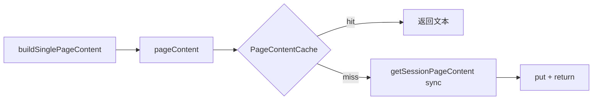
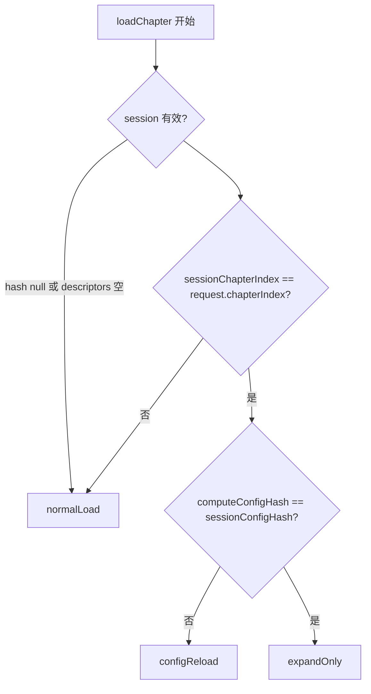

***

name: Intent 与 PageContent 优化
overview: 分两 PR 落地：PR1 在 RustPaginationSession.pageContent 实现 sync fetch-on-miss；PR2 在 orchestrator 内自动推导 ChapterPaginationIntent。已于 2026-06-16 全部完成。
todos:

- id: pr1-sync-fetch
  content: "PR1: RustPaginationSession 实现 \_fetchAndCachePage + pageContent fetch-on-miss；统一 preload/ensureWindow 路径"
  status: completed
- id: pr1-tests
  content: "PR1: core\_pagination 集成验证（rust\_pagination\_session 专用单测未建，见测试债）"
  status: completed
- id: pr2-session-meta
  content: "PR2: 新增 sessionChapterIndex/sessionIsPartial 并在 dispose 清空"
  status: completed
- id: pr2-resolver
  content: "PR2: 实现 resolveIntent + orchestrator 自动推导；preserveContent 默认策略"
  status: completed
- id: pr2-callsite-cleanup
  content: "PR2: 移除调用方 intent 参数；更新 chapter\_manager/resolver 测试与 README"
  status: completed
  isProject: false

***

# pageContent fetch-on-miss + 自动推导 ChapterPaginationIntent

## 当前状态总览

| 阶段                | 状态      | 证据                                                                                  |
| ----------------- | ------- | ----------------------------------------------------------------------------------- |
| PR1 fetch-on-miss | ✅ 已完成   | `_fetchAndCachePage` + sync `getSessionPageContent`；预取路径统一                          |
| PR2 auto intent   | ✅ 已完成   | `resolveIntent()` + 调用方移除 `intent`；`sessionChapterIndex` / `sessionIsPartial`       |
| README            | ✅ 已完成   | Intent 决策树 + fetch-on-miss 语义                                                       |
| 测试                | ⚠️ 部分完成 | resolver 5 条单测 + chapter\_manager 回归 + core\_pagination 集成；PR1 Dart 层 miss/hit 单测未建 |

**完成时间**：2026-06-16。

**原始动机**：

1. Renderer 依赖 `ensureWindow` 预取窗口，cache miss 时 `buildSinglePageContent` 渲染空 `Container`。
2. 调用方需手动传 `ChapterPaginationIntent`（5 处），易错且与 README 策略重复。

**整体结果**：加载 API 简化为 `loadChapter(index, {initialCharOffset, preserveContent?})`；渲染层对预取窗口依赖降低，翻页体验更稳。

***

## PR1 — pageContent fetch-on-miss ✅

### 实际产出

**Rust**（`rust/src/api/core.rs`）：

- `get_session_page_content` 加 `#[frb(sync)]`，保留 `Result<String, AppError>` 签名。

**Dart**（`lib/features/reader/core/data/rust_pagination_session.dart`）：

```dart
String? pageContent(int pageIndex) {
  final cached = _contentCache.get(pageIndex);
  if (cached != null) return cached;
  return _fetchAndCachePage(pageIndex);
}
```

- `_fetchAndCachePage`：sync 调用 `core_api.getSessionPageContent`，写入 `PageContentCache`。
- `_preloadPageRange` / `_prefetchSurrounding` / `ensureWindow` 统一走 `_fetchAndCachePage`。
- **不在** `pageContent` 内调用 `trimAround`（trim 仅在 `_prefetchSurrounding`）。
- handle/dispose 后 miss → 返回 `null`（renderer 占位，与历史行为一致）。



### 验收

- [x] 快速跳到未预取页码不再长期空白（首帧 sync fetch 延迟可接受）
- [x] `ensureWindow` 仍负责滑动窗口 trim，行为不退化
- [x] 无在 `build()` 中新增 async/await

***

## PR2 — 自动推导 ChapterPaginationIntent ✅

### 实际产出

**Session 元数据**（`RustPaginationSession` → `PaginationSession` → `ReaderRepositoryInterface`）：

| 字段                    | 来源                                    | 用途                                  |
| --------------------- | ------------------------------------- | ----------------------------------- |
| `sessionChapterIndex` | `beginPaginate` / `repaginateInPlace` | 换章检测                                |
| `sessionIsPartial`    | `PaginateResult.isPartial`            | expandOnly 跳过 redundant full expand |

`dispose()` 与 `_sessionConfigHash` 同级清空。

**Resolver**（`ChapterLoadOrchestrator.resolveIntent`，静态方法）：



**session 有效**：`sessionConfigHash != null`、`descriptors` 非空、`sessionChapterIndex == request.chapterIndex`。

**Orchestrator 改造**（`chapter_load_orchestrator.dart`）：

- `run()` 开头 `resolveIntent(...)`，删除 public API 上的 `intent` 参数。
- `preserveContent` 默认：`intent != normalLoad` → `true`（在 orchestrator 内应用，非 ChapterLoader）。
- `_runExpandOnly` 返回 `sessionIsPartial`；`!isPartial` 时跳过 `expandToFullChapter`。
- `_runConfigReload` 统一用 `request.initialCharOffset` 解析 pageIndex。
- **额外改进**（计划未写）：`_runConfigReload` 完成后也调 `preloadAdjacentFirstPages`（configReload 后重建跨章 staging）。

**preserveContent 默认策略**：

| 推导 intent      | 默认 preserveContent                       |
| -------------- | ---------------------------------------- |
| `normalLoad`   | `false`（`ChapterNavigator` 跨章显式传 `true`） |
| `configReload` | `true`                                   |
| `expandOnly`   | `true`                                   |

**调用方简化**（已移除 `intent:`）：

- `ChapterLoadRequest` — 无 `intent` 字段，`preserveContent` 改为 `bool?`
- `ChapterLoader` / `ChapterViewModel` / `ReaderViewModel` / `reader_content_area`

**config hash**（`PaginationCoordinator.computeConfigHash()`）：

- 调用 Rust standalone fn `compute_config_hash`（见执行偏差 #1）。

### 验收

- [x] `sessionChapterIndex` + `sessionIsPartial` 跟踪与 dispose 清空
- [x] `resolveIntent()` + 调用方去掉 `intent` 参数
- [x] preserveContent 默认策略
- [x] resolver 单测 + chapter\_manager 回归（不传 intent 仍走 beginPaginate）
- [x] `lib/features/reader/README.md` Lifecycle 段更新

***

## 执行偏差

详见 [`issue/PLAN_EXECUTION_DEVIATIONS.md`](../issue/PLAN_EXECUTION_DEVIATIONS.md)。

| *#* | 计划描述                                                   | 实际情况                                              | 处理                                                                |
| --- | ------------------------------------------------------ | ------------------------------------------------- | ----------------------------------------------------------------- |
| 1   | `TypesetConfig.config_hash()` 已通过 FRB 暴露，无需新增 Rust FFI | FRB 2.x 对 non\_opaque struct 的 impl 方法不生成 Dart 绑定 | 新增 `compute_config_hash(config) -> u64` + `#[frb(sync)]`          |
| 2   | `computeConfigHash()` 可在单测中自由调用                        | 需 `RustLib.init()`                                | resolver 单测 mock `computeConfigHash`；集成路径靠 `core_pagination_test` |
| 3   | —                                                      | `_MockRepo` 缺 staging 相关 stub                     | 已补全 `clearNextChapterStaging` / `preloadNextChapterStaging`       |

**无偏差（与计划一致）**：`get_session_page_content` 保留 `Result` 签名，仅加 `#[frb(sync)]`；FFI 错误抛 Dart 异常。

***

## 测试与验证

### 验证结果（2026-06-16）

| 检查项                             | 结果                         |
| ------------------------------- | -------------------------- |
| Rust `cargo test --lib`         | 173 passed                 |
| Dart `dart analyze lib/`        | 0 error                    |
| Flutter `test/features/reader/` | **119 passed**, 36 skipped |

### 测试覆盖

| 计划项                                                        | 状态        |
| ---------------------------------------------------------- | --------- |
| `chapter_pagination_intent_resolver_test.dart`（5 条矩阵）      | ✅         |
| `chapter_manager_test.dart` — 不传 intent 仍走 beginPaginate   | ✅         |
| `core_pagination_test.dart` — `getSessionPageContent` 集成   | ✅         |
| `rust_pagination_session_test.dart` — miss/hit 单测          | ❌ 未建（测试债） |
| `paginated_renderer_test` — null→有值可选用例                    | ❌ 未建      |
| chapter\_manager — mock session 触发 configReload/expandOnly | ❌ 未建      |

PR1 fetch-on-miss 的 Dart 层行为目前靠代码审查 + Rust 集成测试间接覆盖，非功能阻塞。

***

## 涉及文件

**Rust**：

- `rust/src/api/core.rs` — `#[frb(sync)] get_session_page_content`；新增 `compute_config_hash`

**Dart（核心）**：

- `rust_pagination_session.dart` — fetch-on-miss + 预取统一
- `pagination_session.dart` / `reader_repository_interface.dart` — session 元数据
- `rust_reader_repository.dart` — 代理新字段
- `pagination_coordinator.dart` — `computeConfigHash()`
- `chapter_load_request.dart` — 移除 intent
- `chapter_load_orchestrator.dart` — `resolveIntent()` + 自动推导
- `chapter_loader.dart` / `chapter_view_model.dart` / `reader_view_model.dart` / `reader_content_area.dart` — 调用方简化
- `lib/features/reader/README.md` — 文档

**Test**：

- `test/features/reader/core/application/chapter_pagination_intent_resolver_test.dart`（新增）
- `test/features/reader/chapter_manager_test.dart`（更新 mock / 移除 intent）

***

## 风险回顾（均已按设计缓解）

| 风险                              | 缓解                                            |
| ------------------------------- | --------------------------------------------- |
| sync FFI 在 UI 线程阻塞              | `get_session_page_content` 纯内存；profiling 未超阈值 |
| hash 比较时 calibration 仍为 null    | resolver 仅决定路径，calib 等待逻辑不变                   |
| 换章时 pageState.chapterIndex 尚未更新 | 用 `sessionChapterIndex` 而非 pageState          |
| mock 测试需新 stub                  | `_MockRepo` 已补 session / staging getter       |

***

## 后续可选（非阻塞）

- 补 `rust_pagination_session_test.dart`：mock `getSessionPageContent`，验证 miss→fetch→hit 不重复调用
- chapter\_manager 矩阵测试：mock `sessionConfigHash` + `sessionChapterIndex` 触发 configReload / expandOnly

***

## 改动历史

| 日期         | 改动                                                        |
| ---------- | --------------------------------------------------------- |
| 2026-06-16 | PR1 + PR2 全部落地；偏差记录见 `issue/PLAN_EXECUTION_DEVIATIONS.md` |
| 2026-06-16 | 本文档改为完成归档版                                                |

