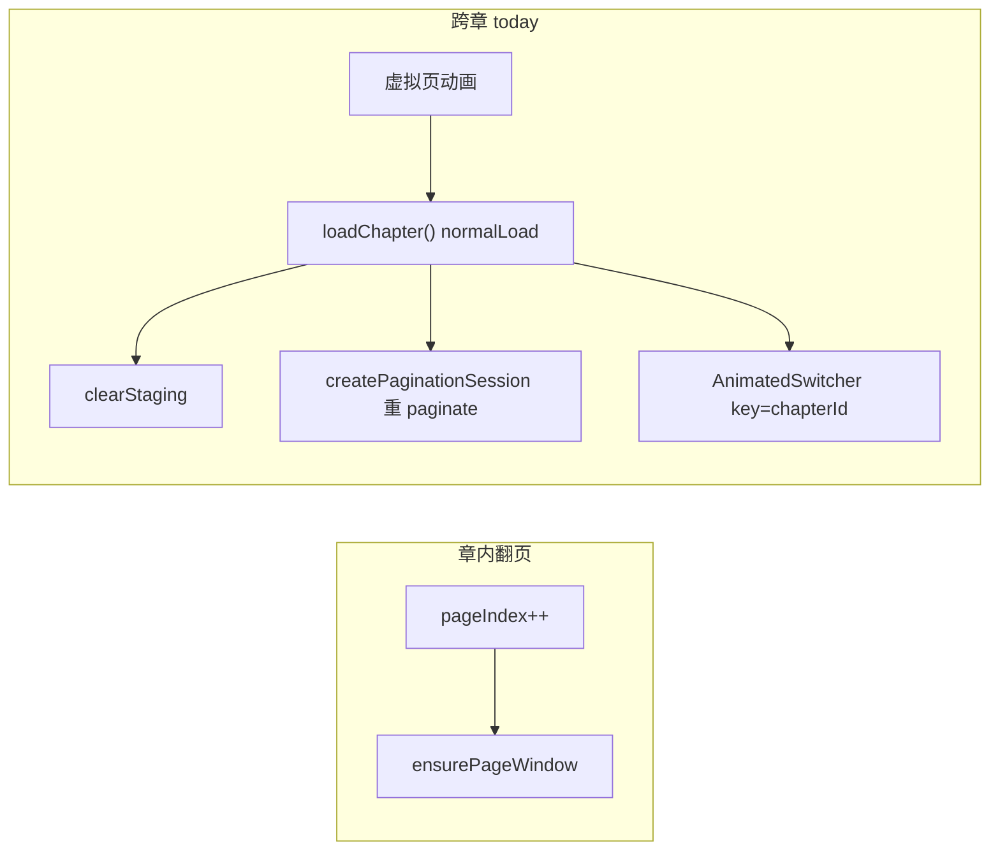
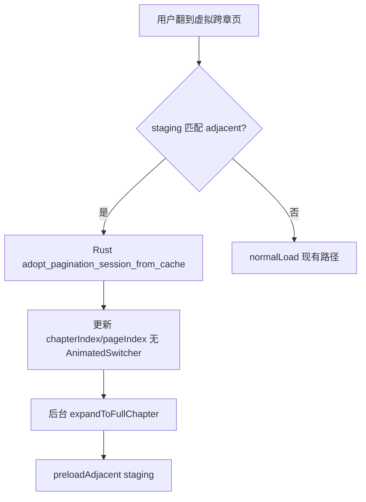

# 跨章丝滑体验优化（分页 + 仿真翻页）

## 目标与验收

**用户感知目标**：向前/向后跨章时，动效类型与章内一致（PageView 滑动 / PageCurl 卷曲），无明显整屏切换、白屏或「卡一下再出现」。

**可量化验收**（真机 + `[Timing]` 日志）：

- 跨章换 session 主线程可见延迟 &lt; 50ms（staging 命中时）
- 分页模式跨章不出现 `AnimatedSwitcher` 整章滑入
- pageTurn 向前/向后跨章均走同一套卷曲动画
- 快速连翻 2 章无 stale staging / 页码错乱
- `flutter test test/features/reader/` 全绿

---

## 根因回顾（为何现在不够丝滑）



- **数据层**：staging 只用于动画展示，换章仍走完整 [`ChapterLoadOrchestrator.run()`](lib/features/reader/core/application/chapter_load_orchestrator.dart)（入口即 `clearNextChapterStaging()` + `normalLoad`）
- **Rust 层**：[`create_pagination_session`](rust/src/api/core.rs) 每次都重新 `paginate_chapter`，即使 staging 已写入 `STREAMER_CACHE`
- **UI 层**：分页模式 [`reader_content.dart`](lib/features/reader/page/widgets/reader_content.dart) 用 `ValueKey('chapter_$chapterId')` 触发 `AnimatedSwitcher`，与 `PageView` 动效不一致
- **反向**：仅有 [`NextChapterStaging`](lib/features/reader/core/data/next_chapter_staging.dart)，无上一章末页预加载

---

## 方案总览



分 4 个 Phase，按依赖顺序实施；每 Phase 可独立验证。

---

## Phase 1 — Rust：从 CACHE adopt session（零重 paginate）

**新增 API**（[`rust/src/api/core.rs`](rust/src/api/core.rs)，经 FRB 生成 Dart 绑定）：

```rust
// 伪签名
create_pagination_session_adopt(
  file_path, chapter_index, config
) -> Result<(PaginationSessionHandle, PaginateResult), AppError>
```

**行为**：

1. 计算 `config_hash`，查 `STREAMER_CACHE[(path, chapter_index, hash)]`
2. **命中**：直接 `allocate_session_id` + 绑定已有 `PageStreamer`，返回现有 descriptors（**不调用** `paginate_chapter`）
3. **未命中**：返回 `AppError::NotFound`（Dart 回退 `create_pagination_session` + 现有 normalLoad）

**Dart 接入**（[`rust_pagination_session.dart`](lib/features/reader/core/data/rust_pagination_session.dart)）：

- 新增 `beginPaginateFromCache(...)`：先 `adopt`，失败再 `_createSession`
- 单元测试：[`rust/tests/pagination_session_test.rs`](rust/tests/pagination_session_test.rs) 覆盖 hit/miss/dispose 后 miss

> 与现有 staging 预加载天然契合：[`preloadNextChapterStaging`](lib/features/reader/core/data/rust_chapter_content_repository.dart) 已调用 `paginateChapter(maxChars=2000)` 写入 CACHE。

---

## Phase 2 — Orchestrator：`stagingPromote` 快速换章路径

### 2.1 扩展意图枚举

[`chapter_pagination_intent.dart`](lib/features/reader/core/application/chapter_pagination_intent.dart) 新增：

- `stagingPromoteForward` — 下一章 staging 命中，adopt + pageIndex=0
- `stagingPromoteBackward` — 上一章 staging 命中，adopt + pageIndex=last

[`ChapterLoadRequest`](lib/features/reader/core/application/chapter_load_request.dart) 新增可选字段：

- `ChapterNavigationKind navigationKind`：`adjacentCrossChapter` | `manualJump`（默认 manualJump）

### 2.2 意图推导

扩展 [`resolveIntent()`](lib/features/reader/core/application/chapter_load_orchestrator.dart)：

| 条件 | Intent |
|------|--------|
| `navigationKind==adjacent` 且 `nextChapterStaging.matches(N+1, hash)` | `stagingPromoteForward` |
| `navigationKind==adjacent` 且 `prevChapterStaging.matches(N-1, hash)` | `stagingPromoteBackward` |
| 否则 | 现有 `normalLoad` / `configReload` / `expandOnly` |

**关键改动**：`stagingPromote*` 路径下 **不在 run 入口 clear staging**；改为 promote 成功后 clear 已消费的 staging，并触发对向预加载。

### 2.3 Promote 执行路径（新 `_runStagingPromote`）

1. `disposePagination()` 仅释放旧 handle（不清 CACHE 中目标章 streamer）
2. `beginPaginateFromCache(bookId, targetChapter, params, maxChars=2000)`
3. 同步写 signals：`chapterIndex`、`totalPages`、`pageIndex`（0 或 last）、`currentCharOffset`、`preserveContent=true`
4. `ensurePageWindow(pageIndex)` 预热当前页
5. 并发：`loadChapterContent` + 若 `isPartial` 则 `expandToFullChapter`（与 today 相同，但 UI 已稳定）
6. 完成后 `preloadAdjacentFirstPages(newIndex)`（预加载新的 next + prev staging）

### 2.4 Navigator 接线

[`chapter_navigator.dart`](lib/features/reader/core/application/chapter_navigator.dart)：

- `nextChapter()` / `previousChapter()` 改传 `ChapterLoadRequest(navigationKind: adjacentCrossChapter)`
- `jumpToChapter()` / `jumpToPosition()` 保持 `manualJump`（可保留 AnimatedSwitcher）

---

## Phase 3 — 双向 Adjacent Staging

### 3.1 数据结构

将 [`next_chapter_staging.dart`](lib/features/reader/core/data/next_chapter_staging.dart) 泛化为 `AdjacentChapterStaging`（或并列增加 `PrevChapterStaging`），字段保持一致：

- `chapterIndex`, `configHash`, `descriptors`, `anchorPageContent`, `anchorPageIndex`（forward=0，backward=last）

Repository 接口扩展（[`chapter_content_repository.dart`](lib/features/reader/core/domain/chapter_content_repository.dart)）：

- `preloadPreviousChapterStaging(...)`
- `prevChapterStaging` getter
- `clearAdjacentStaging()` 替代仅 clear next

### 3.2 上一章末页预加载策略

[`preloadPreviousChapterStaging`](lib/features/reader/core/data/rust_chapter_content_repository.dart)：

1. 调用 `paginateChapter(config, maxChars: null)` — 优先走 Rust KV cache hit（[`core.rs` L578-593](rust/src/api/core.rs)）
2. 取 `descriptors.last` + `getPageContent(..., pageIndex: last)`
3. 仅缓存 **descriptors + 末页文本**（不保留 full streamer 在 Dart；Rust CACHE 已有）

**触发时机**（[`chapter_navigator.dart`](lib/features/reader/core/application/chapter_navigator.dart) / orchestrator 完成钩子）：

- 当前章 stable 后：`preloadNext(N+1)` + `preloadPrev(N-1)`
- 当 `pageIndex <= 1` 时额外 ensure prev staging（接近章首时加速）

`_stagingGen` 竞态防护沿用现有模式。

---

## Phase 4 — UI：统一动效、消除跨章整屏切换

### 4.1 分页模式

[`reader_content.dart`](lib/features/reader/page/widgets/reader_content.dart)：

- `AnimatedSwitcher` **仅在** `manualJump` 时启用（从 VM 传入 `showChapterTransition` flag）
- `adjacentCrossChapter` promote 完成后：**不切换** `ValueKey('chapter_*')`，保持同一 `PageView` 树
- `useEffect([chapterId])` 中的 `jumpToPage(0)` 改为条件执行：
  - forward promote：若已在虚拟页/第 0 页则 skip
  - backward promote：`jumpToPage(lastPage)` 而非 0

[`paginated_renderer.dart`](lib/features/reader/rendering/paginated_renderer.dart)（已有 forward 虚拟页，补 backward）：

- `itemCount = descriptors.length + (hasNext?1:0) + (hasPrev?1:0)`
- index 映射：`displayIndex = pageIndex + (hasPrev?1:0)`
- index=0 且 hasPrev → 渲染 `prevChapterStaging` 末页
- `onPageChanged`：forward 虚拟页 → `onReachEnd`；backward 虚拟页 → `onReachStart`；均不触发 `loadPage` 越界 index

### 4.2 仿真翻页模式

[`page_curl_widget.dart`](lib/features/reader/rendering/page_curl_widget.dart) + [`reader_content.dart`](lib/features/reader/page/widgets/reader_content.dart)：

- 向前：维持现有 virtual page + staging（改为 promote 后无闪帧）
- 向后：在 `pageIndex==0` 时，`pageBuilder` 展示 `prevChapterStaging` 作为「虚拟上一页」（卷曲动画与章内一致），完成后 `onReachStart` → `previousChapter(adjacent)`

[`PageCurlWidget`](lib/features/reader/rendering/page_curl_widget.dart) 的 `_canGoBackward` 在 hasPrev + staging ready 时允许起势；`_onTurnCompleted` 调 `onReachStart` 而非 `pageIndex-1`。

### 4.3 手动跳章保留过渡

TOC / 书签 / 搜索跳章仍走 `manualJump` + `AnimatedSwitcher`，用户预期是「跳到另一章」而非「翻一页」。

---

## 测试计划

| 层级 | 文件 | 覆盖点 |
|------|------|--------|
| Rust | `pagination_session_test.rs` | adopt hit/miss、dispose 后 miss |
| Dart unit | `chapter_pagination_intent_resolver_test.dart` | stagingPromote 意图推导 |
| Dart unit | `chapter_manager_test.dart` | adjacent next/prev 调 promote 路径 |
| Widget | `reader_content_test.dart` | pageTurn 双向 virtual page |
| Widget | `paginated_renderer_test.dart` | 双向 virtual page itemCount |
| 集成 | 手动 | 连翻 5 章 forward/back，改字体后跨章，staging 未就绪降级 |

---

## 风险与缓解

| 风险 | 缓解 |
|------|------|
| CACHE LRU(4) 驱逐 staging streamer | adopt miss → 回退 normalLoad；Timing 日志监控 miss 率 |
| 上一章 full paginate 慢 | KV cache hit 为主；仅 pageIndex≤1 时优先触发 |
| promote 与 expandToFull 竞态 | 沿用 `_generation` stale 检查 |
| pageIndex 越界 | promote 路径统一归一化；虚拟页不调用 `loadPage` |

---

## 不在本次范围

- **滚动模式**多章 lazy 拼接（需独立「书级 ScrollDocument」设计）
- Rust handle 池 Phase 2（doc 原 Phase 2）— adopt CACHE 足够后再评估
- 改 FRB 生成文件（仅改 `rust/src/api/` 源 + codegen）

---

## 建议实施顺序

1. **Phase 1** Rust adopt（基础设施，可独立测）
2. **Phase 2** Orchestrator promote（最大延迟收益）
3. **Phase 4.1** 分页 UI 去 AnimatedSwitcher（最大动效收益）
4. **Phase 3 + 4.2** 双向 staging + pageTurn 向后卷曲
5. 测试补齐 + 真机 profiling
