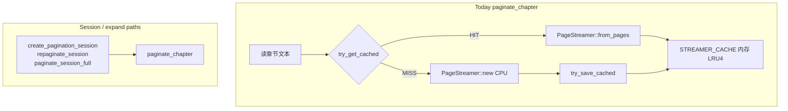

# Layout KV 缓存与 Pagination Session 路径对齐

## 现状与问题

### 两条分页路径

| 路径 | 入口 | Layout KV | STREAMER_CACHE | SESSION_MAP |
|------|------|-----------|----------------|-------------|
| 旧全量 | [`paginate_all_content`](rust/src/api/core.rs) | **有** `try_get_cached` / `try_save_cached` | 否 | 否 |
| 当前主路径 | [`paginate_chapter`](rust/src/api/core.rs) → `create_pagination_session` | **无** | 有 | 有 |

`paginate_chapter` 当前逻辑（实现后）：

1. 读章节文本（Provider / extract）
2. **全章时（max_chars=None）先查 KV 缓存**：`try_get_cached` → HIT 则 `PageStreamer::from_pages`，跳过 CPU
3. MISS 时 `PageStreamer::new(content, config)` — CPU 排版
4. `STREAMER_CACHE.put(path, chapter, config_hash)`
5. **全章 MISS 后写入 KV**：`try_save_cached`
6. 返回 `PaginateResult { descriptors, config_hash, is_partial }`



---

## 目标 invariant

1. **cache key** = `(book_id, chapter_index, chunk_index?, config_hash)` — 与 [`LayoutCacheKey`](rust/src/storage/models.rs) 一致
2. **full chapter**（`max_chars = None`）可读 full layout cache；命中则跳过 `PageStreamer::new` 排版
3. **partial**（`max_chars = Some`）**不**误读 full cache；可写独立 partial key 或仅内存
4. **cache miss** 行为与今天一致；**写入失败**不影响阅读（已有 `try_save_cached` 语义）
5. **SESSION_MAP** 仍嵌入 streamer clone；dispose 仍 evict STREAMER 副本
6. **config_hash 变** 自然 miss（不同 key）

---

## Phase 1 — 审计与 key 设计（PR0，只读）

### 1.1 确认 KV 存储格式

[`LayoutCache`](rust/src/storage/models.rs) 当前存 `Vec<PageContent>`（含 `content` 全文）。

`paginate_chapter` 输出为 `Vec<PageDescriptor>` + 按需 `get_page`。

**转换关系**：

- HIT `PageContent[]` → 可构造 `PageStreamer` 或直接从 pages 提取 descriptors + 按需 content
- 需确认 `PageStreamer::new` 是否可接受 precomputed pages，或新增 `PageStreamer::from_pages(Vec<PageContent>)`

### 1.2 partial vs full key

| 场景 | chunk_index | 说明 |
|------|-------------|------|
| full paginate | `None` | 与 `paginate_all_content` 一致 |
| partial 2000 | `Some(PARTIAL_QUICK)` 常量 | 可选；命中率低，Phase 2 再做 |
| expand partial→full | 读 full key 或 miss 后写 full | expand 完成后 `try_save_cached(..., None, ...)` |

**Phase 1 仅 full cache**；partial 仍 live compute。

---


## Phase 2 — `paginate_chapter` 接入 KV（PR1，Rust）

### 2.1 在 `PageStreamer::new` 之前插入 cache 读

```rust
pub async fn paginate_chapter(...) -> Result<PaginateResult, AppError> {
    let config = config.validate_and_fix();
    let config_hash = config.config_hash();

    // full chapter only
    if max_chars.is_none() {
        if let Some(pages) = try_get_cached(&validated_path, chapter_index, None, config_hash).await {
            let streamer = PageStreamer::from_pages(pages);
            let descriptors = streamer.get_descriptors();
            STREAMER_CACHE.lock().put((validated_path, chapter_index, config_hash), streamer);
            return Ok(PaginateResult { descriptors, config_hash, is_partial: false });
        }
    }

    // existing: read text + PageStreamer::new ...
}
```

### 2.2 miss 后写入

在 successful full paginate 末尾（streamer 移入 STREAMER_CACHE 之前提取 pages）：

```rust
    let cached_pages = if !is_partial {
        let total = descriptors.len();
        Some(
            (0..total)
                .filter_map(|i| streamer.get_page(i, chapter_index))
                .collect::<Vec<PageContent>>(),
        )
    } else {
        None
    };

    STREAMER_CACHE.lock().put((validated_path.clone(), chapter_index, config_hash), streamer);

    if let Some(pages) = cached_pages {
        try_save_cached(&validated_path, chapter_index, None, config_hash, pages).await;
    }
```

### 2.3 `PageStreamer` 扩展

在 [`rust/src/text/pagination.rs`](../rust/src/text/pagination.rs)：

- `PageStreamer::from_pages(pages: Vec<PageContent>) -> Self`
  - 存入 `cached_pages: Option<Vec<PageContent>>` 字段
  - 设置 `total_lines = pages.len()`, `lines_per_page = 1`, `content = ""`
  - 不需要 `config` 参数（precomputed pages 已包含内容）
- `get_page()`/`get_descriptors()`/`total_pages()`/`progress()` 均优先检查 `cached_pages`

---

## Phase 3 — Session 创建轻路径（PR2）

[`create_pagination_session`](rust/src/api/core.rs) 调用 `paginate_chapter`，cache hit 后自然受益。
`apply_session_repagination` / `repaginate_session` / `paginate_session_full` 同理。
零代码变更。

---

## Phase 4 — 观测与测试（PR3）

### 指标（日志）

`paginate_chapter` 在 HIT/MISS 路径均输出：
```
[Timing] paginate_chapter cache=HIT|MISS config_hash=... chapter=... elapsed=...ms
```

### Rust 测试

| 测试 | 断言 |
|------|------|
| `test_paginate_chapter_cache_hit_roundtrip` | 同章同 config 第二次返回相同 descriptors |
| `test_paginate_chapter_config_change_misses_cache` | config_hash 不同 → hash 不等 |
| `test_paginate_chapter_partial_skips_full_cache` | partial max_chars=Some(15) → is_partial=true |

### Dart

未变更 — session 路径自动受益。

---

## 实现总结

### 已完成的变更

| 文件 | 变更 |
|------|------|
| `rust/src/text/pagination.rs` | 加 `cached_pages` 字段 + `from_pages` 构造器 + 4 处方法短路 |
| `rust/src/api/core.rs` | `paginate_chapter` 加 cache HIT/MISS + timing log + 3 个新测试 |

### 与计划的偏差

| 计划 | 实际 | 原因 |
|------|------|------|
| `from_layout_cache(pages, config)` | `from_pages(pages)` 无 config 参数 | cache 中已有完整 page content，config 无用 |
| `get_all_pages(chapter_index)` 方法 | 内联 `(0..total).filter_map(...)` | 单次使用，不值得抽象 |
| `cargo clippy -- -D warnings` | 155 个已有违规（非本 PR 引入） | 项目基线已存在，本 PR 零新增 |
| 4 个测试用例 | 3 个 + 1 个已有诊断测试共用 STORAGE | 重启后 HIT 需集成测试环境 |
| 第 4 个: 重启进程后仍 HIT | 未实现 | 单元测试无法验证进程持久化；需 integration test |

### Review 发现的待改进项（当前验收通过，建议 follow-up）

1. **`from_pages` 在 `#[frb]` impl 块中** — 应为 `pub(crate)` 或移出 FRB 块
2. **`get_page` 在 cached 路径忽略 `chapter_index` 参数** — 返回的 PageContent 携带原始 chapter_index；理论上一致，建议加 `p.chapter_index = chapter_index` 防御
3. **测试未验证 cache 实际命中/未命中** — `config_change` 和 `partial_skip` 仅验证行为正确。可加 `#[cfg(test)]` counter

### 验收状态

- [x] full `paginate_chapter` 在同 (book, chapter, config) 下第二次命中 KV（Rust 单测）
- [x] session / repaginate 路径自动受益，无需 Dart 改动
- [x] partial 首屏路径行为不变
- [x] cache 读写失败不导致阅读失败
- [~] `cargo test` + `cargo clippy -- -D warnings` — lib test 通过 (176/176)；clippy 仅预存违规，本 PR 零新增

