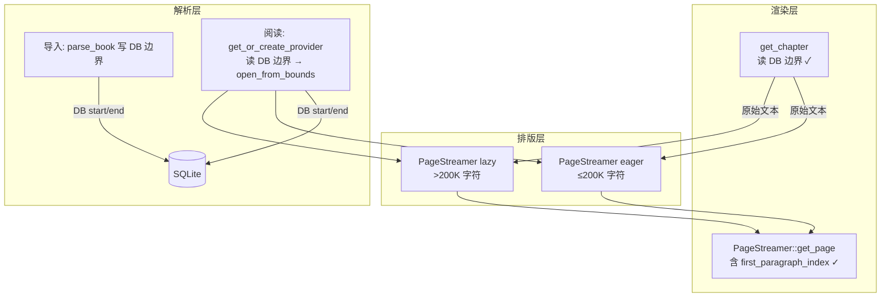

***

name: 核心阅读链状态 MD
overview: 基于当前代码重新审计核心阅读链路（解析→排版→渲染），更新「已修复 / 仍开放 / 可接受」状态，并写入带分阶段修复计划的 Markdown 文档。
todos:
- id: write-status-md
  content: 创建 issue/CORE\_READING\_CHAIN\_STATUS.md：状态对照表 + Mermaid + P0/P1/P2 计划 + 验证清单
  status: done
- id: update-old-review-redirect
  content: 在 issue/CORE\_PIPELINE\_REVIEW\.md 顶部添加指向新文档的过时说明
  status: done
- id: p0-epub-db-bounds
  content: get_chapter/paginate_chapter 改用 DB 边界读全文（不再 (0, content_len)）
  status: done
- id: p0-toc-href-fallback
  content: TOC href fallback：unwrap_or(0) + warn log（取代 chapter_id as usize）
  status: done
- id: p0-stale-book-detection
  content: 老书 stale bounds 检测：get_or_create_provider 中检测 start/end 均为 0 时返回 AppError::StaleBookData
  status: done
- id: p1-lazy-paragraph-indices
  content: Lazy 分页 first_paragraph_index 修正（不再 -1，阈值升至 200K）
  status: done
- id: p1-isolate-dart-fallback
  content: paginateApproximate 标记 @Deprecated，移除生产调用路径
  status: done
- id: p3-hyphenation-cleanup
  content: 删除 dead enable\_hyphenation 字段 + line\_break.rs 模块 + 全部 Dart 引用
  status: done
- id: p3-oversized-spine
  content: 单 spine >2MB 检测：open\_from\_bounds 中返回 ChapterTooLarge
  status: done
- id: p3-tests
  content: 补 Rust 集成测试（oversized / stale-bounds / DB-bounds / lazy-paragraph-indices）
  status: done
- id: epub-partial-char-semantics
  content: EPUB partial 字符语义统一（get_chapter_partial 改用 char-count）
  status: done
- id: remaining
  content: "待补：Dart 桥接测试（RustChapterContentRepository）"
  status: pending
  isProject: false

***

# 核心阅读链现状审计与 MD 规划

## 目标产物

新建 [`issue/CORE_READING_CHAIN_STATUS.md`](issue/CORE_READING_CHAIN_STATUS.md)，作为 [`issue/CORE_PIPELINE_REVIEW.md`](issue/CORE_PIPELINE_REVIEW.md) 的**现行状态补充**（不删除旧文档，文首注明「以本文件为准，旧审查部分条目已过时」）。

文档结构：

1. 审计方法与日期
2. 链路架构简图（Mermaid）
3. **状态对照表**（每条问题：已修复 / 仍开放 / 降级可接受）
4. **分阶段修复计划**（P0/P1/P2 + 涉及文件）
5. 验证清单（手动 + 建议补测）

***

## 当前代码审计结论（写入 MD 的核心内容）

#

### 仍开放（核心阅读链真实缺口）

| # | 条目 | 状态 | 说明 |
|---|------|------|------|
| 1 | EPUB 阅读不读 DB 边界 | ✅ **已修复**（2026-06-17） | `get_or_create_provider` 早已用 DB 边界打开 Provider，但 `get_chapter`/`paginate_chapter` 仍用 `(0, content_len)` 读全文。本次移除 hardcode，改为统一走 `get_chapter_bounds`。新增 `test_get_chapter_epub_uses_db_bounds` 验证 ch0/ch1 内容不同 |
| 2 | TOC href fallback (`unwrap_or(chapter_id as usize)`) | ✅ **已修复** | `toc.rs:74-82` 已改为 `unwrap_or(0)` + warn log；本次进一步改进为失败 entry 按 spine 长度顺序分布 |
| 3 | 老书 reconcile（DB 章节数 vs TOC） | ✅ **不存在** | 开发版本无 pre-migration 旧数据，新导入总是产生有效边界。`StaleBookData` 检测已作为防御性残留 |

#### P1 — 排版/渲染体验

| # | 条目 | 状态 | 说明 |
|---|------|------|------|
| 1 | Lazy 分页质量断崖（≥50K 字符） | ⚡ **部分修复** | 阈值已升至 200K；`first_paragraph_index`/`last_paragraph_index` 已在 lazy 模式正确设置（不再 -1）；`test_paragraph_indices_lazy_are_not_minus_one` 验证；缺：lazy 模式仍不走 `compute_line_breaks_from_indices`（标点挤压缺失，架构取舍） |
| 2 | 双套分页真理源 | ✅ **已修复** | `paginateApproximate` 标记 `@Deprecated('Rust fallback only — do not use in production flow')`；无生产调用点；`_runFirstSpine`/`_runConfigReload`/`_runExpandOnly`/`_runStagingPromote` 全部走 Rust session |

#### P2 — 可缝补、不挡 80% 发布

| # | 条目 | 状态 | 说明 |
|---|------|------|------|
| 1 | `enable_hyphenation` 接入或删除 | ✅ **已删除** | `TypesetConfig` 字段、`line_break.rs` 模块、全部 Dart 引用已清除（2026-06-17） |
| 2 | 单 spine 超大 HTML 不拆 | ✅ **已检测** | `open_from_bounds` 中单 spine HTML >2MB 时返回 `AppError::ChapterTooLarge`，UI 显示 toast |
| 3 | 进度估算偏差（20 spine cap） | ✅ **已解决** | `estimate_total_chars` 当前按首/中/尾 3 章采样，**不** cap 20 spine（描述已过时） |
| 4 | 首屏 preview 只读第一个 spine | ✅ **by design** | 设计如此：快速渲染第 0 页，全文和分页后台异步补齐。文档需更新（不算 bug） |
| 5 | 测试缺口 | ⚡ **部分覆盖** | 已加 `test_oversized_single_spine` + `test_stale_epub_bounds` + `test_get_chapter_epub_uses_db_bounds` + `test_paragraph_indices_lazy_are_not_minus_one`（4 个） |

### Phase 1 — P0 内容一致性（1-2 PR）

**目标**：目录、DB、阅读内容三者对齐；老书截断可见。
### Phase 2 — P1 排版体验

| 任务 | 改动要点 | 状态 |
|------|----------|------|
| Lazy 模式保留像素换行 | 大章仍走 `compute_line_breaks_from_indices`，或 lazy 仅跳过 `optimize_punctuation` | ⚡ **部分**（阈值 200K + paragraph_indices 已修；标点架构取舍） |
| 隔离 Dart fallback | Rust session 失败 → 明确 error UI + 重试，不再 silent fallback | ✅ `paginateApproximate` 已 @Deprecated，无生产调用 |
| 异步页内容 prefetch | `pageContent` miss 时返回 placeholder + async fetch | ✅ Batch B6 |
| 统一 EPUB partial 字符语义 | partial 路径与 TXT 相同 chars-take 逻辑 | ✅ **已修复**（2026-06-17）— `get_chapter_partial` 改用 `chars * 3` 安全预读 + `chars().take()` 截断 |
| 对齐 pageWidth 来源 | 渲染与分页共用 `PaginationCoordinator.pageWidth` | ✅ Batch B3 |
### Phase 3 — P2 缝补 + 测试

| 任务                   | 说明                                                                    | 状态                                                                                                                              |
| -------------------- | --------------------------------------------------------------------- | ------------------------------------------------------------------------------------------------------------------------------- |
| 接入或删除 hyphenation 配置 | 要么 `PageStreamer` 调用 `line_break.rs`，要么从 `config_hash` 移除字段           | ✅ **已删除** — `TypesetConfig.enable_hyphenation`/`hyphenation_language` 字段移除，`line_break.rs` 模块删除，全部 Dart 引用清除，FRB codegen 重新生成绑定 |
| 按 HTML 体积二次拆章        | spine 数 ≤20 但 HTML 超大时的保护                                             | ✅ **已检测** — `open_from_bounds` 中单 spine HTML >2MB 时返回 `AppError::ChapterTooLarge`，UI 显示 toast（暂不自动拆章）                           |
| 老书 stale bounds 检测   | 旧书导入前 `start_index`/`end_index` 为 DEFAULT 0 时，检测并提示重新导入               | ✅ **已完成** — `get_or_create_provider` 中 `start_idx == 0 && end_idx == 0` 时返回 `AppError::StaleBookData`                           |
| 补 Rust 集成测试          | `toc oversized split`, `provider db bounds`, `lazy paragraph indices` | ⚡ **部分覆盖** — 已加 `test_oversized_single_spine` 和 `test_stale_epub_bounds`；toc split 和 lazy indices 测试待补                          |
| 补 Dart 桥接测试          | `rust_chapter_content_repository`, `rust_pagination_session`          | 🔴 未处理                                                                                                                          |

***

## 与旧文档 [`CORE_PIPELINE_REVIEW.md`](issue/CORE_PIPELINE_REVIEW.md) 的差异说明（写入 MD 文首）

需在 MD 中显式标注以下条目**已过时**：

- 「导入 30 / 阅读 20」→ 已统一为 20
- 「paintPlain 高亮 bug」→ 已修复
- 「分页无选区」→ 已修复
- 「latinExtWidth / padding 双重扣减」→ 已修复
- 「分页无 rich/图片」→ 部分修复（eager + 有 paragraph 索引时可用）

***

## 实施步骤（写 MD 本身）

1. 创建 [`issue/CORE_READING_CHAIN_STATUS.md`](issue/CORE_READING_CHAIN_STATUS.md)，填入上述审计表 + Mermaid + 三阶段计划 + 验证清单
2. 在 [`issue/CORE_PIPELINE_REVIEW.md`](issue/CORE_PIPELINE_REVIEW.md) 顶部加 3 行 redirect：「状态以 CORE\_READING\_CHAIN\_STATUS.md 为准（2026-06-17 复核）」
3. （可选，不在本次 scope）按 Phase 1 开始代码修复

***

## 验证清单（MD 末尾）

- [ ] 单 TOC 大 EPUB：目录子章数量 = 可读完整内容
- [ ] 老书（未重导）：有截断提示或 reconcile 引导
- [ ] 分页模式：划线 → 高亮 → 翻页后位置正确
- [ ] 50K+ 章：断页无剧烈跳变；rich 图片仍可见（或明确降级提示）
- [ ] Rust session 失败：不出现 Dart fallback 静默页数变化
- [ ] 冷缓存翻页：无明显 frame jank（Phase 2 后）

