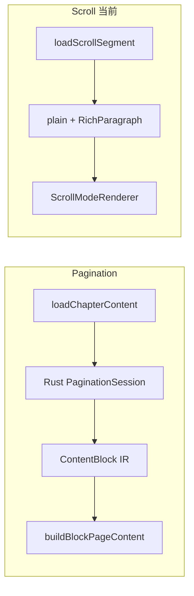
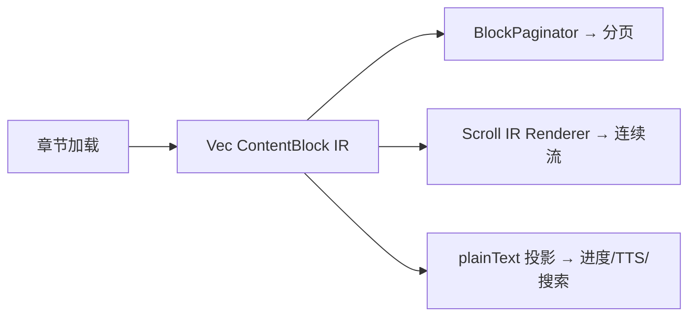

# P4-1 — Scroll 统一 Chunked IR（主线程）

**Agent 主任务** · ADR [009](../discuss/adr/009-scroll-ir-unification.md) · **参与者勿改此链，除非与 Agent 同步**

---

## 现状（2026-06-25 审计）

关键代码：

- `chapter_load_orchestrator.dart` → `_runScrollOrBilingualMode` **跳过分页 pipeline**
- `rust_chapter_content_repository.dart` → `_needsRichContent(scroll)` 拉 rich
- `scroll_segment_factory.dart` → plain `\n\n` 分段

---

## 目标态

---

## 分阶段实施（Agent）

### Phase A — 只读 spike（当前）

- [x] 列出 FRB 已有 block 相关 API（`anchorPageBlocks`、`sessionMode`…）
- [x] 确认 scroll 是否可 **不创建完整 session** 仅拉 IR
- [x] 记录于本文件 §Spike 结果

### Phase B — Scroll 单章 IR 渲染 MVP

- [ ] 新 widget 或扩展 `ScrollModeRenderer`：`IrScrollBlockList`
- [ ] 单章、无跨章拼接；含图章用 `EpubBlockImageCache`
- [ ] 进度：`char_offset` per block → `reportScrollPosition`

### Phase C — 跨章 IR 拼接

- [ ] `ScrollChapterSegment` 携带 `List<ContentBlock>` 或 block 范围
- [ ] `ScrollBoundaryCoordinator.appendNext/prependPrev` 加载 IR 而非 plain payload

### Phase D — 删除 scroll rich 主路径 ✅（2026-06-25）

- [x] `_loadScrollModePayload`：IR → plain 回退；不加载 rich
- [x] scroll 路径永不 `epubRichSkipped`；notice 仅双语
- [x] `scrollIrPayload` helper；segment/coordinator 单测

**遗留（P4-5）**：双语仍走 `RichParagraph` 过渡。

---

## 验收（PHASE4_SCOPE）

- [x] scroll 含图章走 IR，无 `epubRichSkipped` toast（scroll 模式）
- [x] scroll / pagination 同源 `ContentBlock[]`
- [x] I1/I2 不变：进度仍 charOffset on plainText

**2026-06-25 初查**

| 发现 | 路径 |
|------|------|
| 章级 IR 加载已存在（非 session） | `rust/src/reading/chapter_ir.rs` → `load_chapter_content_ir` |
| EPUB/TXT IR 解析 | `parser/epub/content_ir.rs`、`parser/txt/content_ir.rs` |
| 分页 session 取块 | `get_session_page_blocks`（`api/core.rs`）— **按页**，非整章 |
| Scroll 当前入口 | `_runScrollOrBilingualMode` 跳过分页；`loadScrollSegment` → plain+rich |
| 块渲染已有 | `buildBlockPageContent`（pagination）；scroll **无** |

**推论**：P4-1 最小路径 = scroll 调 `load_chapter_content_ir`（或新 FFI 薄封装）→ Flutter `ListView` 按 `ContentBlock` 渲染；**不必**先建完整 `PaginationSession`。

**下一步（Agent）**：Phase C 跨章 IR 拼接；双语仍走 rich 过渡。

### Phase B — Scroll 单章 IR 渲染 MVP ✅（2026-06-25）

- [x] FFI `get_chapter_content_ir`（`api/core.rs` + orchestrator）
- [x] `flutter_rust_bridge_codegen generate`
- [x] scroll 加载路径优先 IR（EPUB/TXT，`ReadingMode.scroll`）
- [x] `buildScrollIrBlockList` + `ScrollModeRenderer` 分支
- [x] `currentChapterIr` / `currentChapterFilePath` 仓库字段

### Phase C — 跨章 IR 拼接 ✅（2026-06-25）

- [x] `ScrollChapterSegment` 增加 `irBlocks` + `chapterFilePath`
- [x] `computeScrollIrListMetrics` 进度/高度估算
- [x] `ScrollSegmentFactory` / `appendNext` / `prependPrev` 走 IR payload
- [x] `resetScrollDocument` 传递 `chapterIr` + `chapterFilePath`
- [x] `buildScrollIrMultiSegmentList` 多章连续渲染
- [x] 测试：`scroll_boundary_coordinator_test` + 你的 `paginated_renderer_test`（16/16 绿）

**待办**：
- [x] 跨章 `ScrollBoundaryCoordinator` 拼接 IR 段（R1.1 验证完成）
- [ ] 双语改 IR 或独立 feature（P4-5，延迟至后续）
- [x] Dart/集成测试：含图 EPUB scroll（R4.1 金路径测试 6/6 绿）

---

## 参与者协作点

| 你可并行 | 不可并行 |
|----------|----------|
| T1 Timing 日志 | 改 `scroll_mode_renderer` IR 渲染 |
| T2/T3/T6 文档 | 改 `rust_chapter_content_repository` load 路径 |
| T4/T5 staging | 改 `ScrollBoundaryCoordinator` 数据类型 |

---

## 验收（PHASE4_SCOPE）

- [x] 含图 EPUB **scroll** 模式可见图，无 `epubRichSkipped` toast
- [x] scroll / pagination 同源 `ContentBlock[]`
- [x] I1/I2 不变：进度仍 charOffset on plainText
