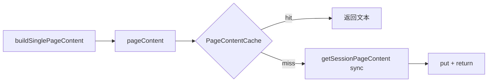
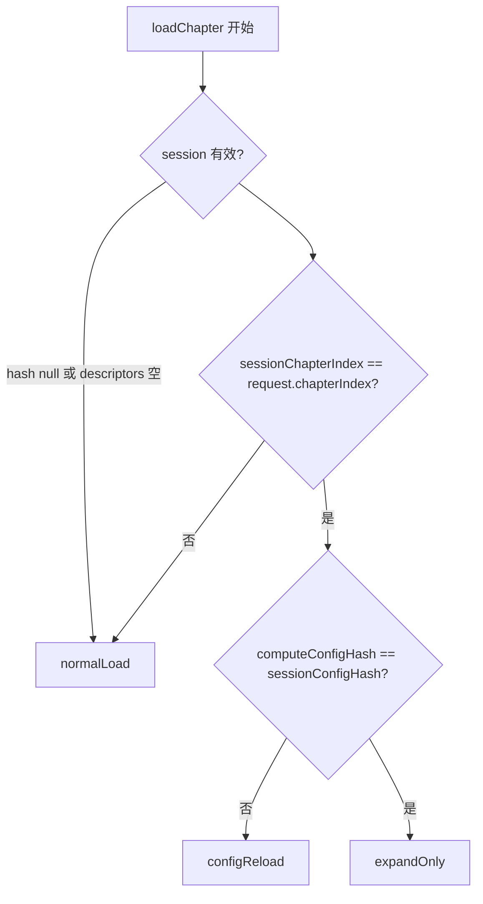

# pageContent fetch-on-miss + 自动推导 ChapterPaginationIntent

## 背景

当前两条已知短板：

1. **Renderer 依赖预取**：`[RustPaginationSession.pageContent](lib/features/reader/core/data/rust_pagination_session.dart)` 仅读 `PageContentCache`；miss 时 `[buildSinglePageContent](lib/features/reader/rendering/paginated_renderer.dart)` 渲染空 `Container`。
2. **Intent 由调用方手动指定**：`[ReaderViewModel](lib/features/reader/core/application/reader_view_model.dart)`、`[reader_content_area](lib/features/reader/core/presentation/reader_content_area.dart)` 等 5 处需正确传 `ChapterPaginationIntent`，易错且与 `[README](lib/features/reader/README.md)` 描述的策略重复。

推荐落地顺序（你已选择）：**PR1 fetch-on-miss → PR2 auto intent**。

---

## PR1 — pageContent fetch-on-miss

### 目标

`pageContent(i)` 在 cache miss 时**同步**从 Rust session 拉取并写入 cache，renderer 不再依赖 `ensureWindow` 预取窗口才能显示内容。

### 现状

```dart
// rust_pagination_session.dart
String? pageContent(int pageIndex) => _contentCache.get(pageIndex);

Future<void> _fetchPageSync(int pageIndex) async {
  final content = await core_api.getSessionPageContent(...); // async 包装
}
```

Rust 侧 `[get_session_page_content](rust/src/api/core.rs)` 已是 **sync 纯内存**操作（`PageStreamer.get_page`），适合在 UI 线程同步调用（与 `get_page_content` 同族）。

### 实现步骤

**1. 抽取同步 fetch 核心**

在 `[rust_pagination_session.dart](lib/features/reader/core/data/rust_pagination_session.dart)`：

```dart
String? _fetchAndCachePage(int pageIndex) {
  if (_contentCache.containsKey(pageIndex)) return _contentCache.get(pageIndex);
  final handle = _handle;
  if (handle == null || _descriptors == null) return null;
  if (pageIndex < 0 || pageIndex >= _descriptors!.length) return null;
  try {
    // 使用 FRB 为 sync Rust fn 生成的同步 API（regen 后确认方法名）
    final content = core_api.getSessionPageContent(handle: handle, pageIndex: pageIndex);
    if (content.isNotEmpty) {
      _contentCache.put(pageIndex, content);
    }
    return content.isEmpty ? null : content;
  } catch (e) {
    Logging.error('_fetchAndCachePage error for page $pageIndex: $e');
    return null;
  }
}
```

**2. 改造 `pageContent`**

```dart
@override
String? pageContent(int pageIndex) {
  final cached = _contentCache.get(pageIndex);
  if (cached != null) return cached;
  return _fetchAndCachePage(pageIndex);
}
```

**3. 统一预取路径**

- `_preloadPageRange` / `_prefetchSurrounding` 改为调用 `_fetchAndCachePage`（或保留 async 包装仅用于 fire-and-forget 周边页，内部仍走 sync fetch）
- `ensureWindow(center)` 逻辑不变：先 fetch center，再 microtask 预取 ±3

**4. 边界**

- handle/dispose 后 miss → 返回 null（renderer 仍走占位，与现行为一致）
- config repaginate 后 `_contentCache.clear()` 已有；下次 `pageContent` 自动 refetch
- **不在 `pageContent` 内调用 `trimAround`**（避免 build 路径副作用）；trim 仍只在 `ensureWindow` / 翻页导航时触发

### 测试（PR1）


| 文件                                                                                                                                                      | 用例                                                                          |
| ------------------------------------------------------------------------------------------------------------------------------------------------------- | --------------------------------------------------------------------------- |
| 新建 `[test/features/reader/core/data/rust_pagination_session_test.dart](test/features/reader/core/data/rust_pagination_session_test.dart)` 或扩展现有 mock 测试 | mock `getSessionPageContent`：`pageContent(3)` 首次 miss 触发 fetch 并缓存；第二次不重复调用 |
| `[test/features/reader/page/widgets/paginated_renderer_test.dart](test/features/reader/page/widgets/paginated_renderer_test.dart)`                      | 新增：`pageContent` 首次 null、二次有值时渲染 `SelectableText`（可选）                       |
| `[test/features/reader/core_pagination_test.dart](test/features/reader/core_pagination_test.dart)`                                                      | 集成：create session 后不 preload，`getSessionPageContent` 等价路径仍能拿到页文本            |


### 验收

- 快速跳到未预取页码不再长期空白（仅首帧 sync fetch 延迟）
- `ensureWindow` 仍负责滑动窗口 trim，行为不退化
- 无在 `build()` 中新增 async/await




---

## PR2 — 自动推导 ChapterPaginationIntent

### 目标

调用方只传 `loadChapter(chapterIndex, {initialCharOffset, preserveContent?})`；orchestrator 在 `run()` 开头解析 intent，**删除** public API 上的 `intent` 参数（`ChapterPaginationIntent` 保留为 orchestrator 内部概念）。

### 决策树




**session 有效**定义：

- `_contentRepo.sessionConfigHash != null`
- `_contentRepo.descriptors?.isNotEmpty == true`
- `_contentRepo.sessionChapterIndex == request.chapterIndex`（**新增字段**）

**config hash**计算（与 Rust 一致）：

```dart
// PaginationCoordinator
int computeConfigHash() =>
    buildTypesetConfig(...).configHash.toInt(); // TypesetConfig.config_hash 已 #[frb(sync)]
```

无需新增 Rust FFI；`[TypesetConfig.config_hash](rust/src/domain/types/typeset.rs)` 已通过 FRB 暴露。

### 新增 session 元数据

在 `[RustPaginationSession](lib/features/reader/core/data/rust_pagination_session.dart)` / `[PaginationSession](lib/features/reader/core/domain/pagination_session.dart)` / `[ReaderRepositoryInterface](lib/features/reader/core/domain/reader_repository_interface.dart)`：


| 字段                    | 来源                                       | 用途                                         |
| --------------------- | ---------------------------------------- | ------------------------------------------ |
| `sessionChapterIndex` | `beginPaginate` / `repaginateInPlace` 入参 | 换章检测                                       |
| `sessionIsPartial`    | `PaginateResult.isPartial`               | expandOnly 时跳过 redundant full expand（可选优化） |


`dispose()` 一并清空（与 `_sessionConfigHash` 同级）。

### Orchestrator 改造

**1. 新增 resolver**（可放在 `[chapter_load_orchestrator.dart](lib/features/reader/core/application/chapter_load_orchestrator.dart)` 或独立 `chapter_pagination_intent_resolver.dart`）：

```dart
ChapterPaginationIntent resolveIntent({
  required int chapterIndex,
  required ReaderRepositoryInterface repo,
  required PaginationCoordinator pagination,
}) { ... }
```

**2. `ChapterLoadOrchestrator.run`**

- 删除 `switch (request.intent)` 对外部 intent 的依赖
- 改为：`final intent = resolveIntent(...)` 再 switch
- 删除 `configReload` 分支内 `sessionConfigHash == null` 的重复判断（resolver 已覆盖）

**3. `preserveContent` 默认策略**（resolver 旁文档化，或在 `ChapterLoadRequest` 工厂中应用）：


| 推导 intent      | 默认 preserveContent                  |
| -------------- | ----------------------------------- |
| `normalLoad`   | `false`（换章可显式传 `true`，navigator 已用） |
| `configReload` | `true`                              |
| `expandOnly`   | `true`                              |


实现方式：若 caller 未显式传 `preserveContent`，在 `ChapterLoader.loadChapter` 内根据推导 intent 填默认值（保留 override 能力给 navigator）。

**4. 简化调用方**（删除 `intent:` 参数）

- `[reader_view_model.dart](lib/features/reader/core/application/reader_view_model.dart)`：`initialize` / `_debounceReloadChapter` / `loadChapter`
- `[reader_content_area.dart](lib/features/reader/core/presentation/reader_content_area.dart)`：`onRetry`
- `[chapter_view_model.dart](lib/features/reader/core/application/chapter_view_model.dart)` / `[chapter_loader.dart](lib/features/reader/core/application/chapter_loader.dart)`

**5. 可选优化：expandOnly 跳过 redundant full**

若 `sessionIsPartial == false`，`_runExpandOnly` 返回 `isPartial: false`，`run()` 跳过 `expandToFullChapter`（避免同 config 重复 full repaginate）。

**6. `_runConfigReload` 小修**

统一使用 `request.initialCharOffset`（而非 `_pageState.currentCharOffset`）做 pageIndex 解析，与 finalize 一致。

### 测试（PR2）


| 文件                                                                            | 用例                                                                                                            |
| ----------------------------------------------------------------------------- | ------------------------------------------------------------------------------------------------------------- |
| 新建 `chapter_pagination_intent_resolver_test.dart`                             | 矩阵：无 session → normal；同章 hash 变 → configReload；同章 hash 同 → expandOnly；章 index 变 → normal                      |
| `[chapter_manager_test.dart](test/features/reader/chapter_manager_test.dart)` | 改 `loadChapter(0)` 不传 intent，mock `sessionConfigHash` + `sessionChapterIndex`，验证仍走 repaginate / beginPaginate |
| 保留原 `configReload` 行为测试，改为通过 mock session 状态触发而非显式 intent                     |                                                                                                               |


### 文档

更新 `[lib/features/reader/README.md](lib/features/reader/README.md)` Lifecycle 段：

- Intent 由 orchestrator **自动推导**（表格改为 decision tree）
- 调用方只需关心 `preserveContent` override
- 补充 PR1：`pageContent` fetch-on-miss 语义

---

## 风险与缓解


| 风险                                | 缓解                                                               |
| --------------------------------- | ---------------------------------------------------------------- |
| sync FFI 在 UI 线程阻塞                | `get_session_page_content` 纯内存；若 profiling 超阈值再改 async+notifier  |
| hash 比较时 calibration 仍为 null      | resolver 不替代 calib 等待；仅决定路径，calib 逻辑保持                           |
| 换章时 `pageState.chapterIndex` 尚未更新 | 用 `**sessionChapterIndex`** 而非 pageState 比较                      |
| mock 测试需新 stub                    | `_MockRepo` 增加 `sessionChapterIndex` / `sessionIsPartial` getter |


---

## PR 拆分与验收

### PR1（fetch-on-miss）

- [ ] `pageContent` miss 同步 fetch + cache
- [ ] 预取路径复用同一 fetch 实现
- [ ] 单元/集成测试 + `flutter test test/features/reader/`

### PR2（auto intent）

- [ ] `sessionChapterIndex` + `sessionIsPartial` 跟踪
- [ ] `resolveIntent()` + 调用方去掉 `intent` 参数
- [ ] preserveContent 默认策略
- [ ] resolver 单测 + chapter_manager 回归
- [ ] README 更新

**整体完成后**：加载 API 简化为 `loadChapter(index, {offset, preserveContent?})`；渲染层对预取窗口依赖降低，翻页体验更稳。