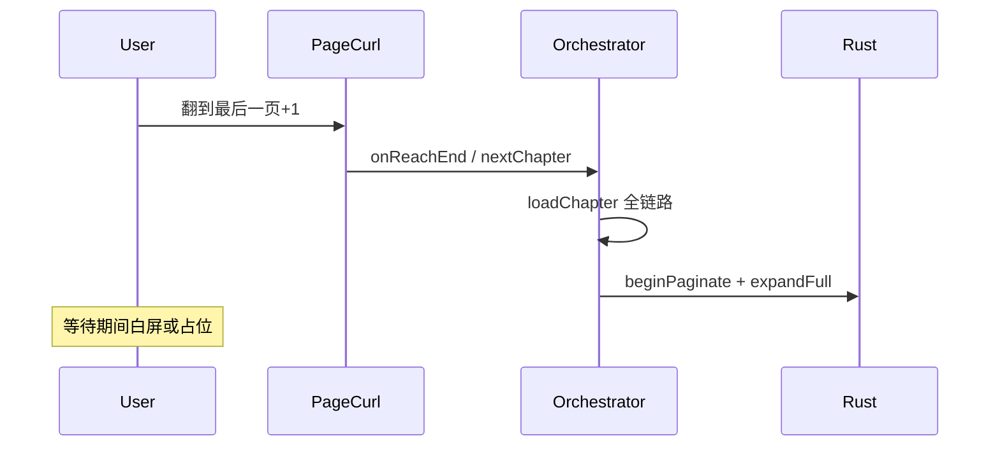

# 跨章无缝翻页（Cross-Chapter Preload）

## 现状与问题

### pageTurn 跨章流程（今天）

[`reader_content.dart`](../lib/features/reader/page/widgets/reader_content.dart) 在 pageTurn 模式：

- `extendedTotal = totalPages + (hasNext ? 1 : 0)` — 最后一页后多一页「虚拟页」用于触发换章
- `onPageChanged`：`index >= totalPages` → `onReachEnd()` → `nextChapter()`
- 虚拟页 `pageBuilder` 仍用**当前章** `descriptors` / `pageContent` — 跨章动画期间内容不对

### 现有预加载（不足）

[`ChapterNavigator.preloadAdjacentFirstPages`](../lib/features/reader/core/application/chapter_navigator.dart) → [`preloadNextChapterFirstPage`](../lib/features/reader/core/data/rust_chapter_content_repository.dart)：

- 仅 `loadFirstSpine` 纯文本 → `_preloadedNextPageContent`
- **无**下一章 `PageDescriptor[]`
- **无** Rust `PaginationSession` / `get_session_page_content`
- 与「descriptors 唯一真理」不一致（plan-unify-typeset-truth 已淘汰 approximate 路径）



**目标**：在用户翻到倒数几页时，下一章 descriptors + 第 0 页 content 已就绪；跨章时 **swap session** 而非 cold load。

---

## 目标 invariant

1. **当前章 session** 仍是唯一 active `PaginationSessionHandle`（单 handle 模型不变）
2. **下一章预加载** 为独立 **staging** 结构：descriptors + 首页 page content + config_hash（不要求长期双 handle）
3. **换章完成** 时：dispose 旧 handle → promote staging 为 active，或 fast path `loadChapter(normalLoad)` 若 staging miss
4. **config 变更**（configReload）或 **换书** 时：invalidate 全部 staging
5. **不** 恢复 `warmPageCache(firstSpine 估算文本)` 生产路径

---

## 方案对比

| 方案 | 描述 | 优点 | 缺点 |
|------|------|------|------|
| **A. Staging descriptors（推荐）** | 后台 `beginPaginate(下一章, 2000)`，结果存 Dart `NextChapterStaging`；换章时 promote | 不改 Rust 双 session；与现有 dispose 模型兼容 | promote 时需处理 handle 迁移或重建 |
| **B. 双 Rust handle** | 同时保持 current + next 两个 `PaginationSessionHandle` | 换章 O(1) swap | SESSION_MAP 翻倍；dispose/STREAMER 复杂度上升 |
| **C. 仅预取 descriptors（无 session）** | Rust 一次性 API 返回下一章 partial descriptors，不创建 handle | 最轻 | 换章仍要 create session；收益有限 |

**推荐方案 A**，分两阶段：**A1 仅 descriptors+首页 content 缓存** → **A2 handle promote（可选）**。

---

## Phase 1 — Staging 缓存（Dart，PR1）

### 1.1 新增 `NextChapterStaging`

路径建议：[`lib/features/reader/core/data/next_chapter_staging.dart`](../lib/features/reader/core/data/next_chapter_staging.dart)

```dart
class NextChapterStaging {
  final int chapterIndex;
  final int configHash;
  final List<PageDescriptor> descriptors;
  final String firstPageContent;
  final bool isPartial;

  bool matches(int chapterIndex, int configHash);
}
```

由 [`ReaderRepository`](../lib/features/reader/data/repositories/rust_reader_repository.dart) 或独立 `CrossChapterPreloadService` 持有；`disposePagination()` / `configReload` / 换书时 `clear()`。

### 1.2 后台触发时机

| 触发点 | 行为 |
|--------|------|
| `_runComplete` / firstSpine 完成后 | `unawaited(preloadNextChapterPagination(centerIndex))` |
| `loadPage` 进入 `totalPages - 2` | 同上（提前量可配置 `preloadLeadPages = 2`） |
| `configReload` / 换章 / reset | `staging.clear()` |

### 1.3 预加载实现（不占用 active handle）

**关键约束**：[`RustPaginationSession`](../lib/features/reader/core/data/rust_pagination_session.dart) 当前单 `_handle`；后台分页不能直接 `beginPaginate`（会 `_releaseHandle` 杀掉当前章）。

**选项 1（推荐 PR1）**：Rust 新增 **无 handle** 的轻量 API：

```rust
/// 仅计算 partial/full descriptors + 第 0 页 content，不写入 SESSION_MAP
pub async fn paginate_chapter_preview(
    file_path: String,
    chapter_index: i32,
    config: TypesetConfig,
    max_chars: Option<u64>,
) -> Result<PaginatePreview, AppError>
```

`PaginatePreview { descriptors, config_hash, is_partial, first_page_content }` — 内部仍用 `STREAMER_CACHE` 临时 entry，或仅 `PageStreamer::new` 不入 SESSION。

**选项 2（Dart-only 过渡）**：临时 `createPaginationSession` + 拷贝 descriptors + `get_session_page_content(0)` + **立即 dispose** — 实现快但换章前重复 I/O，仅作 PoC。

### 1.4 pageTurn UI 接入

[`reader_content.dart`](../lib/features/reader/page/widgets/reader_content.dart)：

- 当 `idx == totalPages`（虚拟跨章页）且 staging 命中：
  - `startOffset = staging.descriptors[0].startOffset`
  - 渲染 staging.firstPageContent（或 staging 专用 dataSource 分支）
- `onReachEnd`：若 staging 命中 → **fast path** `loadChapter(next, expandOnly/normalLoad)` 并 inject descriptors，否则现有 cold path

[`ReaderRenderDataSource`](../lib/features/reader/core/data/reader_render_data_source.dart) 可扩展：

```dart
NextChapterStaging? get nextChapterStaging;
```

---

## Phase 2 — Session promote（可选，PR2）

若 Phase 1 dispose+recreate 仍慢：

1. Rust：`create_pagination_session` 支持 `reserve_handle: Option<u64>` 或 staging 专用 handle 池
2. 换章：`dispose(current)` + assign staging handle → `_handle`

仅在 profiling 证明 Phase 1 不够时做。

---

## Phase 3 — 竞态与 generation

与 [`ChapterLoadOrchestrator`](../lib/features/reader/core/application/chapter_load_orchestrator.dart) `_generation` 对齐：

```dart
int _preloadGen = 0;

Future<void> preloadNext(int chapterIndex) async {
  final gen = ++_preloadGen;
  final preview = await repo.paginateChapterPreview(...);
  if (gen != _preloadGen) return; // stale
  _staging = NextChapterStaging(...);
  preloadGeneration.value++;
}
```

| 事件 | 动作 |
|------|------|
| 新 `loadChapter` 开始 | `_preloadGen++`，clear staging |
| configReload | clear staging |
| 用户跳到非 adjacent 章 | clear staging |
| 快速 nextChapter ×2 | 第二次 load 取消第一次 preload |

---

## 测试计划

| 文件 | 用例 |
|------|------|
| `test/features/reader/cross_chapter_staging_test.dart`（新建） | staging hit/miss；config hash 变 invalidate |
| [`chapter_manager_test.dart`](../test/features/reader/chapter_manager_test.dart) | firstSpine 完成后触发 preview preload（mock） |
| [`reader_content_test.dart`](../test/features/reader/page/widgets/reader_content_test.dart) | pageTurn 虚拟页渲染 staging 内容；无 staging 仍走 onReachEnd |

---

## 验收标准

- [ ] 当前章读到倒数第 2 页时，下一章 descriptors + 第 0 页 content 在后台就绪（Timing 日志可观测）
- [ ] pageTurn 跨章动画期间不再长期空白 Container
- [ ] configReload / 换章 / 快速连翻无 stale staging 污染 active session
- [ ] 不恢复 Dart approximate 分页生产路径
- [ ] `flutter test test/features/reader/` 通过

---

## 风险

| 风险 | 缓解 |
|------|------|
| 单 handle 与后台 paginate 冲突 | Phase 1 用 `paginate_chapter_preview` 无 handle API |
| STREAMER_CACHE LRU(4) 驱逐 | preview 用完即 pop 或短生命周期 key |
| 内存：同时持有两章 streamer | preview 只保留 descriptors + 1 页文本，不保留 full streamer |
| EPUB 大章 partial 2000 字不够换章首屏 | 换章 fast path 仍触发 expandToFull |

---

## PR 拆分建议

1. **PR1**：Rust `paginate_chapter_preview` + Dart `NextChapterStaging` + preload 触发 + invalidate
2. **PR2**：pageTurn UI + fast path loadChapter + 集成测试
3. **PR3（可选）**：handle promote 优化

**前置依赖**：[pland.md](pland.md) PR2（`sessionChapterIndex` / auto intent）完成后接入更顺；PR1 可与 pland PR1 并行。
