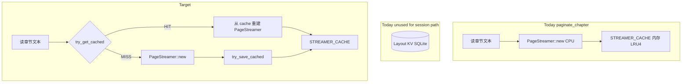

# Layout KV 缓存与 Pagination Session 路径对齐

## 现状与问题

### 两条分页路径

| 路径 | 入口 | Layout KV | STREAMER_CACHE | SESSION_MAP |
|------|------|-----------|----------------|-------------|
| 旧全量 | [`paginate_all_content`](rust/src/api/core.rs) | **有** `try_get_cached` / `try_save_cached` | 否 | 否 |
| 当前主路径 | [`paginate_chapter`](rust/src/api/core.rs) → `create_pagination_session` | **无** | 有 | 有 |

`paginate_chapter` 当前逻辑（L606–658）：

1. 读章节文本（Provider / extract）
2. `PageStreamer::new(content, config)` — **每次 CPU 排版**
3. `STREAMER_CACHE.put(path, chapter, config_hash)`
4. 返回 `PaginateResult { descriptors, config_hash, is_partial }`

**未调用** `try_get_cached`，因此：

- 同一本书同一章同一 config，**第二次打开**仍 full repaginate
- 设置 configReload 后 hash 变 → 合理 miss；但 **hash 不变的重进章** 也无法命中
- `paginate_all_content` 的 KV 投资与 session 路径 **脱节**



---

## 目标 invariant

1. **cache key** = `(book_id, chapter_index, chunk_index?, config_hash)` — 与 [`LayoutCacheKey`](rust/src/storage/models.rs) 一致
2. **full chapter**（`max_chars = None`）可读 full layout cache；命中则跳过 `PageStreamer::new` 排版
3. **partial**（`max_chars = Some`）**不**误读 full cache；可写独立 partial key 或仅内存
4. **cache miss** 行为与今天一致；**写入失败**不影响阅读（已有 `try_save_cached` 语义）
5. **SESSION_MAP** 仍嵌入 streamer clone；dispose 仍 evict STREAMER 副本
6. **config_hash 变** 自然 miss（不同 key）

---

## Phase 1 — 审计与 key 设计（PR0，只读）

### 1.1 确认 KV 存储格式

[`LayoutCache`](rust/src/storage/models.rs) 当前存 `Vec<PageContent>`（含 `content` 全文）。

`paginate_chapter` 输出为 `Vec<PageDescriptor>` + 按需 `get_page`。

**转换关系**：

- HIT `PageContent[]` → 可构造 `PageStreamer` 或直接从 pages 提取 descriptors + 按需 content
- 需确认 `PageStreamer::new` 是否可接受 precomputed pages，或新增 `PageStreamer::from_pages(Vec<PageContent>)`

### 1.2 partial vs full key

| 场景 | chunk_index | 说明 |
|------|-------------|------|
| full paginate | `None` | 与 `paginate_all_content` 一致 |
| partial 2000 | `Some(PARTIAL_QUICK)` 常量 | 可选；命中率低，Phase 2 再做 |
| expand partial→full | 读 full key 或 miss 后写 full | expand 完成后 `try_save_cached(..., None, ...)` |

**Phase 1 仅 full cache**；partial 仍 live compute。

---

## Phase 2 — `paginate_chapter` 接入 KV（PR1，Rust）

### 2.1 在 `PageStreamer::new` 之前插入 cache 读

```rust
pub async fn paginate_chapter(...) -> Result<PaginateResult, AppError> {
    let config = config.validate_and_fix();
    let config_hash = config.config_hash();

    // NEW: full chapter only
    if max_chars.is_none() {
        if let Some(pages) = try_get_cached(&validated_path, chapter_index, None, config_hash).await {
            let streamer = PageStreamer::from_pages(pages, config)?; // 或等价构造
            let descriptors = streamer.get_descriptors();
            STREAMER_CACHE.lock().put((validated_path.clone(), chapter_index, config_hash), streamer);
            return Ok(PaginateResult { descriptors, config_hash, is_partial: false });
        }
    }

    // existing: read text + PageStreamer::new ...
}
```

### 2.2 miss 后写入

在 successful full paginate 末尾：

```rust
if !is_partial {
    let pages = streamer.get_all_pages(chapter_index); // 需新增或从 streamer 导出
    try_save_cached(&validated_path, chapter_index, None, config_hash, pages).await;
}
```

### 2.3 `PageStreamer` 扩展

在 [`rust/src/text/pagination.rs`](../rust/src/text/pagination.rs)：

- `PageStreamer::from_layout_cache(pages: Vec<PageContent>, config: TypesetConfig) -> Self`
- 保证 `get_descriptors()` / `get_page()` 与 `new(content, config)` 行为一致

---

## Phase 3 — Session 创建轻路径（PR2）

[`create_pagination_session`](rust/src/api/core.rs)  today 调用 `paginate_chapter`，cache hit 后自然受益。

可选优化：`repaginate_session` / `apply_session_repagination` full expand 也走同一 hit 路径。

**expand partial → full**：

- partial session 已在内存；expand 时 `max_chars=None` → 若 KV HIT，**替换** streamer 而非重算
- 若 KV MISS，现有 CPU full paginate + **try_save_cached**

---

## Phase 4 — 观测与测试（PR3）

### 指标（日志）

```
[Timing] paginate_chapter cache=HIT|MISS config_hash=... chapter=... elapsed=...ms
```

### Rust 测试

| 用例 | 断言 |
|------|------|
| 同章同 config 第二次 `paginate_chapter` | 第二次 elapsed 显著降低；日志 HIT |
| config_hash 不同 | MISS |
| partial max_chars=2000 | 不读 full cache |
| full 完成后 | KV 可读；重启进程后仍 HIT（集成测，需 temp storage） |

### Dart

[`core_pagination_test.dart`](../test/features/reader/core_pagination_test.dart) 可选：同一 fixture 连续 create session 两次，断言第二次更快（flaky → 仅 Rust 单测）。

---

## 验收标准

- [ ] full `paginate_chapter` 在同 (book, chapter, config) 下第二次命中 KV（Rust 单测）
- [ ] session / repaginate 路径自动受益，无需 Dart 改动
- [ ] partial 首屏路径行为不变
- [ ] cache 读写失败不导致阅读失败
- [ ] `cargo test` + `cargo clippy -- -D warnings` 通过

---

## 风险

| 风险 | 缓解 |
|------|------|
| `PageContent` 与 `PageDescriptor` 格式漂移 | 单测 round-trip：`new` → save → load → `get_page` 一致 |
| KV 体积膨胀 | 仅 full chapter；已有 `LayoutCache` version 校验 |
| partial 误读 full cache | `max_chars.is_some()` 时跳过 try_get |
| `PageStreamer::from_pages` 与 config 不一致 | cache key 含 config_hash；load 时 `is_valid(expected_hash)` |

---

## 与 planc / plane 的关系

| 计划 | 关系 |
|------|------|
| [planc](archive/planc-session-config-hot-reload.md) | configReload 改 hash → 自然 miss；正确 |
| [plane](plane-cross-chapter-preload.md) | 下一章 preview 若走 `paginate_chapter`，二次打开可命中 KV |
| [pland](pland.md) | 无直接依赖；可并行 |

---

## PR 拆分

1. **PR1**：`PageStreamer::from_pages` + `paginate_chapter` full cache HIT/MISS + Rust 单测
2. **PR2**：miss 后 `try_save_cached` + expand full 写 cache
3. **PR3**：Timing 日志 + 可选 partial key（低优先级）
