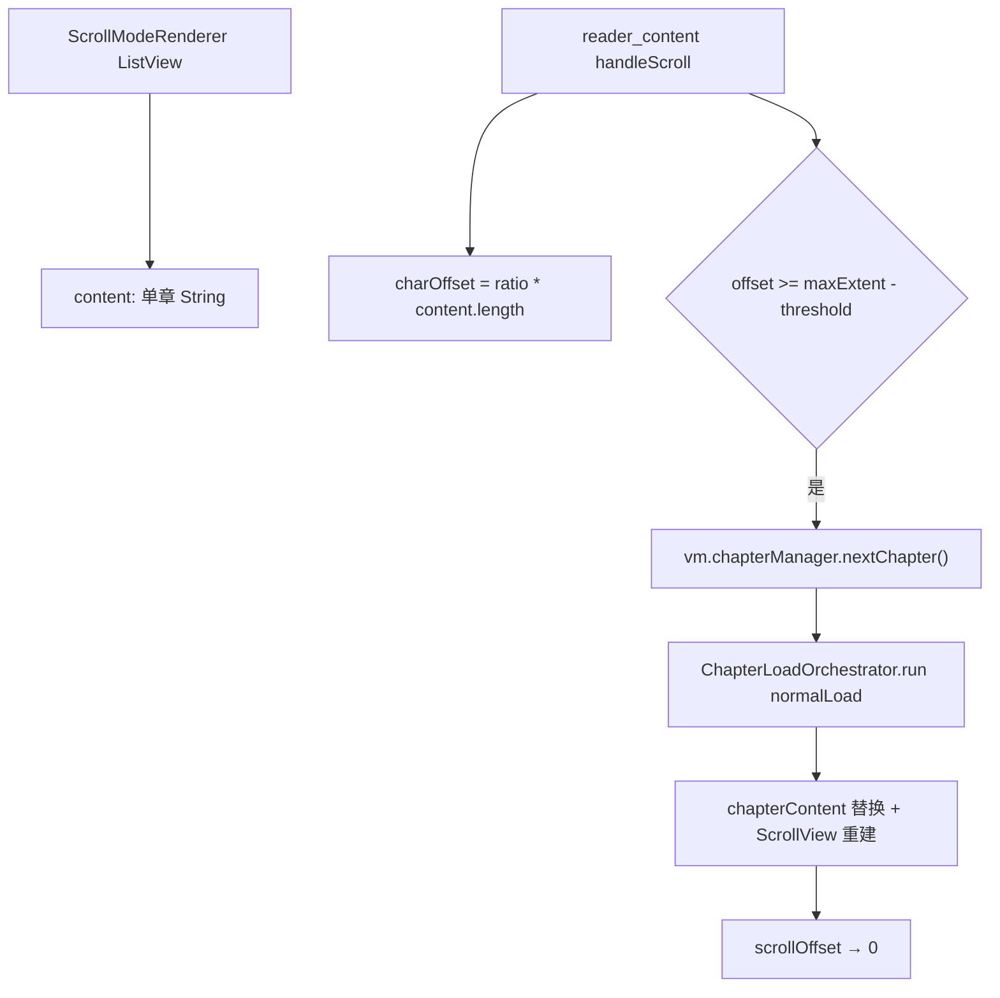
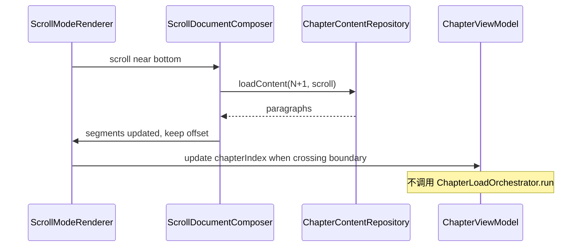

# 滚动模式跨章接缝修复 — 规划文档

**产出路径**：[doc/plane-scroll-cross-chapter-seam.md](doc/plane-scroll-cross-chapter-seam.md)（确认后写入，并更新 [doc/README.md](doc/README.md) 索引）

**优先级**：P1（与 [plane-cross-chapter-preload](doc/plane-cross-chapter-preload.md) 分页/pageTurn 优化并行）

**核心原则**：章内滚动已足够好；**只消除章界处的硬底、跳顶、整章替换**，不做全书 global offset 重构。

---

## 1. 问题定义

### 用户感知

- 章内：连续滑动，体验正常
- 章界：滚到 `maxScrollExtent` 停住 → 触发 `nextChapter()` → 新 `ScrollView` 从 offset=0 开始 → **断裂感**

### 根因（代码路径）



关键文件：

- [`lib/features/reader/rendering/scroll_mode_renderer.dart`](lib/features/reader/rendering/scroll_mode_renderer.dart) — 单章 `content` → `ListView.builder`
- [`lib/features/reader/page/widgets/reader_content.dart`](lib/features/reader/page/widgets/reader_content.dart) — `onReachEnd` / `onReachStart` 调 `nextChapter` / `previousChapter`
- [`lib/features/reader/core/presentation/reader_content_area.dart`](lib/features/reader/core/presentation/reader_content_area.dart) — 接线
- 进度仍用 `chapterIndex + currentCharOffset`（[`ChapterViewModel`](lib/features/reader/core/application/chapter_view_model.dart)），与拼接模型需对齐

---

## 2. 目标与非目标

### 目标（验收）

- 向下滚过章末：**无硬底、无跳回顶部**，视觉上连续
- 向上滚过章首（已向下滚过再回顶）：可进入上一章末段，无跳变
- 跨章时 **不触发** 整章 `AnimatedSwitcher` / loading 全屏（`preserveContent` 或 append 路径）
- 进度 / 书签 / 高亮：`chapterIndex + charOffset` 在跨章后仍正确
- 预加载：接近边界前下一章文本就绪（Timing 日志可观测）

### 非目标（本阶段不做）

- 全书单一 `globalCharOffset` 存库迁移
- 无限章节全部常驻内存
- EPUB 含大图/复杂富文本的首版（Phase 2）
- 竖排滚动（Phase 2，与横排 plain 路径对齐后再做）
- 改动分页 / pageTurn 路径

---

## 3. 方案：ScrollSegment 接缝拼接

### 3.1 数据模型

新增 `ScrollChapterSegment`（建议路径 `lib/features/reader/core/data/scroll_chapter_segment.dart`）：

```dart
class ScrollChapterSegment {
  final int chapterIndex;
  final List<String> paragraphs;       // plain 路径
  final List<int> paragraphCharOffsets; // 章内 charOffset 起点
  // Phase 2: List<RichParagraph>? richParagraphs
}
```

`ScrollDocumentComposer`（application 层）维护 **滑动窗口**：

```
[prev?] [current] [next?]   // 最多 3 段，远离 viewport 的段 trim
```

- **appendNext**：滚近底时加载 N+1 章文本，插入 composer，**不 reset** `ScrollController`
- **prependPrev**：滚近顶时加载 N-1 章，prepend；用 `ScrollController.jumpTo(oldOffset + prependedHeight)` 保持视觉位置
- **trim**：离开段超过 1 章距离时移除并调整 offset（防内存膨胀）

### 3.2 边界检测改造

从 [`reader_content.dart`](lib/features/reader/page/widgets/reader_content.dart) 的 `onReachEnd → nextChapter()` 改为：

| 事件 | 新行为 |
|------|--------|
| 近底 + 已有 next segment | 无操作（用户继续滚） |
| 近底 + 无 next segment | `composer.appendNext()` async，**不**调 `nextChapter()` |
| 滚入 next segment | 更新 `chapterIndex` signal（用于进度/高亮） |
| 近顶 + 已滚过 threshold | `composer.prependPrev()` |
| 手动 TOC 跳章 | `composer.reset(chapterIndex)` + 单章加载 + `jumpToCharOffset` |

### 3.3 进度映射

替换现有 ratio 估算（[`reader_content.dart` L196-204](lib/features/reader/page/widgets/reader_content.dart)）：

- 由 composer 根据 `scrollOffset` + 各段累计高度 → 映射到 `(chapterIndex, charOffset)`
- 首版可用 **段落索引 + 段内 offset** 近似（与现有 plain ListView 一致）
- Phase 2：用 `Scrollable.ensureVisible` / `GlobalKey` 精确定位

### 3.4 预加载

复用现有 [`RustChapterContentRepository.preload`](lib/features/reader/core/data/rust_chapter_content_repository.dart) 或 `loadFirstSpine`：

- 当前章 stable 后：`preload(bookId, chapterIndex + 1)`（与分页 staging 独立，只缓存文本）
- `pageIndex <= 1` 等价条件：scroll 距顶 < 2 屏时 preload `chapterIndex - 1`
- generation 防护：换书 / 跳章时 invalidate

### 3.5 UI 渲染改造

[`ScrollModeRenderer`](lib/features/reader/rendering/scroll_mode_renderer.dart) 改为接收：

```dart
final List<ScrollChapterSegment> segments; // 替代单一 content + chapterId
final int? segmentDividerIndex;            // 可选：章界视觉分隔（默认无）
```

`ListView.builder` 的 `itemCount` = 各段 paragraphs 之和；`itemBuilder` 根据 globalIndex 查 segment + 本地 index。

**章内渲染逻辑不变**（`HighlightPainter`、选区、`paragraphSpacing` 均保留）。

---

## 4. 与现有 Chapter 加载的关系



- **相邻滚章**：走 composer append/prepend，**绕过** `ChapterLoadOrchestrator` 全量分页 pipeline
- **手动跳章 / 换书 / 改字体**：仍 `loadChapter()` + composer.reset（现有 orchestrator）
- **配置重载**：composer reset + 当前章重载（与 pagination configReload 类似）

新增 `ChapterNavigationKind.scrollAdjacent`（可与分页跨章计划共用枚举）区分 adjacent vs manual。

---

## 5. 分阶段实施

### Phase 1 — Plain 文本接缝（TXT/MD 优先）

| 任务 | 文件 |
|------|------|
| `ScrollChapterSegment` + `ScrollDocumentComposer` | `core/data/`, `core/application/` |
| 改造 `ScrollModeRenderer` 多段 ListView | `rendering/scroll_mode_renderer.dart` |
| 边界检测 + 进度映射 | `reader_content.dart`, `reader_content_area.dart` |
| append/prepend 预加载 | `chapter_navigator.dart` 或专用 `ScrollBoundaryCoordinator` |
| 单元测试 composer append/prepend/trim | `test/features/reader/application/scroll_document_composer_test.dart` |
| Widget 测试双章拼接 | `test/features/reader/rendering/scroll_mode_renderer_test.dart` |

### Phase 2 — EPUB 富文本 + 竖排

- 段模型扩展 `RichParagraph`
- 高亮 offset 跨段修正
- 竖排 `ListView.horizontal` 同样 segment 化

### Phase 3 — 体验抛光

- 可选章界微间距（极淡 divider，默认关闭）
- 快速 fling 跨多章：队列 append，防重复触发
- `[Timing]` 日志：append 延迟、trim 次数

---

## 6. 风险与缓解

| 风险 | 缓解 |
|------|------|
| prepend 后 scroll 跳动 | `jumpTo(oldOffset + prependedExtent)` + post-frame 校正 |
| 高亮/书签 charOffset 跨章错位 | segment 内局部 offset + chapterIndex 联合定位 |
| 内存：多章 plain 文本 | 滑动窗口最多 3 章，trim 远端 |
| append 时用户 fast fling | debounce + loading tail segment 占位（骨架屏高度 ≈ 1 屏） |
| 与 `nextChapter()` 双路径 | scroll 模式禁用 `onReachEnd→nextChapter`，统一走 composer |

---

## 7. 测试与验收

- [ ] 两章 TXT：滚过章界无停、无跳顶
- [ ] 反向：滚回上一章末段位置连贯
- [ ] 连滚 3 章：segment trim 正常，无 OOM
- [ ] TOC 跳章：composer reset，进度正确恢复
- [ ] 改字体：重载当前章，不 crash
- [ ] `flutter test test/features/reader/` 全绿

---

## 8. 文档与索引更新

确认实施后：

1. 创建 [doc/plane-scroll-cross-chapter-seam.md](doc/plane-scroll-cross-chapter-seam.md)（本文 + frontmatter todos）
2. 更新 [doc/README.md](doc/README.md) 表格增加一行 P1
3. 在 [lib/features/reader/README.md](lib/features/reader/README.md) 数据流补充 scroll composer

---

## 9. 依赖关系


两者可并行；滚动方案 **不依赖** Rust session adopt，仅复用 `loadContent` / `preload`。
