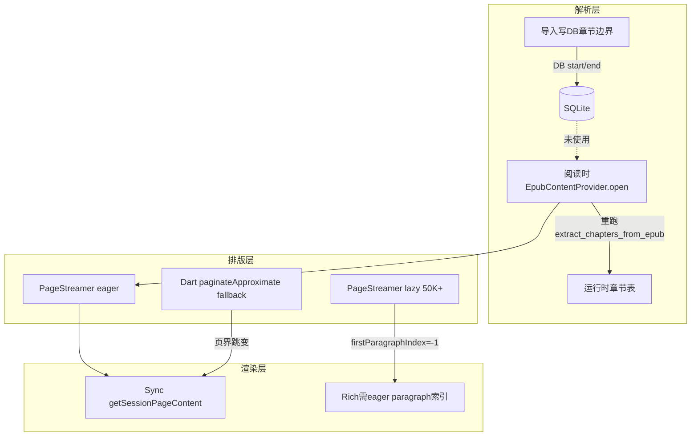

# 核心阅读链现状审计与 MD 规划

## 目标产物

新建 [`issue/CORE_READING_CHAIN_STATUS.md`](issue/CORE_READING_CHAIN_STATUS.md)，作为 [`issue/CORE_PIPELINE_REVIEW.md`](issue/CORE_PIPELINE_REVIEW.md) 的**现行状态补充**（不删除旧文档，文首注明「以本文件为准，旧审查部分条目已过时」）。

文档结构：
1. 审计方法与日期
2. 链路架构简图（Mermaid）
3. **状态对照表**（每条问题：已修复 / 仍开放 / 降级可接受）
4. **分阶段修复计划**（P0/P1/P2 + 涉及文件）
5. 验证清单（手动 + 建议补测）

---

## 当前代码审计结论（写入 MD 的核心内容）

### 已修复（旧审查中 P0，当前代码已不存在）

| 条目 | 证据 |
|------|------|
| EPUB 导入 30 vs 阅读 20 不一致 | [`toc.rs:60`](rust/src/parser/epub/toc.rs) 与 [`provider.rs:42`](rust/src/parser/epub/provider.rs) 均为 **20** |
| 分页高亮错位 / 重复文本 | [`highlight_painter.dart`](lib/features/reader/rendering/highlight_painter.dart) 已有 `contentStart`、页内 offset 递增、页外 skip；[`paginated_renderer.dart`](lib/features/reader/rendering/paginated_renderer.dart) 传入 `contentStart: startOffset` |
| 分页模式无选区回调 | [`reader_content_area.dart:227-229`](lib/features/reader/core/presentation/reader_content_area.dart) 已接 `onSelectionChanged` |
| `latinExtWidth` 恒为 0 | [`typeset_calibrator.dart:176`](lib/features/reader/data/typeset_calibrator.dart) 映射 `calibration.otherWidth` |
| `buildTypesetConfig` 未扣 padding | [`typeset_calibrator.dart:181`](lib/features/reader/data/typeset_calibrator.dart) `pageWidth = (width - 2*padding) * dpr` |
| 三套 EPUB extract 逻辑 | [`mod.rs`](rust/src/parser/epub/mod.rs) 已移除 `extract_chapter`；[`parse.rs`](rust/src/parser/epub/parse.rs) 富文本统一走 `EpubContentProvider` |
| 分页模式完全无 rich/图片 | [`paginated_renderer.dart:129-175`](lib/features/reader/rendering/paginated_renderer.dart) 已有 rich 路径（依赖 `PageDescriptor.firstParagraphIndex`） |

### 仍开放（核心阅读链真实缺口）

#### P0 — 内容正确性 / 数据一致性

1. **EPUB 阅读不读 DB 边界，运行时重算 TOC**
   - [`EpubContentProvider::open`](rust/src/parser/epub/provider.rs:49-51) 调用 `extract_chapters_from_epub`，按 `chapter_index` 匹配，**忽略** [`get_chapter_bounds`](rust/src/api/core.rs:914) 的 DB 值
   - EPUB 在 [`get_chapter`](rust/src/api/core.rs:439-440) / [`paginate_chapter`](rust/src/api/core.rs:591-592) 固定 `(0, content_len)`，边界完全由 Provider 打开时的 spine 窗口决定
   - **影响**：旧版导入的「整本一大章」DB 记录与运行时拆章结果不一致；目录条数/标题可能与实际可读范围不符

2. **老书 oversized 章节仍被 20 spine cap 截断**
   - [`provider.rs:69`](rust/src/parser/epub/provider.rs) `end.min(start + MAX_SPINE_ITEMS)` 作为 safety net
   - 新导入已按 20 拆章，但 **未重新导入的老书** 单章 DB `end_index` 可能远大于 20，阅读仍只加载前 20 spine，**无 UI 提示**

3. **TOC href 映射失败 fallback 不可靠**
   - [`toc.rs:74-76`](rust/src/parser/epub/toc.rs) `find_spine_index_by_toc_href(...).unwrap_or(*chapter_id as usize)` 可能指错 spine

#### P1 — 排版/渲染体验（非崩溃，但影响 80% 质量）

4. **Lazy 分页质量断崖**（≥50K 字符）
   - [`pagination.rs:127-152`](rust/src/text/pagination.rs) 阈值 `LAZY_PAGINATION_CHAR_THRESHOLD = 50_000`
   - Lazy 模式无标点优化、无像素换行、**`first_paragraph_index = -1`** → 分页 rich/图片路径失效

5. **双套分页真理源**
   - Rust `PageStreamer` + session 为主路径
   - [`pagination_coordinator.dart:140-173`](lib/features/reader/core/application/pagination_coordinator.dart) Rust 失败时 `fallbackToCalculatePages` → Dart 近似，页数/断页可能跳变

6. **Sync FFI 阻塞 UI 线程**
   - [`rust_pagination_session.dart:307-316`](lib/features/reader/core/data/rust_pagination_session.dart) `_fetchAndCachePage` 同步调用 `getSessionPageContent`，由 `ensureWindow` 在翻页/build 路径触发

7. **`max_chars` 语义混用**
   - TXT/MD partial 有 UTF-8 字符补偿（[`core.rs:578-583`](rust/src/api/core.rs)）
   - EPUB partial 直接 byte range（[`core.rs:586-587`](rust/src/api/core.rs)），CJK 预读偏少

8. **页宽 safe area 与渲染 MediaQuery 可能偏差**
   - 分页宽：[`reader_shell.dart:77`](lib/features/reader/core/presentation/reader_shell.dart) `pageWidth = mq.size.width - mq.padding.horizontal`
   - 渲染宽：[`paginated_renderer.dart:202`](lib/features/reader/rendering/paginated_renderer.dart) `MediaQuery.sizeOf(context).width - 2*pageMargin`（含系统 safe area 差异）

#### P2 — 可缝补、不挡 80% 发布

9. **`enable_hyphenation` 未接入** — `PageStreamer` 只用 `compute_line_breaks_from_indices`，[`line_break.rs`](rust/src/text/line_break.rs) 仍为 dead path

10. **单 spine 超大 HTML 不拆** — 拆章仅按 spine 个数（[`toc.rs:101-140`](rust/src/parser/epub/toc.rs)），1 TOC + 1 巨型 xhtml 仍是一章

11. **进度估算偏差** — [`estimate_total_chars`](rust/src/parser/epub/parse.rs:101-148) 采样时也 cap 20 spine

12. **首屏 preview 只读第一个 spine** — [`get_chapter_first_spine_only`](rust/src/api/core.rs:346-378) 设计如此，大章首屏不代表全章

13. **测试缺口** — 无 EPUB oversized 拆章 / Provider-DB 一致性 / lazy+rich 集测（[`toc.rs` 测试](rust/src/parser/epub/toc.rs) 仅字符串工具）

### 降级可接受（缝补期可暂不修）

- 近似排版 vs Flutter 真实 glyph 布局的结构性漂移（CharWidthTable 方案固有限制）
- 富文本 HTML >100KB 跳过 html5ever（[`parse.rs:185-189`](rust/src/parser/epub/parse.rs)）— 有日志，属性能保护
- EPUB 滚动+分页均加载 rich（[`rust_chapter_content_repository.dart:89-106`](lib/features/reader/core/data/rust_chapter_content_repository.dart)）— 双重 IO，性能问题非功能缺失

---

## MD 中的修复计划（分阶段）

### Phase 1 — P0 内容一致性（1-2 PR）

**目标**：目录、DB、阅读内容三者对齐；老书截断可见。

| 任务 | 改动要点 | 主要文件 |
|------|----------|----------|
| EPUB Provider 改读 DB 边界 | `EpubContentProvider::open(file_path, start_index, end_index)` 或 `open_from_bounds`；`get_or_create_provider` 先 `get_chapter_bounds` 再 open | `provider.rs`, `core.rs` |
| 移除或条件化 20 spine safety cap | 新逻辑以 DB `end-start` 为准；仅当 `end-start > MAX` 且 DB 未拆章时返回 `AppError` 或 `is_truncated` flag | `provider.rs`, `parse.rs` |
| 老书 reconcile | 打开书籍时对比 DB 章节数 vs 重算 TOC；不一致则提示「重新导入以更新目录」或后台 migration | 新增 `epub/reconcile.rs` 或 import 钩子 + Dart toast |
| TOC href fallback | 映射失败时 log warn + 跳过条目或按 spine 顺序推断，禁止 `chapter_id as usize` | `toc.rs` |

**验证**：fixture EPUB（单 TOC 100 spine）；旧 DB 单章 + 新逻辑；对比 spine 覆盖完整性。

### Phase 2 — P1 排版体验（1-2 PR）

| 任务 | 改动要点 | 主要文件 |
|------|----------|----------|
| Lazy 模式保留像素换行 | 大章仍走 `compute_line_breaks_from_indices`，或 lazy 仅跳过 `optimize_punctuation` | `pagination.rs` |
| 隔离 Dart fallback | Rust session 失败 → 明确 error UI + 重试，不再 silent fallback（或 fallback 仅首屏） | `pagination_coordinator.dart`, `chapter_load_orchestrator.dart` |
| 异步页内容 prefetch | `pageContent` miss 时返回 placeholder + `compute`/`Isolate`/`async` fetch，build 不 sync FFI | `rust_pagination_session.dart`, `paginated_renderer.dart` |
| 统一 EPUB partial 字符语义 | partial 路径与 TXT 相同 chars-take 逻辑 | `core.rs` |
| 对齐 pageWidth 来源 | 渲染与分页共用 `PaginationCoordinator.pageWidth`，避免 MediaQuery 二次计算 | `paginated_renderer.dart`, `reader_shell.dart` |

### Phase 3 — P2 缝补 + 测试

| 任务 | 说明 |
|------|------|
| 接入或删除 hyphenation 配置 | 要么 `PageStreamer` 调用 `line_break.rs`，要么从 `config_hash` 移除字段 |
| 按 HTML 体积二次拆章 | spine 数 ≤20 但 HTML 超大时的保护 |
| 补 Rust 集成测试 | `toc oversized split`, `provider db bounds`, `lazy paragraph indices` |
| 补 Dart 桥接测试 | `rust_chapter_content_repository`, `rust_pagination_session` |

---

## 与旧文档 [`CORE_PIPELINE_REVIEW.md`](issue/CORE_PIPELINE_REVIEW.md) 的差异说明（写入 MD 文首）

需在 MD 中显式标注以下条目**已过时**：
- 「导入 30 / 阅读 20」→ 已统一为 20
- 「paintPlain 高亮 bug」→ 已修复
- 「分页无选区」→ 已修复
- 「latinExtWidth / padding 双重扣减」→ 已修复
- 「分页无 rich/图片」→ 部分修复（eager + 有 paragraph 索引时可用）

---

## 实施步骤（写 MD 本身）

1. 创建 [`issue/CORE_READING_CHAIN_STATUS.md`](issue/CORE_READING_CHAIN_STATUS.md)，填入上述审计表 + Mermaid + 三阶段计划 + 验证清单
2. 在 [`issue/CORE_PIPELINE_REVIEW.md`](issue/CORE_PIPELINE_REVIEW.md) 顶部加 3 行 redirect：「状态以 CORE_READING_CHAIN_STATUS.md 为准（2026-06-17 复核）」
3. （可选，不在本次 scope）按 Phase 1 开始代码修复

---

## 验证清单（MD 末尾）

- [ ] 单 TOC 大 EPUB：目录子章数量 = 可读完整内容
- [ ] 老书（未重导）：有截断提示或 reconcile 引导
- [ ] 分页模式：划线 → 高亮 → 翻页后位置正确
- [ ] 50K+ 章：断页无剧烈跳变；rich 图片仍可见（或明确降级提示）
- [ ] Rust session 失败：不出现 Dart fallback 静默页数变化
- [ ] 冷缓存翻页：无明显 frame jank（Phase 2 后）
