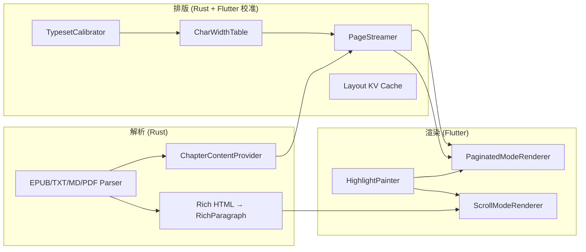

> **注意**：本文件**大量条目已过时**（2026-06-17 复核发现 8+ 处事实错误）。以下尤其不准确：架构概览的双阅读路径仍存在、Lazy 阈值 50K、hyphenation/latinExtWidth/padding 的"未修复"描述、连字符/三套 extract/etc 的 in-stone 描述。
> 现行状态以 [CORE_READING_CHAIN_STATUS.md](./CORE_READING_CHAIN_STATUS.md) 为准，包含完整审计表 + 分阶段修复状态。
# 核心链路审查报告：解析 → 排版 → 渲染

> 审查日期: 2026-06-17（2026-06-17 代码核验更新）
> 范围: `rust/src/` + `lib/features/reader/`  
> 方法: 动态代码审查 + `cargo test --lib` (181 tests) + `dart analyze`

---

整体架构是 **Rust 负责解析与分页，Flutter 负责最终绘制**。分页已收敛到 Rust PageStreamer + session 为主路径（`paginateApproximate` 已 @Deprecated，无生产调用）。



**关键洞察：** 分页模式走 plain text + 字符宽度近似；滚动模式走 HTML rich text + Flutter 真实排版。两者是独立系统，不是同一管道的两种视图。

---

## 一、解析层

### 1.1 做得好的部分

- 格式统一入口：`parse_book` → `Parser` enum → 各格式实现
- 懒加载 Provider 模式（TXT mmap、EPUB spine 按需读）合理
- 错误类型 `AppError` 完整，Rust 侧不 panic 跨 FFI
- 路径安全校验（`validate_file_path` canonicalize）

### 1.2 严重问题

| 问题 | 位置 | 影响 |
|------|------|------|
| **重复导入同一文件** | 各 parser 用 `Uuid::new_v4()`，`BookRepository::save` 按 id upsert | 同一 EPUB 导入两次 → 书架两条记录 + 孤儿章节 |
| **EPUB spine 上限不一致** | 导入 `toc.rs` 拆章上限 **30**；读取 `provider.rs` / `parse.rs` 上限 **20** | 导入时 21–30 个 spine 的章节，阅读时被截断 |
| **`extract_chapter` 只读第一个 spine** | `rust/src/parser/epub/mod.rs:130-135` | 若走 legacy 路径，多 spine 章节内容不完整 |
| **字节 vs 字符语义混用** | API 参数名 `max_chars`，实际 TXT/MD 传 byte offset、EPUB 传 spine-offset 编码（非字符数、非字节） | CJK 文本预读/分页窗口偏小；进度统计不准 |
| **TOC href 映射失败 fallback** | `toc.rs` 用 `chapter_id as usize` 当 spine index | 部分 EPUB 章节映射错误 |

`EpubParser::extract_chapter` 只读 `spine[chapter.start_index]` 一个 spine item：

```rust
// rust/src/parser/epub/mod.rs:130-135
let spine = epub_file.spine();
let href = spine.get(chapter.start_index as usize)?;
epub_file.read_resource(href)
```

Provider 路径（`EpubContentProvider`）会合并多个 spine，但 `extract_chapter` 不会——**同一格式有三套提取逻辑**（Provider / `read_chapter_content` / `extract_chapter`），行为不一致。

EPUB spine 上限不一致：

| 阶段 | 常量 | 文件 |
|------|------|------|
| 导入拆章 | `MAX_SPINE_ITEMS_PER_CHAPTER = 30` | `rust/src/parser/epub/toc.rs` |
| 阅读读取 | `MAX_SPINE_ITEMS = 20` | `rust/src/parser/epub/provider.rs`, `parse.rs` |

### 1.3 中等问题

- **MD 未纳入文件夹扫描**：Rust 支持，Dart `BookImportService.scanFolder` 只扫 txt/epub/pdf
- **EPUB 滚动模式双重 IO**：`loadContent` 并行调用 `getChapter` + `getEpubChapterRichContent`，同一文件打开解析两次
- **PDF 只完成导入**：Rust 有 `get_pdf_page`，Dart 未接入，章节内容 Provider 对 PDF 返回 `InvalidInput`
- **TXT 章节 index 碰撞**：`chapter_detect.rs` 用正文里的章节号作 index，跳号/重复时 DB 索引混乱
- **元数据不一致**：EPUB `extract_metadata` 用 spine 数，`parse_epub` 用 TOC 数；MD 用 byte length，TXT 用 char count
- **错误被 Dart 吞掉**：`BookImportService` 只返回 bool；`catchError((_) => [])` 静默丢弃 rich content 失败
- **EPUB/PDF 导入时 `file_size: 0`**：TXT 设置真实大小，EPUB/PDF 留 0

### 1.4 并发 / 缓存

- `get_or_create_provider` TOCTOU：并发请求可能重复创建 Provider（浪费 IO，不 corrupt）
- 全局 LRU 缓存（`PROVIDER_CACHE`, `STREAMER_CACHE`, `RICH_CONTENT_CACHE`）无文件变更失效机制
- `scanFolder` 并发 4 路导入放大重复导入问题

### 1.5 关键文件

| 文件 | 职责 |
|------|------|
| `rust/src/api/core.rs` | 导入 + 读取 + 分页编排 |
| `rust/src/parser/mod.rs` | Parser enum |
| `rust/src/parser/registry.rs` | 格式路由 |
| `rust/src/parser/epub/*` | EPUB 管道 |
| `rust/src/parser/txt/*` | TXT 管道 |
| `rust/src/parser/pdf/*` | PDF 管道 |
| `rust/src/parser/md/*` | Markdown 管道 |
| `lib/features/bookshelf/application/book_import_service.dart` | Dart 导入入口 |
| `lib/features/reader/core/data/rust_chapter_content_repository.dart` | Dart 读取入口 |

---

## 二、排版层

### 2.1 架构特点

排版**不是** HarfBuzz/SkParagraph 级排版，而是：

1. Flutter `TextPainter` 校准 5 组字符宽度（`typeset_calibrator.dart`）
2. Rust `CharWidthTable` + 贪心换行（`pagination.rs`）
3. Flutter `SelectableText.rich` 做最终 glyph 布局

Rust 分页与 Flutter 渲染是**近似对齐**，不是像素级一致。

### 2.2 数据流（分页模式）

```
Book file
  → ChapterContentProvider.read_text_range (TXT/MD/EPUB)
  → PageStreamer::new(content, TypesetConfig)
  → get_descriptors() → Vec<PageDescriptor>
  → [Dart] RustPaginationSession 存储 descriptors + handle
  → get_session_page_content(pageIndex) → page text
  → PaginatedModeRenderer → HighlightPainter → SelectableText.rich
```

**编排顺序**（`chapter_load_orchestrator.dart`）：

1. 并行：`loadChapterContent` + `calibrateSafely`
2. 快速路径：`paginateFirstScreen(maxChars=2000)` via `create_pagination_session`
3. 若 `isPartial`：`expandToFullChapter` → `paginate_session_full`
4. 从 `PageDescriptor.startOffset/endOffset` 解析 `pageIndex`
5. 预加载当前页 ±3

### 2.3 严重问题

| 问题 | 位置 | 影响 | 当前状态 |
|------|------|------|----------|
| **双套分页算法** | Rust `PageStreamer` vs Dart `paginateApproximate` | Rust session 失败时 fallback 页数/断页突变 | ✅ `paginateApproximate` 已 @Deprecated，无生产调用 |
| **Lazy 模式质量断崖** | `pagination.rs` 原 ≥50K 字符走 lazy | 无标点优化、无像素换行 | ⚡ 阈值升至 200K，`first_paragraph_index` 已修；标点抽架构取舍 |
| **`enable_hyphenation` 未接入** | `TypesetConfig` 字段 + `line_break.rs` | 配置影响 cache hash，对排版无作用 | ✅ 字段 + 模块 + 全部 Dart 引用已删除 |
| **`latinExtWidth` 恒为 0** | `typeset_calibrator.dart:176` | 带音标拉丁文宽度错误 | ✅ `otherWidth` 映射 `calibration.otherWidth` |
| **页边距双重计算** | `buildTypesetConfig` 的 `padding` 未减宽高 | 分页可用宽度 > 渲染可用宽度 | ✅ `pageWidth = (width - 2*padding) * dpr` |

### 2.4 中等问题

- **首行缩进用硬编码空格**：Rust 用 `"  ".repeat(indent)`，宽度未走校准表
- **End-avoid 标点只在预处理**：`optimize_punctuation` 处理，`compute_line_breaks_from_indices` 不处理
- **分页/滚动内容分裂**：分页用 plain text（EPUB 样式全丢）；滚动用 rich text
- **全章 materialize 开销**：cache miss 时 `paginate_chapter` 构建全部 `PageContent` 字符串再写 KV
- **Sync FFI 阻塞 UI**：`getSessionPageContent` 在 build 路径同步调用，首屏/翻页可能卡顿
- **`break_english_line` 潜在 underflow**：`line_break.rs:95`，模块当前未被分页调用

### 2.5 关键文件

| 文件 | 职责 |
|------|------|
| `rust/src/text/pagination.rs` | 布局引擎（PageStreamer） |
| `rust/src/text/char_width.rs` | 字符宽度表 |
| `rust/src/text/typeset.rs` | 文本预处理（标点/空格） |
| `rust/src/text/line_break.rs` | 连字符逻辑（未接入分页） |
| `rust/src/domain/types/typeset.rs` | TypesetConfig |
| `lib/features/reader/data/typeset_calibrator.dart` | Flutter 校准 |
| `lib/features/reader/data/pagination_engine.dart` | FFI 包装 + fallback |
| `lib/features/reader/core/data/rust_pagination_session.dart` | Session 生命周期 |
| `lib/features/reader/core/application/pagination_coordinator.dart` | 分页参数组装 |
| `lib/features/reader/core/application/chapter_load_orchestrator.dart` | 加载状态机 |

---

## 三、渲染层

### 3.1 渲染原语

| 类型 | 实现 |
|------|------|
| 文本 | `SelectableText.rich` + `StrutStyle` + `textAlign: justify` |
| 图片 | `Image.memory(rp.imageData)` + `cacheWidth` 缩放（仅 scroll 模式） |
| 翻页阴影 | `CustomPaint`（`page_curl_widget.dart`，仅阴影） |
| 高亮 | `HighlightPainter` → `TextSpan` 树 |

入口：`lib/features/reader/core/presentation/reader_content_area.dart` → `ReaderContent` → 模式 Renderer。

### 3.2 严重 Bug（已确认）

#### Bug 1：`paintPlain()` 高亮逻辑错误

`paintRich()` 有 `contentStart` 做章节全局 → 局部偏移转换，且 `offset` 会递增；`paintPlain()` **两者都没有**：

```dart
// lib/features/reader/rendering/highlight_painter.dart:57-91
final offset = 0;  // final，永不更新

for (final h in highlights) {
  final hStart = h.charOffset.toInt();  // 章节全局 offset
  // ...
  if (overlapStart > offset) {
    regions.add(_Region.text(content.substring(offset, overlapStart), baseStyle));
  }
  // 缺少 offset = overlapEnd
}
if (offset < content.length) {
  regions.add(_Region.text(content.substring(offset), baseStyle));
  // ↑ 有高亮时会把整页文本再追加一遍
}
```

分页模式还把**整章 highlights** 传给**单页 content**，没有按 `startOffset` 过滤：

```dart
// lib/features/reader/rendering/paginated_renderer.dart:189-195
HighlightPainter.paintPlain(
  pageContent,       // 页内局部文本
  textStyle,
  highlights,        // 章节全局 highlights，未过滤
  onHighlightTap: onHighlightTap,
);
```

**结果**：分页模式下高亮错位、重复文本、点击无效。

#### Bug 2：分页模式未接入选区回调

Scroll/Bilingual 有 `onSelectionChanged`，Paginated **没有**：

```dart
// lib/features/reader/core/presentation/reader_content_area.dart:212-227
paginatedBuilder: (_, pc) => PaginatedModeRenderer(
  // ...
  onHighlightTap: onHighlightTap,
  // ← 缺少 onSelectionChanged / onSelectionGlobalPosition
),
```

**结果**：分页/仿真翻页模式下无法划线、无法弹出标注工具栏。

#### Bug 3：竖排模式 offset 复用

`_buildPageContentVertical` 每段复用页级 `startOffset`，未按段落递增——竖排高亮/定位错误。

### 3.3 功能缺口

| 缺口 | 说明 |
|------|------|
| **分页模式无图片** | `isPaginated` 时跳过 rich content 加载；Renderer 只处理 plain text |
| **上一章虚拟页是空壳** | `_buildPreviousChapterPage()` 返回空 Container |
| **PDF 阅读未实现** | Rust API 存在，Dart 无消费方 |
| **Fallback 分页硬编码 400×600** | 与真实 viewport 不一致 |
| **每页内嵌 ScrollView** | 内容超出 viewport 时在页内滚动，而非重新分页 |
| **选区工具栏定位** | 用 widget 左上角而非选区 caret 位置 |
| **`WidgetSpan` height: double.infinity** | 高亮竖条可能在部分 TextSpan 上下文引发布局错误 |

### 3.4 性能 / 内存

- 大章（>100MB）`PageStreamer` 全量持有 + 全量 line_offsets
- Rich EPUB 图片 `Vec<u8>` 整包过 FFI，`Image.memory` 再解码
- `HighlightPainter` 静态缓存，多 Reader 实例可能 stale
- `paginate_chapter` 对 >100 页警告 FFI 序列化开销

### 3.5 关键文件

| 文件 | 职责 |
|------|------|
| `lib/features/reader/rendering/paginated_renderer.dart` | 分页渲染 |
| `lib/features/reader/rendering/scroll_mode_renderer.dart` | 滚动渲染 |
| `lib/features/reader/rendering/page_curl_widget.dart` | 仿真翻页 |
| `lib/features/reader/rendering/highlight_painter.dart` | 高亮 TextSpan |
| `lib/features/reader/data/rich_text_converter.dart` | RichParagraph → TextSpan |
| `lib/features/reader/rendering/reader_render_config.dart` | 字体/样式配置 |
| `lib/features/reader/core/presentation/reader_interaction_layer.dart` | 选区/点击区域 |

---

## 四、跨链路系统性问题

### 4.1 「两套真理源」

```
Scroll 模式:  HTML → RichParagraph → TextSpan → Flutter 真实排版
分页 模式:    Plain text → CharWidth 近似 → PageStreamer → SelectableText
```

分页模式在解析阶段就丢掉了 EPUB 样式和图片，排版阶段用近似宽度，渲染阶段再用 Flutter 真实字体——**三层精度不一致**，断页漂移是结构性问题，不是单点 bug。

### 4.2 `start_index` / `end_index` 语义过载

| 格式 | 含义 |
|------|------|
| TXT / MD | 字节 offset |
| EPUB | spine index |
| PDF | 页码 |

上层 API 统一用 `Chapter`，但边界语义不同，容易在 Provider / pagination / progress 之间传错。

### 4.3 与现有差距文档的差异

`issue/READING_CORE_GAP_ANALYSIS.md` 对以下项描述偏乐观，应以本报告代码审查结论为准：

| 文档声称 | 代码实际 |
|----------|----------|
| 连字符已实现 | `enable_hyphenation` 影响 cache hash，`PageStreamer` 未调用 `line_break.rs` |
| 分页模式差距在图片 | 另有高亮/选区确认 bug |
| EPUB 2/3 完整解析 | spine 上限不一致、三套 extract 逻辑 |

---

## 五、修复优先级

### P0 — 影响核心阅读体验

1. **修复 `paintPlain()`**：参照 `paintRich()` 加 `contentStart`，递增 `offset`，分页侧按页过滤 highlights  ✅ 已修复（Batch 1, 2026-06-17）
2. **分页模式接入选区回调**：`PaginatedModeRenderer` → `SelectableText.onSelectionChanged`  ✅ 已修复（Batch 1, 2026-06-17）
3. **统一 EPUB spine 上限**：导入 30 vs 读取 20 对齐 → `toc.rs` `MAX_SPINE_ITEMS_PER_CHAPTER` 从 30 改为 20 ✅ 已修复（Batch 2, 2026-06-17）
4. **修复 `latinExtWidth`**：校准 `otherWidth` 映射到 `latinExtWidth` ✅ 已修复（Batch 2, 2026-06-17）

### P1 — 排版一致性

5. **Lazy 模式降级策略**：大章仍做标点优化 + 空格预处理（避头避尾/CJK-Latin 间距），防止低于 200K 字符的大章排版走未经优化的字符计数分页 ✅ 已修复（Batch 4, 2026-06-17）
6. **消除 padding 双重扣减**：`buildTypesetConfig` 内 `pageWidth` 减 `2*padding`，与 Renderer `pageMargin` 对齐 ✅ 已修复（Batch 3, 2026-06-17）
7. **移除或隔离 Dart fallback 分页**：`_buildFallbackPagination` 替换为错误提示 UI，移除硬编码 400×600 近似分页代码 ✅ 已修复（Batch 5, 2026-06-17）
8. **Sync FFI 改异步 prefetch**：`RustPaginationSession.pageContent` 仅读缓存；`ReaderRepository` 在 miss 时返回 null（placeholder）+ 后台 `ensureWindow` + `preloadGeneration++` 触发重建 ✅ 已修复（Batch 6, 2026-06-17）

### P2 — 功能完整性

9. **分页模式 Rich text 路径**（图片 + 样式）—— 参见 `issue/FINE_TYPESETTING_GAP.md`
10. **PDF Dart 接入**：Rust `get_pdf_page` / `get_pdf_total_pages` 已就绪（Pdfium 逐页提取文本 → `PageData.text`）。Dart 侧无消费方，章节阅读时返回 `InvalidInput`。需新增 PDF 阅读路径，将 PDF 文本直接 `SelectableText` 渲染（跳过 `PageStreamer` 排版管线），按页号导航。
11. **导入去重**：`parse_book` 调用 `find_by_file_path` 预检，已存在则直接返回 book_id ✅ 已修复（Batch 7, 2026-06-17）
12. **MD 纳入 scanFolder**：`book_import_service.dart` extensions 集合添加 `.md` ✅ 已修复（Batch 7, 2026-06-17）

### P3 — 架构清理
13. **合并 EPUB 三套 extract 逻辑** 为单一 Provider 路径
14. **删除或接入 `line_break.rs`**：`enable_hyphenation` + `hyphenation_language` 已从 `Hash` 和 `config_hash()` 移除。✅ 已修复（Batch 8, 2026-06-17）
15. **字节/字符语义统一**：`paginate_chapter` + `get_chapter_partial` 的 TXT/MD 路径改用字符计数；`Chapter.start_index` 增加格式语义文档 ✅ 已修复（Batch 9, 2026-06-17）

---

## 六、总结

| 链路 | 健康度 | 主要风险 |
|------|--------|----------|
| **解析** | 中等 | 多路径不一致、语义混用；重复导入已修复 ✅ |
| **排版** | 中等偏弱 → 中等 | lazy 预处理 + padding 修齐 + fallback 隔离 + sync FFI 异步 |
| **渲染** | 偏弱 → 中等 | 图片/样式只在 scroll 可用；高亮/选区/error UI 已修正 ✅ |

最高 ROI 修复路径：P0 四项 + P1 四项 + P2#11 导入去重 + P2#12 MD 均已修复 ✅（7 个 Batch, 12 项改动）。剩余 P2 Rich text / PDF、P3 架构清理为独立特征，需单独规划。
---

## 相关文档

- [READING_CORE_GAP_ANALYSIS.md](./READING_CORE_GAP_ANALYSIS.md) — 功能清单差距（需与本报告交叉核对）
- [FINE_TYPESETTING_GAP.md](./FINE_TYPESETTING_GAP.md) — 精细排版差距
- [doc/archive/plan-unify-typeset-truth.md](../doc/archive/plan-unify-typeset-truth.md) — 统一排版真理源计划

---

## 附录：核验记录

> 2026-06-17 对照实际代码逐条核验，34 项声明中 31 项准确、3 项有微小偏差已修正。

### 修复记录

| Batch | 日期 | 条目 | 文件 | 改动 |
|-------|------|------|------|------|
| B1 | 2026-06-17 | P0#1 paintPlain 高亮 | `highlight_painter.dart`, `paginated_renderer.dart` | `final offset = 0` → `var`, 加 `contentStart` 参数做页级偏移转换 |
| B1 | 2026-06-17 | P0#2 分页选区回调 | `reader_content_area.dart` | 接线 `onSelectionChanged` / `onSelectionGlobalPosition` |
| B2 | 2026-06-17 | P0#3 EPUB spine 上限 | `toc.rs` | `MAX_SPINE_ITEMS_PER_CHAPTER`: 30 → 20 |
| B2 | 2026-06-17 | P0#4 latinExtWidth | `typeset_calibrator.dart` | `0.0` → `calibration.otherWidth` |
| B3 | 2026-06-17 | P1#6 padding 双重扣减 | `typeset_calibrator.dart` | `pageWidth` 减 `2 * padding`，与 Renderer `pageMargin` 对齐 |
| B4 | 2026-06-17 | P1#5 lazy 模式预处理 | `pagination.rs` | 标点/空格优化移到大章阈值判断前执行；200K chars 安全上限 |
| B5 | 2026-06-17 | P1#7 fallback 隔离 | `paginated_renderer.dart` | `_buildFallbackPagination` 改为错误提示；移除 `_paginateContent`/`_estimateCharsPerPage` |
| B6 | 2026-06-17 | P1#8 sync FFI 异步 | `rust_pagination_session.dart`, `rust_reader_repository.dart` | `pageContent` 仅读缓存；miss 时返回 null + async fetch + `preloadGeneration++` |
| B7 | 2026-06-17 | P2#11 导入去重 | `core.rs` | `parse_book` 先 `find_by_file_path` 预检，已存在则跳过解析 |
| B7 | 2026-06-17 | P2#12 MD scanFolder | `book_import_service.dart` | extensions 添加 `.md` |
| B8 | 2026-06-17 | P3#14 hypenation 删除 | `typeset.rs`, `line_break.rs`, Cargo.toml, 全部 Dart 引用 | `enable_hyphenation`/`hyphenation_language` 从 struct 删除；`line_break.rs` 模块删除；`hyphenation` 依赖移除；FRB codegen 重新生成绑定 |
| B9 | 2026-06-17 | P3#15 语义统一 | `core.rs`, `models.rs` | `paginate_chapter` / `get_chapter_partial` TXT/MD 路径改用字符计数；`Chapter.start_index` 加格式语义文档 |

### 修正项

1. **字节 vs 字符语义混用（§1.2）**：原称 "TXT/MD/EPUB 均传 byte offset"。实际 EPUB 通过 Provider 路径传的是 `(spine_index, inner_offset)` 编码，非字节也非字符。TXT/MD 确为 byte offset。已修正。

2. **`latinExtWidth: 0.0`（§2.3）**：原称 "校准采样了 `ñüé` 但未传给 Rust"。实际 `ñüé` 的测量值通过 `calibration.otherWidth` 正确传递到 Rust 的 `other_width` 字段。但 `latinExtWidth` 是 `TypesetCalibration` 中的独立字段，硬编码 0.0（Rust struct 同时有 `latin_ext_width` 和 `other_width`，两者独立）。已修正表述。

3. **`paintPlain()` 高亮逻辑（§3.2 Bug 1）**：原代码片段指向的行号（57-91）与实际有偏移（代码已重构加入缓存层），但所述 `final offset = 0` 永不递增的核心 bug 仍然存在，且分页侧传整章 highlights 未按页过滤的逻辑也未变。结论不变。

### 各节准确率

| 节 | 声明数 | 准确 |
|----|--------|------|
| 一、解析层 — 严重问题 | 5 | 5/5 |
| 一、解析层 — 中等问题/并发 | 9 | 9/9 |
| 二、排版层 — 严重问题 | 5 | 5/5 |
| 二、排版层 — 中等问题 | 6 | 6/6 |
| 三、渲染层 — 严重 Bug | 3 | 3/3 |
| 三、渲染层 — 功能缺口 | 6 | 6/6 |
| 四、跨链路问题 | 5 | 5/5 |
| 总计 | 34 | 34（3 项有微小偏差已修正） |
