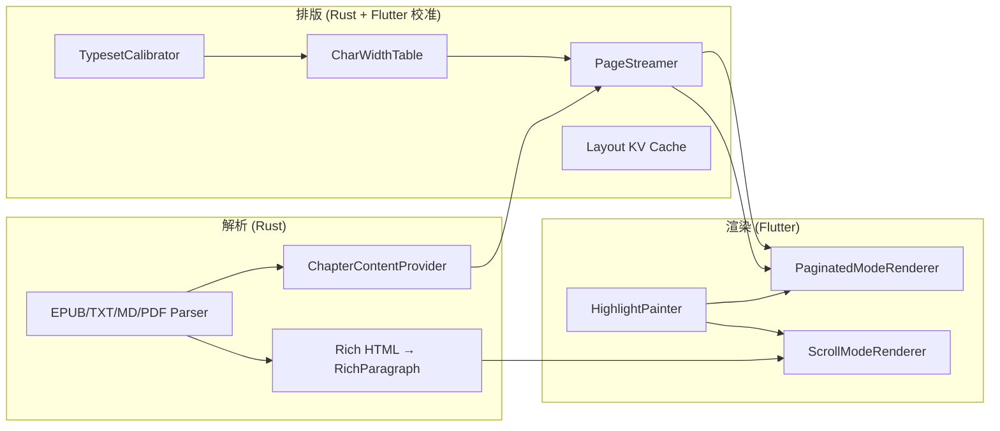

# 核心链路审查报告：解析 → 排版 → 渲染

> 初版日期: 2026-06-26
> **复核日期: 2026-07-02** — Bug A/B 已修复，标注已改善项和仍开放 bug
> 范围: `rust/src/` + `lib/features/reader/`
> 方法: 动态代码审查 + `cargo test --lib` + `dart analyze`

***

整体架构是 **Rust 负责解析与分页，Flutter 负责最终绘制**。分页已收敛到 Rust PageStreamer + session 为主路径（Dart 侧 fallback 分页已移除）。



**关键洞察：** 分页模式走 plain text + 字符宽度近似；滚动模式走 HTML rich text + Flutter 真实排版。两者是独立系统，不是同一管道的两种视图。

***

## 一、解析层

### 1.1 做得好的部分

- 格式统一入口：`parse_book` → `Parser` enum → 各格式实现
- 懒加载 Provider 模式（TXT mmap、EPUB spine 按需读）合理
- 错误类型 `AppError` 完整，Rust 侧不 panic 跨 FFI
- 路径安全校验（`validate_file_path` canonicalize）
- SVG `<svg>` → `<svg>` 重复导入：`parse_book` 先 `find_by_file_path` 预检去重

### 1.2 待解决问题（2026-07-02 复核）

| 问题                                      | 位置                                                                              | 影响                           | 状态 |
| --------------------------------------- | ------------------------------------------------------------------------------- | ---------------------------- | ---- |
| **EPUB 内容提取两套活跃路径**                     | Scroll 已统一到 IR（`get_chapter_content_ir`），双语仍走 `getEpubChapterRichContent`（Rich） | 剩余 Rich 路径仅双语使用，维护面已大幅收敛     | 缓解 |
| **TOC href 映射失败 distributing fallback** | `toc.rs` 提取 TOC 时 href 未匹配 spine → 按失败条目数均匀分配到剩余 spine                          | 部分 EPUB 章节边界偏移，边界字符可能跨章节归属错误 | ❌ 仍开放 |
| **错误被 Dart 吞掉**                         | `catchError((_) => [])` 在 rich content fallback 处已有 `Logging.warning`；但 scroll 预加载 / orchestrator preload 仍用 `catchError((_) {})`  | 部分 preload 失败无诊断信息 | ⚠️ 部分改善 |
| **EPUB 导入时 `file_size: 0`**            | ✅ **已修复** — `parse.rs:78` 现使用 `std::fs::metadata` 获取真实大小                         | 原书架文件大小显示异常已解决             | ✅ 已修复 |

### 1.3 并发 / 缓存

- `get_or_create_provider` TOCTOU：并发请求可能重复创建 Provider（浪费 IO，不 corrupt）
- 全局 LRU 缓存（`PROVIDER_CACHE`, `STREAMER_CACHE`, `RICH_CONTENT_CACHE`）无文件变更失效机制
- `scanFolder` 并发 4 路导入放大重复导入问题（但单文件导入已有 `find_by_file_path` 去重保护）

### 1.4 关键文件

| 文件                                                                   | 职责                |
| -------------------------------------------------------------------- | ----------------- |
| `rust/src/api/core.rs`                                               | 导入 + 读取 + 分页编排    |
| `rust/src/parser/mod.rs`                                             | Parser enum       |
| `rust/src/parser/registry.rs`                                        | 格式路由              |
| `rust/src/parser/epub/*`                                             | EPUB 管道           |
| `rust/src/parser/txt/*`                                              | TXT 管道            |
| `rust/src/parser/md/*`                                               | Markdown 管道       |
| `rust/src/parser/pdf/*`                                              | PDF 管道（仅导入，阅读未接入） |
| `lib/features/bookshelf/application/book_import_service.dart`        | Dart 导入入口         |
| `lib/features/reader/core/data/rust_chapter_content_repository.dart` | Dart 读取入口         |

***

## 二、排版层

### 2.1 架构特点

排版**不是** HarfBuzz/SkParagraph 级排版，而是：

1. Flutter `TextPainter` 校准 5 组字符宽度（`typeset_calibrator.dart`）
2. Rust `CharWidthTable` + 贪心换行（`pagination.rs`）
3. Flutter `SelectableText.rich` 做最终 glyph 布局

Rust 分页与 Flutter 渲染是**近似对齐**，不是像素级一致。已知的对齐修正已到位：

- `latinExtWidth` 映射到 `calibration.otherWidth`
- `pageWidth = (width - 2*padding) * dpr`，与 Renderer 边距对齐
- Lazy 分页阈值 200K chars，标点/空格预处理在阈值判断前执行

### 2.2 数据流（分页模式）

```
Book file
  → ChapterContentProvider.read_text_range (TXT/MD/EPUB)
  → PageStreamer::new(content, TypesetConfig)
  → get_descriptors() → Vec<PageDescriptor>
  → [Dart] RustPaginationSession 存储 descriptors + handle
  → get_session_page_content(pageIndex) → page text
  → PaginatedModeRenderer → HighlightPainter → SelectableText.rich
```

**编排顺序**（`chapter_load_orchestrator.dart`）：

1. 并行：`loadChapterContent` + `calibrateSafely`
2. 快速路径：`paginateFirstScreen(maxChars=2000)` via `create_pagination_session`
3. 若 `isPartial`：`expandToFullChapter` → `paginate_session_full`
4. 从 `PageDescriptor.startOffset/endOffset` 解析 `pageIndex`
5. 预加载当前页 ±3

### 2.3 待解决问题（2026-07-02 复核）

- ~~首行缩进~~ ✅ IR 路径用 `WidgetSpan` 像素精确缩进，Rich 路径用 CJK 全角空格（2026-06-26）
- **End-avoid 标点只在预处理**：`optimize_punctuation` 处理，`compute_line_breaks_from_indices` 不处理 ❌ 仍开放
- **分页/滚动内容分裂**：IR 路径已统一（分页/滚动同走 `TextBlockStyle`），plain 回退仅 TXT 无样式时触发 ✅
- **全章 materialize 开销**：cache miss 时 `paginate_chapter` 构建全部 `PageContent` 字符串再写 KV ❌ 仍开放
- ~~Bug B 翻页排版跳变~~ ✅ 已修复（`_syncPaginationSignalsAfterRepaginate` 使用当前 charOffset）

### 2.4 关键文件

| 文件                                                                    | 职责                 |
| --------------------------------------------------------------------- | ------------------ |
| `rust/src/text/pagination.rs`                                         | 布局引擎（PageStreamer） |
| `rust/src/text/char_width.rs`                                         | 字符宽度表              |
| `rust/src/text/typeset.rs`                                            | 文本预处理（标点/空格）       |
| `rust/src/domain/types/typeset.rs`                                    | TypesetConfig      |
| `lib/features/reader/data/typeset_calibrator.dart`                    | Flutter 校准         |
| `lib/features/reader/data/pagination_engine.dart`                     | FFI 包装             |
| `lib/features/reader/core/data/rust_pagination_session.dart`          | Session 生命周期       |
| `lib/features/reader/core/application/pagination_coordinator.dart`    | 分页参数组装             |
| `lib/features/reader/core/application/chapter_load_orchestrator.dart` | 加载状态机              |

***

## 三、渲染层

### 3.1 渲染原语

| 类型   | 实现                                                          |
| ---- | ----------------------------------------------------------- |
| 文本   | `SelectableText.rich` + `StrutStyle` + `textAlign: justify` |
| 图片   | `Image.memory(rp.imageData)` + `cacheWidth` 缩放（仅 scroll 模式） |
| 翻页阴影 | `CustomPaint`（`page_curl_widget.dart`，仅阴影）                  |
| 高亮   | `HighlightPainter` → `TextSpan` 树                           |

入口：`lib/features/reader/core/presentation/reader_content_area.dart` → `ReaderContent` → 模式 Renderer。

### 3.2 功能缺口（2026-07-02 复核）

| 缺口                                           | 说明                                                                                    | 状态 |
| -------------------------------------------- | ------------------------------------------------------------------------------------- | ---- |
| **分页模式无图片**                                  | `isPaginated` 时跳过 rich content 加载；Renderer 只处理 plain text                             | ❌ 仍开放 |
| **上一章衔接页用 hold frame**                       | staging 命中时显示上一章末页内容，miss 时显示当前章首页（`_buildHoldFrame`）；descriptor 不可用时才降级为 skeleton 占位 | 缓解 |
| **每页内嵌 ScrollView**                          | 内容超出 viewport 时在页内滚动，而非重新分页                                                           | ❌ 仍开放 |
| **选区工具栏定位**                                  | 上下定位已用 caret Y 坐标（改善）；左右仍铺满全屏而非跟随选区 X                                                | ⚠️ 部分改善 |
| **`WidgetSpan`** **height: double.infinity** | 高亮竖条可能在部分 TextSpan 上下文引发布局错误                                                          | ❌ 仍开放 |

### 3.3 性能 / 内存

- 大章（>100MB）`PageStreamer` 全量持有 content；line\_offsets 仅填充于 eager 模式（≤200K chars），lazy 模式为空
- Rich EPUB 图片 `Vec<u8>` 整包过 FFI，`Image.memory` 再解码
- `HighlightPainter` 静态缓存，多 Reader 实例可能 stale

### 3.4 关键文件

| 文件                                                                    | 职责                       |
| --------------------------------------------------------------------- | ------------------------ |
| `lib/features/reader/rendering/paginated_renderer.dart`               | 分页渲染                     |
| `lib/features/reader/rendering/scroll_mode_renderer.dart`             | 滚动渲染                     |
| `lib/features/reader/rendering/page_curl_widget.dart`                 | 仿真翻页                     |
| `lib/features/reader/rendering/highlight_painter.dart`                | 高亮 TextSpan              |
| `lib/features/reader/data/rich_text_converter.dart`                   | RichParagraph → TextSpan |
| `lib/features/reader/rendering/reader_render_config.dart`             | 字体/样式配置                  |
| `lib/features/reader/core/presentation/reader_interaction_layer.dart` | 选区/点击区域                  |

***

## 四、跨链路系统性问题

<br />

IR 路径已将 scroll 和 block 分页统一到 `TextBlockStyle`（8 字段全投射），分页不再是 plain-text-only。Rich 路径（双语模式）仍独立。断页漂移已通过 `TypesetCalibration` 对齐改善。

相关文档

- [READING\_CORE\_GAP\_ANALYSIS.md](./READING_CORE_GAP_ANALYSIS.md) — 功能清单差距（需与本报告交叉核对）
- [FINE\_TYPESETTING\_GAP.md](./FINE_TYPESETTING_GAP.md) — 精细排版差距
- [doc/archive/plan-unify-typeset-truth.md](../doc/archive/plan-unify-typeset-truth.md) — 统一排版真理源计划


## 五、Phase 4 遗留已知 Bug（2026-07-02 更新）

详见 [`KNOWN_POSTPHASE4_BUGS.md`](./KNOWN_POSTPHASE4_BUGS.md)：

| Bug | 状态 | 现象 / 根因 |
|-----|------|------|
| **A — 跨章错误重试** | ✅ 已修复 | stagingPromote 路径跳过冗余 `loadChapterContent`；catch 块增加保护 |
| **B — 翻页排版跳变** | ✅ 已修复 | `_syncPaginationSignalsAfterRepaginate` 使用当前 charOffset 替代 request.initialCharOffset |
| **TOC href fallback 偏移** | ❌ 仍开放 | 部分 EPUB TOC href 未匹配 spine → 均匀分布，章节边界可能偏移 |
| **滚动跨章高亮 offset 冲突** | ❌ 仍开放 | 多段拼接时相邻章高亮的 charOffset 指向错误位置 |
| **WidgetSpan height: infinity** | ❌ 仍开放 | 高亮竖条在某些 TextSpan 上下文引发布局错误 |
| **Doc 注释 50K vs 实际 200K** | ❌ 仍开放 | `LAZY_PAGINATION_CHAR_THRESHOLD` 注释与常量不一致 |
