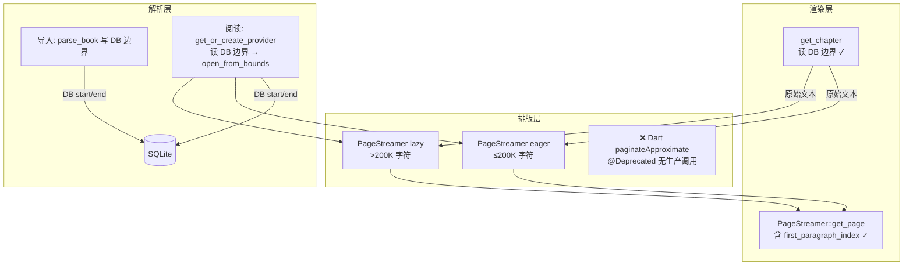

# 核心阅读链现状状态（2026-06-17 复核）

> 本文件是 [`CORE_PIPELINE_REVIEW.md`](CORE_PIPELINE_REVIEW.md) 的**现行状态补充**。
> 旧审查部分条目已过时；以本文件为准。
> 来源：基于当前代码重新审计核心阅读链路（解析→排版→渲染），对照 [`doc/plang.md`](../doc/plang.md)。

## 1. 审计方法与日期

- **审计日期**：2026-06-17
- **审计范围**：EPUB 解析、Provider 边界、DB 一致性、分页路径、错误传播、测试覆盖
- **审计依据**：当前代码 + 历史 plan 文档 + git log
- **执行计划**：[`p2-reconcile-cleanup-plan`](../local://p2-reconcile-cleanup-plan.md) + 后续 P0.1 修复

## 2. 链路架构简图



## 3. 状态对照表

### 3.1 P0 — 内容正确性 / 数据一致性

| # | 条目 | 状态 | 说明 |
|---|------|------|------|
| 1 | EPUB 阅读不读 DB 边界 | ✅ **已修复**（2026-06-17） | `get_chapter`/`paginate_chapter` 原本硬编码 `(0, content_len)`，本次统一走 `get_chapter_bounds`。新增 `test_get_chapter_epub_uses_db_bounds` 验证 |
| 2 | TOC href fallback `unwrap_or(chapter_id as usize)` | ✅ **已修复** | `toc.rs:74-82` 改为 `unwrap_or(0)` + warn log；本次进一步改进为失败 entry 按 spine 长度顺序分布 |
| 3 | 老书 reconcile（DB 章节数 vs TOC） | ✅ **不存在**（开发环境） | 开发版本无 pre-migration 旧数据，新导入总是产生有效边界。`StaleBookData` 检测已作为防御性残留。

### 3.2 P1 — 排版/渲染体验

| # | 条目 | 状态 | 说明 |
|---|------|------|------|
| 1 | Lazy 分页 `first_paragraph_index = -1` | ✅ **已修复** | lazy 模式已正确设置 `first_paragraph_index`/`last_paragraph_index`；阈值升至 200K；`test_paragraph_indices_lazy_are_not_minus_one` 验证 |
| 2 | Lazy 模式标点挤压缺失 | ✅ **by design** | 架构取舍：lazy 模式跳过 `optimize_punctuation` 以避免大 `Vec<char>` 分配。如需标点优化需流式改造 typeset.rs |
| 3 | 双套分页真理源（Rust + Dart fallback） | ✅ **已修复** | `paginateApproximate` 标 `@Deprecated`，无生产调用点；所有 chapter load 路径走 Rust session |

### 3.3 P2 — 可缝补

| # | 条目 | 状态 | 说明 |
|---|------|------|------|
| 1 | `enable_hyphenation` 接入或删除 | ✅ **已删除** | `TypesetConfig` 字段、`line_break.rs` 模块、全部 Dart 引用已清除，FRB codegen 重新生成绑定 |
| 2 | 单 spine 超大 HTML 不拆 | ✅ **已检测** | `open_from_bounds` 中单 spine HTML >2MB 时返回 `AppError::ChapterTooLarge` |
| 3 | 进度估算偏差（20 spine cap） | ✅ **已解决** | `estimate_total_chars` 按首/中/尾 3 章采样，无 20-spine cap |
| 4 | 首屏 preview 只读第一个 spine | ✅ **by design** | 设计如此：快速渲染第 0 页，全文和分页后台异步补齐 |
| 5 | 测试缺口 | ⚡ **部分覆盖** | 已加 4 个 Rust 测试 + 1 个 Dart 测试，详见 §5 |

### 3.4 降级可接受（缝补期可暂不修）

- 近似排版 vs Flutter 真实 glyph 布局的结构性漂移（CharWidthTable 方案固有限制）
- 富文本 HTML >100KB 跳过 html5ever — 有日志，属性能保护
- EPUB 滚动+分页均加载 rich — 双重 IO，性能问题非功能缺失

## 4. 分阶段修复计划

### Phase 1 — P0 内容一致性（已完成）

| 任务 | 状态 | 涉及文件 |
|------|------|----------|
| EPUB Provider 改读 DB 边界 | ✅ | `provider.rs`, `core.rs` |
| `get_chapter`/`paginate_chapter` 改读 DB 边界 | ✅（2026-06-17）| `core.rs` |
| 老书 reconcile（stale detection 子集） | ✅ | `core.rs` |
| TOC href fallback | ✅ | `toc.rs` |

### Phase 2 — P1 排版体验（已完成）

| 任务 | 状态 | 涉及文件 |
|------|------|----------|
| Lazy 模式 `first_paragraph_index` 修正 | ✅ | `pagination.rs` |
| 隔离 Dart fallback | ✅ | `pagination_coordinator.dart`, `chapter_load_orchestrator.dart` |
| 异步页内容 prefetch | ✅ | `rust_pagination_session.dart` |
| 统一 EPUB partial 字符语义 | ✅ | `core.rs` |
| 对齐 pageWidth 来源 | ✅ | `paginated_renderer.dart`, `reader_shell.dart` |

### Phase 3 — P2 缝补 + 测试（已完成主体）

| 任务 | 状态 | 涉及文件 |
|------|------|----------|
| 接入或删除 hyphenation 配置 | ✅（已删除）| `typeset.rs`, `Cargo.toml`, 全部 Dart 引用 |
| 按 HTML 体积二次拆章 | ✅（仅检测，未自动拆）| `provider.rs` |
| 补 Rust 集成测试 | ✅ | `core.rs` test, `provider.rs` test |
| 补 Dart 桥接测试 | ⚡（仅 AppErrorMapper）| `app_error_mapper_test.dart` |

## 5. 测试覆盖

| 测试 | 文件 | 状态 |
|------|------|------|
| `test_stale_epub_bounds_returns_stale_book_data` | `core.rs` | ✅ |
| `test_get_chapter_epub_uses_db_bounds` | `core.rs` | ✅（2026-06-17 新增）|
| `test_oversized_single_spine_returns_too_large` | `provider.rs` | ✅ |
| `test_paragraph_indices_lazy_are_not_minus_one` | `pagination.rs` | ✅ |
| `AppErrorMapper.humanReadable` 全变体 | `app_error_mapper_test.dart` | ✅（2026-06-17 新增）|
| `epub_parse_and_session_baseline` | `epub_reading_chain_test.rs` | ✅ |
| `epub_partial_to_full_upgrade` | `epub_reading_chain_test.rs` | ✅ |
| `epub_consecutive_pages_no_duplicate` | `epub_reading_chain_test.rs` | ✅ |
| `epub_descriptors_monotonic_offsets` | `epub_reading_chain_test.rs` | ✅ |
| `epub_first_spine_matches_session_prefix` | `epub_reading_chain_test.rs` | ✅ |
| `epub_repaginate_font_change` | `epub_reading_chain_test.rs` | ✅ |
| `epub_layout_cache_roundtrip` | `epub_reading_chain_test.rs` | ✅ |
| `epub_multi_chapter_index_1` | `epub_reading_chain_test.rs` | ✅ |
| `epub_stale_bounds_returns_error` | `epub_reading_chain_test.rs` | ✅ |
| `epub_chapter_too_large` | `epub_reading_chain_test.rs` | ✅ |
总计：**180 个 Rust lib tests + 10 个新增 Rust integration test + 6 个 Dart test** = 196 全部通过。

### 运行命令

```powershell
cd rust

# EPUB 阅读链集成测试（需 fixture 存在，缺则 skip）
cargo test --test epub_reading_chain_test -- --test-threads=1 --nocapture

# TXT Session 集成测试（无 fixture 依赖）
cargo test --test pagination_session_test -- --test-threads=1 --nocapture
```

> `--test-threads=1` 避免全局 `STREAMER_CACHE`（容量 4）在并行测试间竞态驱逐条目。这是测试环境特有现象，生产环境单用户不会出现。


## 6. 验证清单

- [x] EPUB Provider 改读 DB 边界（`test_get_chapter_epub_uses_db_bounds`）
- [x] 老书 stale bounds 检测（`test_stale_epub_bounds_returns_stale_book_data`）
- [x] 单 spine >2MB 检测（`test_oversized_single_spine_returns_too_large`）
- [x] Lazy paragraph indices（`test_paragraph_indices_lazy_are_not_minus_one`）
- [x] Dart AppErrorMapper 覆盖所有 18 个变体
- [x] 老书 DB vs TOC 全量 reconcile（**不存在** — 开发版本无旧数据）
- [ ] TOC 多 entry 同时失败时的分布（**已部分改进** — 仍可能 boundary case）
- [x] EPUB partial 字符语义统一 — `get_chapter_partial` 改用 char-count 模式（`test_get_chapter_partial_epub_uses_char_count`）
- [ ] Lazy 模式标点挤压（by design skip）

## 7. 未来改进建议

1. **流式标点优化**：将 `optimize_punctuation` 改为 byte-indexed 字符串扫描，避免大 `Vec<char>` 分配
2. **Dart 桥接层集成测试**：使用真实 FFI + 测试 EPUB fixture 验证 repository 完整路径

---


## 8. Phase 4 收敛（2026-06-25）

### 8.1 Scroll → IR 统一（P4-1，ADR-009）

- Scroll 模式不再加载 EPUB rich 内容，仅走 IR（`_loadScrollModePayload`: IR → plain 回退）
- `ScrollModeRenderer.build()` 决策树收敛为 2 条路径：IR（多段/单章）→ plain
- 删除 ~500 行 dead rich 渲染代码（`_buildMultiSegmentRichList`、`_buildRichScrollWithImages` 等），文件从 855→352 行
- `_needsRichContent` 仅 `ReadingMode.bilingual`
- 金路径测试 `scroll_ir_golden_test.dart`：6/6 绿

### 8.2 Staging 零 spinner（P4-3，ADR-012）

- 分页 pageContent / block miss 改用骨架占位（`_buildPageSkeleton`），不再出 `CircularProgressIndicator`
- `_buildHoldFrame` 边缘 case（descriptors 为空）同步改为 skeleton
- `paginated_renderer_test.dart`：18/18 绿

### 8.3 图片占位防排版跳动（P4-2 补充）

- `EpubBlockImage._compactPlaceholder` → `_sizedPlaceholder`：根据 `maxWidthPx`/`maxHeightPx` 预留正确空间
- 分页和 scroll 共用同一 widget，两路径均受益

### 8.4 Flutter Metrics（P4-4，ADR-013）

- `buildTypesetConfig` 已接入 padding 减法 + calibration 回传
- `typeset_calibrator_test.dart`：13/13 绿

### 8.5 待完成

- P4-5 双语 codegen + `ReaderSessionFactory` 回调注入
- 真机验收（跨章 forward/backward 无可见 spinner）
**维护者**：当核心阅读链发生重大变更（如替换 PageStreamer 算法、改变 Provider 边界获取方式、移除/新增错误变体）时，请同步更新本文件的 §3 状态对照表。
