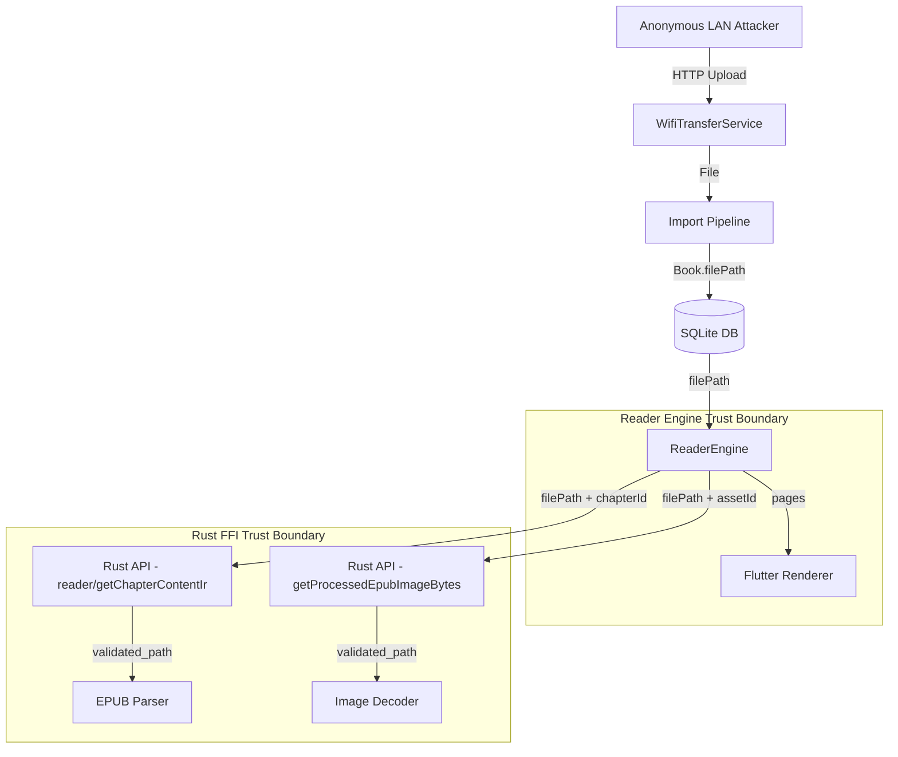

# Knowledge Base Report — Reader Engine

## Static Analysis Summary

### Backend
- Tool: grep + manual source review (CodeQL/Semgrep unavailable)
- Coverage: 46 Dart files, ~192 KB total (100% of reader_engine)
- Time: ~4 minutes (lite mode)

### Results

| Severity | Count | IDs |
|----------|-------|-----|
| High | 1 | q2-004 |
| Medium | 2 | q2-001, q2-002 |
| Low | 1 | q2-003 |

### Findings by Category
- **Information Disclosure**: q2-001 (file path logging)
- **Path Traversal / Access Control**: q2-002 (file path re-validation gap)
- **Resource Exhaustion**: q2-003 (image load limits)
- **Pre-auth Attack Surface**: q2-004 (WiFi transfer service)

### Rust Cross-Reference
The Rust API layer (scoped separately) produced 8 findings in an earlier pass covering path traversal, LIKE injection, and missing authz.

---

## CodeQL Structural Analysis

CodeQL database was not built (tool not available in environment). No structural extraction was performed.

### Entry Points
Identified via manual review:
- `ChapterContentRepository.loadContent(bookId, chapterId)` — called from pagination renderer
- `ChapterContentRepository.preload(bookId, chapterId)` — preload trigger
- `FlutterStagingPreloader.preload(bookId, chapterIndex, params, forNext)` — staging preloader
- `PaginationSession.beginPaginate(...)` — main pagination entry
- `PaginationSession.beginPaginateFromCache(...)` — staging promote
- `PaginationSession.expandToFullChapter(...)` — full chapter expansion
- `EpubBlockImageCache.load(filePath, assetId, maxWidthPx)` — image loading
- `EpubBlockImageCache.prefetchBlocks(filePath, blocks, maxWidthPx)` — image prefetch

### Sinks (High-Risk Operations)
- `reader_api.getChapterContentIr(bookId, chapterIndex)` — IR extraction from file
- `reader_api.getChapterPlain(bookId, chapterIndex)` — plain text extraction
- `epub_api.getProcessedEpubImageBytes(filePath, assetId, maxWidthPx)` — image decoding
- `epub_api.getProcessedEpubImage(filePath, assetId, maxWidthPx)` — image cache file
- `book_api.getBook(bookId)` — database read

### Call Graph Slices (Manual)
```
WifiTransferService (HTTP) :: upload
  → file saved to disk
  → import_book(file_path) [Rust]
  → Book record created with filePath
  → ChapterContentRepository.loadContent(bookId, chapterId)
    → book_api.getBook(bookId) → filePath
    → reader_api.getChapterContentIr(bookId, chapterIndex) → file [Rust validator]
    → Paginator parses text/image blocks
    → EpubBlockImageCache.load(filePath, assetId, ...) [Rust image decoder]
```

---

## SAST Enrichment

### Inline Enrichment Verdicts

Since CodeQL database was not built and Semgrep was not run, enrichment is based on manual cross-reference:

| Finding | Classification | Attacker Control | Boundary | CodeQL Reachability | Verdict |
|---------|---------------|-----------------|----------|-------------------|---------|
| q2-001 | correctness/env | Physical device access or log collection | App↔Storage | no-slice | keep |
| q2-002 | likely security | Book record compromise (SQL injection, malicious import) | Dart↔Rust FFI | no-slice | keep |
| q2-003 | correctness/robustness | Malicious EPUB upload | External↔App | no-slice | keep |
| q2-004 | likely security | Any LAN client | Network↔App | no-slice | keep (pre-auth) |

### Drop Criteria Applied
- Build-time issues: none found
- Test-only / dev-only: none found
- Same-user state correctness: none found
- Admin safety / retry hardening: none found
- Low severity dropped: All findings are at least medium; no drops

### Custom Rule Generation Not Required
The reader_engine Dart layer is a thin client with no custom wrappers, RPC, or generated interfaces that would hide sources/sinks from built-in tooling. The Rust FRB layer uses `flutter_rust_bridge` code generation, which was handled in the Rust audit pass.

---

## DFD/CFD Blind Spots

1. **Dart→Rust FFI boundary** — The trust boundary between Dart and Rust is crossed on every API call. The `filePath` is validated in Rust on each call, but the validation only checks existence + canonicalization without path containment verification (no sandbox check).

2. **WiFi transfer HTTP handler** — Outside reader_engine boundary but feeds into it. No authentication, no CSRF protection, no rate limiting.

3. **Book import pipeline** — The gap between file upload (no auth) and file processing (validated but not bounded) is the highest-risk flow.

### Mermaid DFD (Simplified)



---

## Appendix: Existing Rust Audit Findings (for Cross-Reference)

| ID | Slug | Severity |
|----|------|----------|
| q2-001 | cover-extraction-path-traversal | high |
| q2-002 | delete-book-cover-path-traversal | high |
| q2-003 | note-search-like-wildcard-injection | medium |
| q2-004 | dictionary-init-unvalidated-path | medium |
| q2-005 | export-destination-path-validation | medium |
| q2-006 | validate-file-path-lacks-symlink-check | medium |
| q2-007 | create-web-book-cover-path-unvalidated | medium |
| q2-008 | no-authz-in-frb-api-layer | high |
