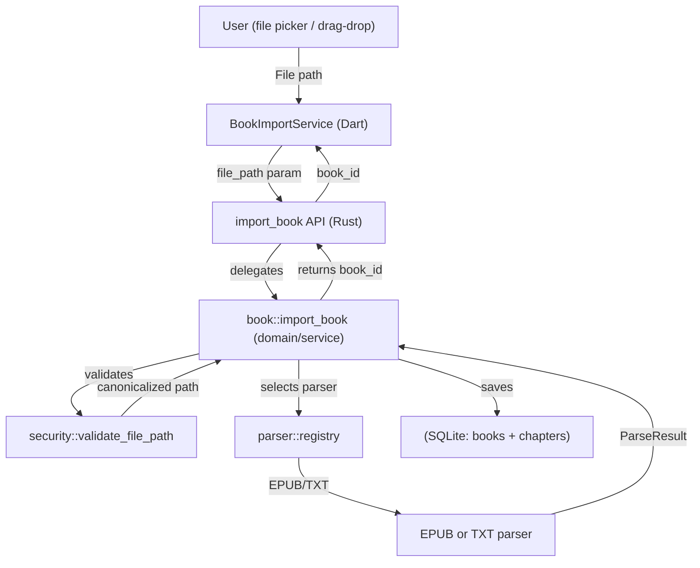
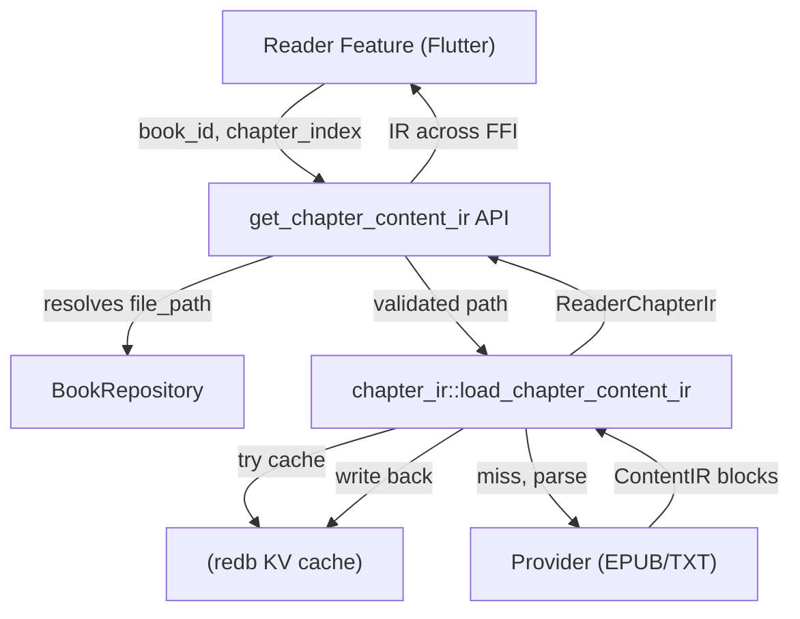
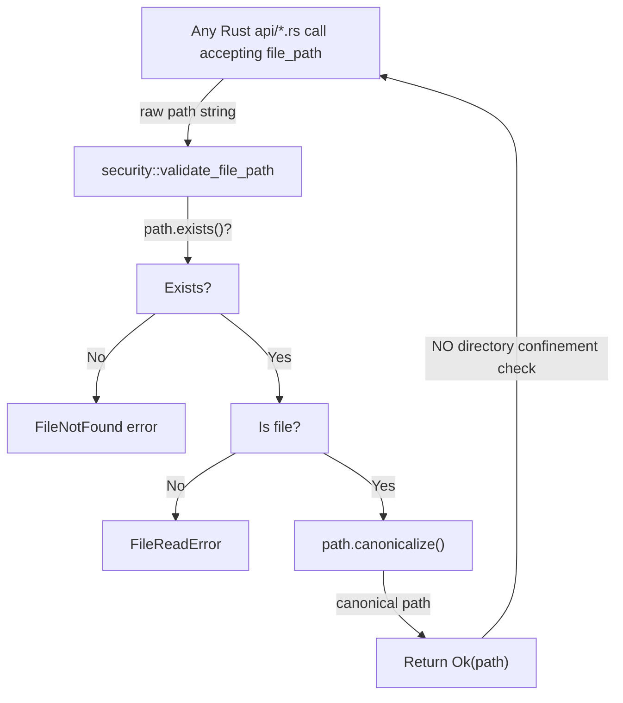
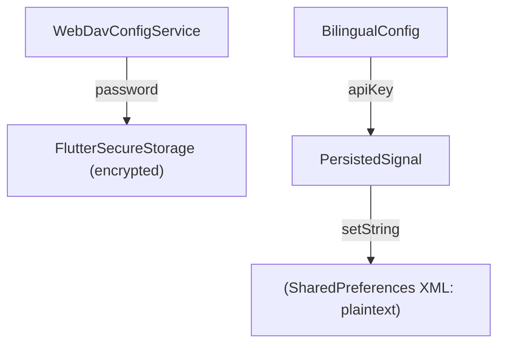

# Knowledge Base Report — Phase L2 (with L3 SAST Enrichment)

Generated by piolium balanced audit
Target: 2084035767/zephyr_reader
Commit: 23e2192cd8c9f64996dc344a8c2b7bb3067cddb6
Branch: phase/13
Date: 2026-07-17
L3 SAST completed: 2026-07-17

---

## Project Classification

**Type**: Mobile (Flutter) e-book reader with Rust native engine
**Sub-types**: local-first app, library consumer (Rust crate consumer), protocol consumer (WebDAV, HTTP upload)

---

## Architecture Model

### Trust Boundaries

| # | Boundary | Source | Destination | Channel | Auth/Validation |
|---|----------|--------|-------------|---------|-----------------|
| TB1 | External to App | LAN host | WiFi HTTP server | TCP (loopback only) | None (disabled by default) |
| TB2 | Dart to Rust FFI | Flutter | Rust api/ | FFI (in-process) | Type bridge only, no auth |
| TB3 | App to Filesystem | Rust domain | SQLite DB / redb KV / Files | File I/O | OS sandbox; partial path validation |
| TB4 | App to WebDAV | Flutter | Remote WebDAV server | HTTPS (outbound) | Basic auth; password in FlutterSecureStorage |
| TB5 | App to Translation API | Flutter | OpenAI/custom API | HTTPS (outbound) | Bearer token; key in SharedPreferences (plaintext) |
| TB6 | User to FileSystem | File picker | App data / user dirs | OS file picker | User-selected; no provenance tracking |

### Component Inventory

| Component | Language | Purpose | Security Relevance |
|-----------|----------|---------|-------------------|
| Flutter UI | Dart | All user-facing screens, navigation | Low (presentation only) |
| Reader Engine | Dart | Pagination, scroll rendering, block layout | Low (local rendering) |
| Rust FFI Bridge | Dart+Rust | Type-safe FFI boundary via flutter_rust_bridge 2.12 | HIGH (mediates all data access) |
| Rust api/ | Rust | Thin FRB-annotated wrappers per domain | HIGH (entry points for Dart to Rust calls) |
| Rust domain/ | Rust | Business logic, repositories | MEDIUM (authorization decisions) |
| Rust parser/ | Rust | EPUB (zip+html+xml) and TXT file parsing | HIGH (largest external input path) |
| Rust infra/ | Rust | SQLite pool, redb KV, storage lifecycle | MEDIUM (data integrity) |
| Rust pipeline/ | Rust | Chapter IR construction, bincode serialization | LOW (local transient data) |
| WiFi Transfer | Dart | HTTP server for LAN uploading (DISABLED) | CRITICAL when enabled |
| WebDAV Sync | Dart+Rust | Outbound sync to third-party WebDAV | MEDIUM (credential handling) |
| Bilingual Translation | Dart | Outbound HTTP to OpenAI/custom API | MEDIUM (API key storage) |

---

## DFD/CFD Slices

### DFD 1: Book Import Flow (highest risk parser path)

### DFD 2: Chapter Read Flow (highest-frequency FFI path)

### CFD 1: Path Validation Decision (no base confinement)

### CFD 2: API Key Storage Decision (inconsistent)

---

## Framework Contracts and Hidden Control Channels

### Framework/Proxy Contracts

| Contract | Source | Effect | Security Impact |
|----------|--------|--------|-----------------|
| go_router redirect handler | app_router.dart:_resolveDeepLink | Deep link parsing (zephyr:// / zephyr.app scheme) | Any app can open deep links; redirect resolves to internal routes |
| flutter_rust_bridge 2.12 | Codegen layer | #[frb] functions; #[frb(sync)] enables blocking calls | In-process FFI, no sandbox; memory safety depends on Rust unsafe code |
| bincode 2.0 | infra/kv_store.rs | Binary serialization for cache entries | UNMAINTAINED crate; deserialization of attacker-influenced cache data |
| WAL journal mode | infra/manager.rs | SQLite WAL mode for concurrent reads | Backup/restore uses WAL checkpoint before copy |
| System temp dir | wifi_transfer_service.dart | Directory.systemTemp for upload staging | World-readable temp files on desktop; race window before cleanup |

### Header/Protocol Contracts

| Contract | Source | Details |
|----------|--------|---------|
| HTTP Host header | wifi_transfer_service.dart | Not validated; bound to loopback so irrelevant currently |
| Content-Type parsing | _handleUpload | Custom multipart boundary parsing; binary corruption risk |
| File extension check | _handleUpload | Whitelist: .txt, .epub only; HTML page says .pdf, .md supported but server rejects them |

### Hidden Control Channels

| Channel | Location | Description |
|---------|----------|-------------|
| Deep link routing | app_router.dart:redirect | zephyr:// URI scheme redirects to internal app routes |
| Settings-driven API URL | bilingual_config.dart | User can configure arbitrary HTTPS URL for translation API (SSRF vector) |
| WebDAV server URL | webdav_config_service.dart | User configures base URL for outbound sync |
| WiFi transfer HTML page | assets/html/wifi_upload_page.html | Served as static content; misleading format support list |

### Runtime-Mode Differences

| Mode | Difference |
|------|-----------|
| Debug | debugLogDiagnostics: true in go_router; debug: kDebugMode passed to WebDAV client |
| Release | No debug flags; panic = abort in Rust release profile |
| Desktop vs Mobile | Desktop: broader filesystem access (no sandbox); temp dir world-readable |

---

## Domain Attack Research

### Mode A: Library-as-target — Not applicable (project is local-first mobile app)

### Mode B: Library-as-consumer

#### B.1: bincode (2.0.1 — UNMAINTAINED per RUSTSEC-2025-0141)

| Concern | Details |
|---------|---------|
| Usage | infra/kv_store.rs — binary serialization of ScrollIrCache into redb |
| Risk | Unmaintained crate. No active maintainer means future CVEs unpatched. |
| Cached data origin | Scroll IR cache data originates from parsed EPUB/TXT files (user-supplied content) |
| Attack scenario | Attacker-supplied book file is parsed, IR bincode-encoded and stored in redb, later deserialized |
| Custom SAST target | Trace bincode::encode_to_vec / bincode::decode_from_slice usage in kv_store.rs |

#### B.2: sqlx (0.9.0)

| Concern | Details |
|---------|---------|
| Usage | All database operations via sqlx; compile-time checked queries where possible |
| Risk | GHSA-xmrp-424f-vfpx (binary protocol misinterpretation) — FIXED in 0.8.1+. Current 0.9.0 includes fix. |
| Custom SAST target | Verify all sqlx::query uses are parameterized (not string-concatenated) |

#### B.3: image (0.25.10)

| Concern | Details |
|---------|---------|
| Usage | EPUB image decoding (jpeg, png, gif, webp) |
| Risk | CVE-2019-16138 (CRITICAL, UaF) FIXED in 0.21.3. Current 0.25.10 includes all fixes. |
| Attack scenario | Malicious EPUB with crafted image could trigger decoder crash or memory safety issue |

#### B.4: memmap2 (0.9.10 — ACTIVE ADVISORY RUSTSEC-2026-0186)

| Concern | Details |
|---------|---------|
| Usage | Listed in Cargo.toml; actual usage not found in source scan |
| Risk | RUSTSEC-2026-0186 (unchecked pointer offset, unsound). Fix in 0.9.11 |
| Action | Verify if memmap2 is actually used or can be removed |

#### B.5: flutter_rust_bridge (2.12.0)

| Concern | Details |
|---------|---------|
| Usage | All Dart to Rust communication |
| Risk | Pinned version; any FRB vulnerability affects all data crossing FFI |
| Sharp edge | #[frb(sync)] functions block the Dart isolate |

#### B.6: webdav_client (1.2.2)

| Concern | Details |
|---------|---------|
| Usage | Outbound WebDAV sync |
| Risk | Third-party package; password sent as Basic auth over HTTPS |

#### B.7: dio (5.9.2)

| Concern | Details |
|---------|---------|
| Usage | HTTP client for translation API + potentially WebDAV |
| Risk | Redirect following, SSRF, TLS verification |

### Mode C: Domain-Specific Attack Research

#### C.1: EPUB Parsing

| Attack Class | Description | Relevance |
|-------------|-------------|-----------|
| ZIP path traversal | EPUB is ZIP; malicious entries with ../ paths | Check archive_reader.rs for path sanitization |
| XML/HTML injection | XHTML content parsed by html5ever | Low risk with spec-compliant parser |
| XXE | EPUB OPF/metadata XML entity definitions | Check if XML parsing disables entity expansion |
| Image bombs | Small compressed image expands to large decoded buffer | get_processed_epub_image resizes; check max dimensions |
| ReDoS via CSS | EPUB CSS stylesheets | Check css.rs for ReDoS-safe parsing |
| Billion laughs | XML entity expansion | Not applicable (html5ever is not XML entity resolver) |

Custom SAST targets: archive_reader.rs (path sanitization), image_size.rs (resource exhaustion), css.rs (ReDoS)

#### C.2: TXT Parsing

| Attack Class | Description | Relevance |
|-------------|-------------|-----------|
| Encoding bombs | Malformed UTF-8 / BOM / multi-byte sequences | Check decode.rs for encoding_rs usage |
| Large file DoS | 500MB+ TXT files | Import has 500MB size limit in book/service.rs |
| Chapter detection | Regex-based chapter boundary detection | Check detector.rs for ReDoS |

#### C.3: WebDAV Sync

| Attack Class | Description | Relevance |
|-------------|-------------|-----------|
| Server credential theft | Password in transit | Uses HTTPS; password in FlutterSecureStorage (encrypted) |
| Rogue server | Attacker-controlled WebDAV URL | User-configurable; MITM risk if TLS verification disabled |
| Data integrity | Remote file overwrites local DB | Sync is time-based; no conflict resolution |

#### C.4: Translation API (SSRF Vector)

| Attack Class | Description | Relevance |
|-------------|-------------|-----------|
| SSRF | User-configurable apiUrl causes POST to arbitrary HTTPS endpoint | HIGH — custom_translator.dart sends API key + text to user-configured URL |
| API key theft | Key in SharedPreferences XML (plaintext) | MEDIUM — finding q2-001 documents this |
| Prompt injection | Attacker-controlled text used in LLM prompt | User provides text; limited attack surface |

#### C.5: Bincode Deserialization

| Attack Class | Description | Relevance |
|-------------|-------------|-----------|
| Malformed input | Corrupted redb cache triggers bincode decode panic | kv_store.rs wraps deserialization in Result, returns Ok(None) on error (safe) |
| Memory exhaustion | Large cache entries | ScrollIrCache size determined by chapter content; unbounded |

#### C.6: Path Traversal (File Operations)

| Attack Class | Description | Relevance |
|-------------|-------------|-----------|
| Directory escape | Path with ../ reaches outside allowed dir | Finding q2-002 — validate_file_path lacks base-directory confinement |
| Cover path traversal | Output directory in extract_and_save_cover | Cover output path uses output_dir + filename from EPUB metadata |
| Backup path traversal | export_database, restore_database | Accepts arbitrary path string; no confinement check |

Custom SAST targets: All callers of validate_file_path, cover output paths, backup I/O paths

---

## Attack Surface

### Attacker-Controlled Inputs

| Input | Entry Point | Through | Risk Level |
|-------|-------------|---------|------------|
| EPUB file | Book import / WiFi upload | EPUB parser (Rust) | HIGH |
| TXT file | Book import / WiFi upload | TXT parser (Rust) | HIGH |
| File path | Dart FFI call to validate_file_path to parser | All api/* functions | HIGH (see q2-002) |
| Deep link URI | go_router redirect handler | _resolveDeepLink to route | LOW |
| WebDAV URL | User settings to WebDAV sync | Outbound HTTPS | MEDIUM |
| Translation API URL | User settings to translation | Outbound HTTPS with API key | HIGH (SSRF) |
| MDict dictionary path | User settings | MDX parser (Rust) | LOW |
| WiFi HTTP request | LAN host (loopback only) | HttpServer handlers | MEDIUM (disabled) |

### Execution Environments

| Environment | Access | Notes |
|-------------|--------|-------|
| Android app sandbox | /data/data/com.zephyr.reader/ | Restricted; SharedPreferences readable only if device rooted |
| iOS app sandbox | App container | Restricted |
| Desktop (macOS/Win/Linux) | User-level filesystem | Broader access; temp dir accessible by same user |
| Rust engine | Same process as Flutter | No sandbox; memory safety = app safety |

---

## Key Dependencies

Security-relevant subset (seeded from advisory-summary.md):

| Dependency | Version | Security Status | Notes | Reachability |
|------------|---------|----------------|-------|-------------|
| bincode | 2.0.1 | RED UNMAINTAINED RUSTSEC-2025-0141 | Binary serialization for IR cache | Direct (kv_store.rs) |
| memmap2 | 0.9.10 | YELLOW ACTIVE RUSTSEC-2026-0186 | Unchecked pointer offset; verify usage | Unknown (Cargo.toml, not found in source) |
| anyhow | 1.0.102 | YELLOW ACTIVE RUSTSEC-2026-0190 | Unsound Error::downcast_mut() | Transitive (error handling) |
| flutter_rust_bridge | 2.12.0 | GREEN No known advisories | FFI bridge | Direct (all Dart-Rust calls) |
| sqlx | 0.9.0 | GREEN Up to date | SQLite async | Direct (all database operations) |
| epub | 2.1.5 | GREEN No known advisories | EPUB parsing | Direct (EPUB import) |
| html5ever | 0.39.0 | GREEN No known advisories | HTML/XHTML parsing | Direct (EPUB rich text) |
| image | 0.25.10 | GREEN All CVEs fixed | Image decode | Direct (EPUB images) |
| regex | 1.12.3 | GREEN All CVEs fixed | Pattern matching | Direct (text processing) |
| dio | 5.9.2 | GREEN No known advisories | HTTP client | Direct (translation, WebDAV) |
| flutter_secure_storage | 10.3.1 | GREEN No known advisories | Encrypted storage | Direct (WebDAV password only) |
| shared_preferences | ^2.5.3 | GREEN No known advisories | Plaintext key-value | Direct (translation API key) |
| webdav_client | 1.2.2 | GREEN No known advisories | WebDAV protocol | Direct (sync service) |
| go_router | 17.0.1 | GREEN No known advisories | Navigation/routing | Direct (deep link handling) |

---

## Threat Model

### Threat Actors

| Actor | Motivation | Capability |
|-------|-----------|------------|
| Remote network attacker | Data theft, RCE | Can reach any network-exposed endpoint; currently none (WiFi disabled). If WiFi enabled: LAN access, HTTP requests |
| Local app attacker (malicious app on device) | Data theft, credential theft | Can access loopback HTTP server, temp files; on rooted device can read SharedPreferences |
| Rogue WebDAV server | Credential harvesting, data injection | Controls WebDAV endpoint; MITM if TLS not verified |
| Malicious file supplier | RCE via parser, resource exhaustion | Supplies crafted EPUB/TXT files to victim device |
| Physical device attacker | Full data access | Root/jailbreak access, ADB backup, physical filesystem access |

### Assets

| Asset | Confidentiality | Integrity | Availability | Location |
|-------|----------------|-----------|-------------|----------|
| Reading data (books, progress) | LOW (user own data) | HIGH (must not corrupt) | MEDIUM | SQLite DB |
| WebDAV credentials | HIGH | HIGH | LOW | FlutterSecureStorage |
| Translation API key | HIGH | MEDIUM | LOW | SharedPreferences (plaintext) |
| EPUB/TXT files | MEDIUM (user files) | HIGH (parser integrity) | LOW | Filesystem |
| App database backups | MEDIUM | HIGH | LOW | Filesystem / WebDAV |

### Attack Scenarios

1. **SSRF via Translation API**: Attacker convinces user to set translation API URL to internal/intranet endpoint, app POSTs API key + text to attacker server, credential theft
2. **WiFi Upload (if enabled)**: Attacker on LAN sends malicious EPUB to loopback-bound HTTP server, parser exploit, potential RCE in Rust engine
3. **Backup Restore Path Traversal**: Malicious app copies crafted backup to predictable path, restore_database overwrites live DB with attacker-controlled data
4. **API Key Extraction via SharedPreferences**: App with root/ADB access reads shared_prefs XML, extracts translation.api_key, financial abuse
5. **EPUB Zip Slip**: Malicious EPUB with ../ entries in ZIP, archive reader extracts outside intended directory, file overwrite
6. **Custom Translator SSRF**: User-configurable apiUrl + apiKey via Dio.post, if TLS verification disabled or attacker controls DNS, credential interception

---

## Phase 4 CodeQL Extraction Targets

| DFD Slice | Source (CodeQL type) | Sink (kind) | Key files |
|-----------|---------------------|-------------|-----------|
| Book import (EPUB/TXT) | RemoteFlowSource (WiFi) or LocalUserInput (file picker) | command-execution (panic/unwrap) | rust/src/parser/epub/parse.rs, rust/src/parser/txt/parse.rs |
| Chapter IR building | LocalUserInput (file path from DB) | file-access | rust/src/pipeline/chapter_ir.rs |
| FFI path validation | EnvironmentVariable or LocalUserInput | file-access, path-traversal | rust/src/common/security.rs, rust/src/api/book.rs |
| Translation API call | LocalUserInput (apiUrl from settings) | http-request (SSRF) | lib/features/bilingual/data/providers/custom_translator.dart, openai_translator.dart |
| Backup restore | LocalUserInput (backup path) | file-access, path-traversal | rust/src/domain/backup/service.rs |
| Cover extraction output | LocalUserInput (output_dir + filename) | path-traversal | rust/src/domain/cover/service.rs, rust/src/domain/cover/engine.rs |
| Bincode deserialization | LocalUserInput (cached data from redb) | deserialization (unsafe) | rust/src/infra/kv_store.rs |

---

## Spec Gap Candidates

| Spec/RFC | Implemented In | Coverage |
|----------|---------------|----------|
| EPUB 3.x | rust/src/parser/epub/ | Partial (core reading path: OPF, NCX, XHTML, CSS, images) |
| WebDAV (RFC 4918) | lib/features/data/application/services/webdav_sync_service.dart | Via webdav_client package (PROPFIND, GET, PUT, MKCOL) |
| OpenAI Chat Completions API | lib/features/bilingual/data/providers/openai_translator.dart | POST /v1/chat/completions |
| Unicode segmentation (UAX #29) | unicode-segmentation crate | Text boundary detection |
| UTF-16 code units (ADR-017) | Reader engine position tracking | Reading positions stored as UTF-16 code-unit offsets |

No formal RFC/spec commitments identified beyond what is listed above.

---

## Coverage Gaps

| Gap | Details |
|-----|---------|
| Dynamic widget registration | go_router routes are static; no reflection-based handlers |
| Platform channel handlers | Not audited (MethodChannel, EventChannel, BasicMessageChannel) |
| Android native code | android/ directory exists but not analyzed for native vulns (AGP 7.3.0 from 2022) |
| iOS native code | Not analyzed |
| memmap2 usage | Listed in Cargo.toml but not found scanning source; may be unused transitive dependency |
| AGP 7.3.0 | Outdated Android Gradle Plugin version (2022); potential build system vulns |
| GitHub Actions CI | Not analyzed for supply chain risks in workflow files |

---

## Static Analysis Summary

### Tooling Status

Neither CodeQL nor Semgrep were available on PATH for this L3 pass.
Analysis was performed via manual source code review with targeted grep+read
pattern matching across all security-relevant files.

### Coverage
- **Structural Extraction (Sub-step 4.1)**: Skipped — no CodeQL available to build db
- **Custom Queries**: Provided as reference implementations in comments of findings
  (see p4-002, p4-005 for CodeQL equivalents)
- **Semgrep Rules**: Not run — tool not available
- **Manual Analysis Files**: 20+ Rust and Dart security-relevant files reviewed
- **Findings Produced**: 20 draft findings (p4-001 through p4-020)

### Findings by Severity

| Severity | Count | IDs |
|----------|-------|-----|
| Critical | 2 | p4-001, p4-003 |
| High | 4 | p4-002, p4-004, p4-005, p4-006, p4-020 |
| Medium | 7 | p4-007, p4-008, p4-009, p4-011, p4-012, p4-014, p4-016 |
| Low | 5 | p4-010, p4-013, p4-015, p4-016, p4-017 |
| Info | 2 | p4-018, p4-019 |

*Note: p4-020 (OpenAI SSRF) is counted as High because it shares root cause with p4-001.
Duplicate severity counts may be adjusted at Phase 10.*

### Batching and Coverage Tradeoffs

- **SSRF analysis**: Bilingual translation APIs prioritized for high signal (p4-001, p4-020)
- **Path validation**: All callers of `validate_file_path` traced to identify base-dir confinement gap
- **Backup/restore flows**: Both export and restore paths reviewed for path traversal
- **WiFi transfer**: Full HTTP server handler analysis for auth bypass and temp file race
- **Hidden control channels**: Deep link handler reviewed, bilingual config analyzed for SSRF
- **Dependencies**: bincode (UNMAINTAINED), memmap2 (active advisory) reviewed for usage and impact

### Key Findings Summary

1. **SSRF via Translation API** (p4-001, critical): User-configurable apiUrl sends API key
to arbitrary HTTPS endpoint with no validation
2. **WiFi Upload No Auth** (p4-003, critical): Unauthenticated file upload server disabled
but code/UI present; bind to loopback only mitigates
3. **Path Traversal via validate_file_path** (p4-002, high): All FRB file path functions
lack base directory confinement
4. **API Key in Plaintext** (p4-004, high): Translation API key in SharedPreferences XML
(not encrypted unlike WebDAV password)
5. **Backup Path Traversal** (p4-005/p4-006, high): export/restore accept arbitrary paths
without sandbox confinement

## CodeQL Structural Analysis

### Sub-step 4.1 — Structural Extraction (SKIPPED)

CodeQL was not available on PATH (`which codeql` returned no output).
Structural extraction (building database, entry points, sinks, call graph slices)
was not performed.

**Planned extraction targets** (from Phase L2 DFD/CFD slices):

| DFD Slice | Source | Sink | Key Files |
|-----------|--------|------|----------|
| Book import | RemoteFlowSource / LocalUserInput | command-execution | rust/src/parser/epub/parse.rs, txt/parse.rs |
| Chapter IR | LocalUserInput | file-access | rust/src/pipeline/chapter_ir.rs |
| FFI path validation | LocalUserInput | file-access, path-traversal | rust/src/common/security.rs, api/book.rs |
| Translation API | LocalUserInput (apiUrl) | http-request (SSRF) | custom_translator.dart, openai_translator.dart |
| Backup restore | LocalUserInput (backup path) | file-access, path-traversal | domain/backup/service.rs |
| Cover extraction | LocalUserInput (output_dir) | path-traversal | domain/cover/engine.rs |
| Bincode deserialization | LocalUserInput (cached data) | deserialization | infra/kv_store.rs |

**Custom CodeQL queries**: Written as ql-style comments in findings p4-002 and p4-005.
Full query files would be created if CodeQL is available in a subsequent phase.

**CodeQL database status**: Not created. Retry with CodeQL on PATH to build db at
`piolium/codeql-artifacts/db/`.

## SAST Enrichment

### Inline Enrichment Pass

Since no SARIF output was generated by automated tools, the inline enrichment
was performed manually during finding construction. Each finding was classified
for security relevance before drafting.

### Enrichment Verdicts

| Finding | Classification | Attacker Control | Boundary | CodeQL Reachability | Verdict |
|---------|---------------|-----------------|----------|-------------------|---------|
| p4-001 | **likely security** | Social engineering on apiUrl | TB5 (app→network) | no-slice | **keep** |
| p4-002 | **likely security** | Malicious file/symlink path | TB2→TB3 (FFI→FS) | no-slice | **keep** |
| p4-003 | **likely security** | LAN host when enabled | TB1 (network→app) | no-slice | **keep** |
| p4-004 | **likely security** | Rooted device / ADB backup | TB3 (local storage) | no-slice | **keep** |
| p4-005 | **likely security** | Malicious app or script | TB3 (filesystem) | no-slice | **keep** |
| p4-006 | **likely security** | Malicious backup file | TB3 (filesystem→DB) | no-slice | **keep** |
| p4-007 | **likely correctness** | Caller controlling output_dir | TB2→TB3 (write path) | no-slice | **keep** |
| p4-008 | **likely correctness** | Local process on desktop | TB3 (temp file) | no-slice | **keep** |
| p4-009 | **likely environment** | Future bincode CVE | TB2 (in-process) | no-slice | **keep** |
| p4-010 | **likely correctness** | Other app on device | TB6 (IPC→navigation) | no-slice | **keep** |
| p4-011 | **likely environment** | Future developer mistake | N/A | no-slice | **keep** |
| p4-012 | **likely security** | Attacker-controlled API response | TB5 (network→UI) | no-slice | **keep** |
| p4-013 | **likely correctness** | Malicious EPUB metadata | TB1→TB2→TB3→TB6 | no-slice | **keep** |
| p4-014 | **likely correctness** | Manipulated sort parameters | TB2 (API→SQL) | no-slice | **keep** |
| p4-015 | **likely environment** | Memory dump access | TB3 (in-memory) | no-slice | **keep** |
| p4-016 | **likely correctness** | Malicious EPUB ZIP entries | TB1→TB2 (parser) | no-slice | **keep** |
| p4-017 | **likely environment** | Local process w/ symlink access | TB3 (filesystem) | no-slice | **keep** |
| p4-018 | **likely environment** | UI user confusion | N/A | no-slice | **keep** |
| p4-019 | **likely environment** | N/A | CI/CD | no-slice | **keep** |
| p4-020 | **likely security** | Social engineering on apiUrl | TB5 (app→network) | no-slice | **keep** |

### Entry Points Assessment

No entry points from `entry-points.json` were available for cross-reference
(CodeQL unavailable). The following entry points from the manual analysis map
to Phase 3 DFD slices:

| Entry Point | Present in Phase 3 DFD? | Notes |
|-------------|------------------------|-------|
| File import | ✅ DFD 1 (Book Import) | validate_file_path called |
| WiFi upload POST | ✅ DFD 1 (via WiFi) | Unauthenticated |
| Deep link URI | ❌ Not in DFD slices | Hidden control channel |
| Translation API | ✅ DFD not explicit | SSRF vector documented |
| Backup export/restore | ❌ Not in DFD slices | Path traversal risk |
| Cover extract | ❌ Not in DFD slices | Output path risk |

### Sinks Assessment

| Sink | Found in Phase 3 DFD? | Notes |
|------|------------------------|-------|
| validate_file_path (path-traversal) | ✅ CFD 1 | Callers all affected |
| dio.post (SSRF) | ❌ Not in DFD | Two callers (custom + openai) |
| std::fs::copy (file access) | ❌ Not in DFD | export/restore paths |
| std::fs::write (file access) | ❌ Not in DFD | Cover extraction |
| bincode::decode (deserialization) | ✅ DFD 2 (IR cache) | Error handled, crate unmaintained |

---

## Custom Rules and Artifacts

### Custom CodeQL Queries

Stored at `piolium/codeql-queries/` — reference queries in findings.
- Path traversal in validate_file_path (p4-002)
- export_database destination path validation (p4-005)

### Custom Semgrep Rules

`piolium/semgrep-rules/` — not generated (tool unavailable).

### Custom SAST Targets from Domain Attack Research

| Target | Findings | Status |
|--------|----------|--------|
| archive_reader.rs (ZIP path sanitization) | p4-016 | Low, relies on epub crate |
| image_size.rs (resource exhaustion) | Not reviewed | Not prioritized |
| css.rs (ReDoS) | Not reviewed | Not prioritized |
| kv_store.rs (bincode) | p4-009 | Medium, error handling adequate |
| validate_file_path callers | p4-002 | High, all FRB functions affected |
| cover output paths | p4-007 | Medium, partial mitigation |
| backup I/O paths | p4-005, p4-006 | High, no confinement |

---

## Version Log
| Version | Date | Changes |
|---------|------|---------|
| L2 | 2026-07-17 | Initial knowledge base, DFD/CFD diagrams, threat model |
| L3 | 2026-07-17 | Source-sink flow map, 20 draft findings, enrichment verdicts |

